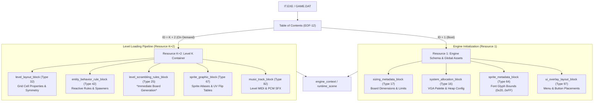
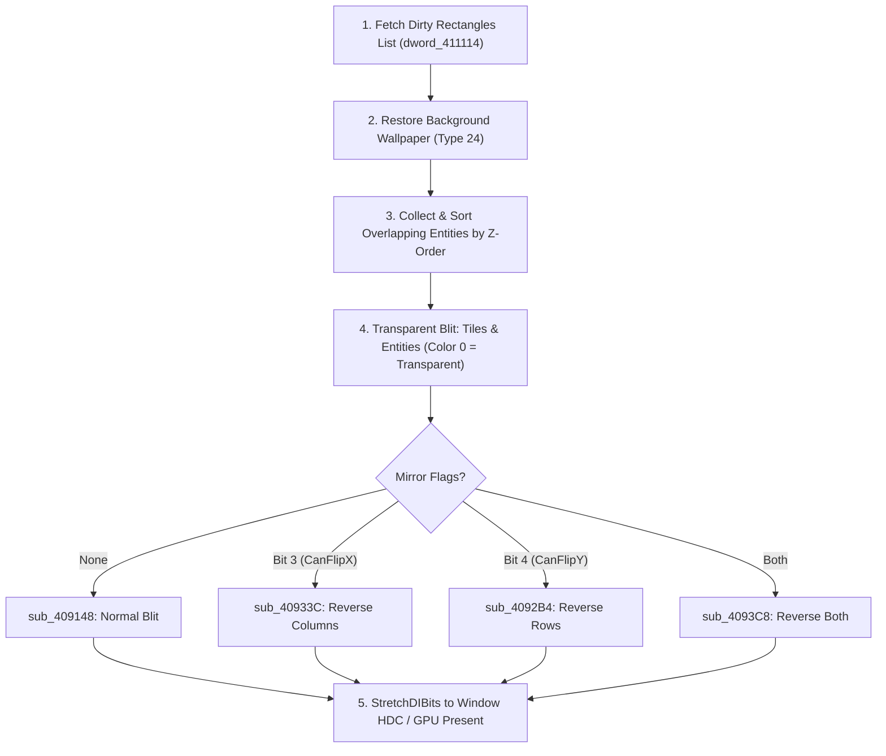

# Engine Implementation Specification: "IT" (The Incredible Toon Machine)

This document provides a comprehensive technical architecture and implementation specification for reimplementing the game engine of **IT** (GAMOS, 1996) in modern C++20 using the Neutrino framework.

---

## 1. Architectural Philosophy & Core Paradigm

The original executable (`IT.EXE`) operates on a **hybrid, two-tier architecture**:
1. **Container Level (Random Access Indexing)**: The game file stores an indexed archive accessed via a 12-byte footer at `EOF - 12` and a Table of Contents (ToC). Containers are fetched directly by ID via $O(1)$ file seeks.
2. **Resource Block Level (Sequential Stream State Machine)**: Inside any container, data is not a database of records to query; it is a **byte-driven command stream**. As blocks arrive, the engine unpacks them and performs **immediate dispatch**: allocating tables, wiring pointers, running procedural board scramblers, or streaming audio.



---

## 2. Complete Asset Block & Struct Catalog

The table below cross-references all binary asset blocks against their strongly-typed C++ structs in [`it_blocks.hh`](file:///home/igor/proj/neutrino/neutrino/games/it/it_blocks.hh), their dispatch targets in the original engine (`IT.c`), and their role in the modern engine reimplementation.

| Type ID | C++ Struct Name (`it_blocks.hh`) | Size / Encoding | Original Handler | Target Engine Subsystem | Lifecycle & Role |
| :---: | :--- | :--- | :--- | :--- | :--- |
| **15** | [`level_config_block`](file:///home/igor/proj/neutrino/neutrino/games/it/it_blocks.hh#L20-L24) | 52 bytes | `IT.c:4634` | `session_manager` | Level filename suffix (`IT0.***`) and save directory registers. |
| **16** | [`system_allocation_block`](file:///home/igor/proj/neutrino/neutrino/games/it/it_blocks.hh#L26-L39) | 125 bytes | `IT.c:4641` | `render_system` | 256-color VGA palette, 640x480 resolution, window title (`АйТи`), tile size ($40 \times 40$). |
| **17** | [`sizing_metadata_block`](file:///home/igor/proj/neutrino/neutrino/games/it/it_blocks.hh#L41-L56) | 52 bytes | `sub_404FB0` | `engine_context` | 13 dimension limits (`GridCols=16`, `GridRows=12`, `MaxZones=178`, `MaxEntities=182`). |
| **18** | [`menu_config_block`](file:///home/igor/proj/neutrino/neutrino/games/it/it_blocks.hh#L58-L62) | 8 bytes | `IT.c:4408` | `ui_system` | Menu options bitmask and palette register configuration. |
| **19** | [`script_bytecode_block`](file:///home/igor/proj/neutrino/neutrino/games/it/it_blocks.hh#L64-L76) | Varint stream | `sub_408E38` | `script_vm` | Cinematic initialization bytecode. |
| **20** | [`script_bytecode_block`](file:///home/igor/proj/neutrino/neutrino/games/it/it_blocks.hh#L64-L76) / [`animation_stream_block`](file:///home/igor/proj/neutrino/neutrino/games/it/it_blocks.hh#L117-L120) | Timeline records | `sub_40683C` | `cinematic_player` | Cutscene video keyframes, delta frames, palette cycling, and audio cues. |
| **24** | [`background_image_block`](file:///home/igor/proj/neutrino/neutrino/games/it/it_blocks.hh#L122-L132) | $W \times H + 768$ | `IT.c:4419` | `render_system` | Static background art and intro backdrop with embedded 256-color palette. |
| **25** | [`level_scrambling_rules_block`](file:///home/igor/proj/neutrino/neutrino/games/it/it_blocks.hh#L190-L201) | Rule words | `sub_403A64` | `level_scrambler` | **Procedural level generator**: Evaluated immediately on stream arrival to construct puzzle. |
| **32** | [`level_layout_block`](file:///home/igor/proj/neutrino/neutrino/games/it/it_blocks.hh#L203-L217) | 4 bytes | `IT.c:4448` | `game_board` | Cell layout archetype, $D_4$ symmetry mask, entity behavior flags, state size. |
| **33** | [`script_bytecode_block`](file:///home/igor/proj/neutrino/neutrino/games/it/it_blocks.hh#L64-L76) | Bytecode | `sub_408E38` | `script_vm` | Level initialization and trigger script. |
| **34** | [`level_collision_override_block`](file:///home/igor/proj/neutrino/neutrino/games/it/it_blocks.hh#L219-L222) | Variable | `IT.c:4454` | `physics_system` | Per-level manual walkthrough override bitmap. |
| **35** | [`entity_rule_index_block`](file:///home/igor/proj/neutrino/neutrino/games/it/it_blocks.hh#L224-L230) | $4 \times N$ offsets | `IT.c:4457` | `rule_engine` | Offset jump table mapping entity slots to their active Type 42 rule groups. |
| **42** | [`entity_behavior_rule_block`](file:///home/igor/proj/neutrino/neutrino/games/it/it_blocks.hh#L232-L244) | Pattern groups | `sub_403A64` | `rule_engine` | Reactive entity behavior rules (conditions, pattern match, transformations, actions). |
| **43** | [`script_bytecode_block`](file:///home/igor/proj/neutrino/neutrino/games/it/it_blocks.hh#L64-L76) | Bytecode | `sub_408E38` | `script_vm` | Pre-interaction event script (called before evaluating Type 42 condition). |
| **44** | [`script_bytecode_block`](file:///home/igor/proj/neutrino/neutrino/games/it/it_blocks.hh#L64-L76) | Bytecode | `sub_408E38` | `script_vm` | Post-interaction event script (sound effects, scoring, win triggers). |
| **56** | [`collision_walkability_matrix_block`](file:///home/igor/proj/neutrino/neutrino/games/it/it_blocks.hh#L246-L260) | 23 bytes (184b) | `IT.c:4482` | `physics_system` | 184-bit passability mask testing if an entity class can enter specific tile IDs. |
| **57** | [`tile_candidate_list_block`](file:///home/igor/proj/neutrino/neutrino/games/it/it_blocks.hh#L262-L272) | Dynamic array | `IT.c:4485` | `level_scrambler` | Tile substitution and candidate list for random selection groups. |
| **58** | [`tile_rotations_block`](file:///home/igor/proj/neutrino/neutrino/games/it/it_blocks.hh#L368-L396) | Byte array | `IT.c:4488` | `game_board` | Directional connection ports (NESW nibbles) and $90^\circ$ rotation permutations. |
| **64** | [`sprite_metadata_block`](file:///home/igor/proj/neutrino/neutrino/games/it/it_blocks.hh#L398-L418) | 4 bytes | `IT.c:4491` | `sprite_renderer` | Dual mode: Font ASCII bounds (`0x20..0xFF`) OR directional traits (`FlipX`, `FlipY`, `Idle`). |
| **66** | [`sprite_frame_table_block`](file:///home/igor/proj/neutrino/neutrino/games/it/it_blocks.hh#L420-L429) | $8 \times N$ bytes | `IT.c:4498` | `sprite_renderer` | Frame pointers and pivot hotspots (`x_hotspot`, `y_hotspot`). |
| **67** | [`sprite_graphic_block`](file:///home/igor/proj/neutrino/neutrino/games/it/it_blocks.hh#L431-L436) | $W \times H + 4$ | `IT.c:4504` | `sprite_renderer` | Palette-indexed 8-bit raw pixel frame buffer. |
| **80** | [`audio_settings_block`](file:///home/igor/proj/neutrino/neutrino/games/it/it_blocks.hh#L438-L447) | 4 bytes | `IT.c:4512` | `audio_mixer` | Sound priority, volume attenuation, stereo panning, channel flags. |
| **81** | [`digital_audio_clip_block`](file:///home/igor/proj/neutrino/neutrino/games/it/it_blocks.hh#L449-L459) | Raw PCM | `sub_40A16C` | `audio_mixer` | 11,025 Hz unsigned 8-bit mono sound effect (`.to_wav()`). |
| **82** | [`music_track_block`](file:///home/igor/proj/neutrino/neutrino/games/it/it_blocks.hh#L461-L467) | Custom MIDI | `sub_40A7C0` | `audio_mixer` | Custom MIDI stream with post-event deltas & LE varints (`.to_mid()`). |
| **96** | [`ui_overlay_action_block`](file:///home/igor/proj/neutrino/neutrino/games/it/it_blocks.hh#L469-L476) | 4 bytes | `sub_406AEC` | `ui_system` | 32-bit action rule word executed when an overlay button is clicked. |
| **97** | [`ui_overlay_layout_block`](file:///home/igor/proj/neutrino/neutrino/games/it/it_blocks.hh#L489-L496) | $8 \times N$ bytes | `sub_406F20` | `ui_system` | UI button layout array (`x`, `y`, `sprite_index`, `flags`, `is_terminal`). |
| **124-126** | [`save_game_layout_block`](file:///home/igor/proj/neutrino/neutrino/games/it/it_blocks.hh#L498-L509) | $8 \times N + 4$ | `sub_405ABC` | `save_manager` | State buffer slice mappings (`state_offset`, `state_size`) for save/load files. |

---

## 3. Subsystem Implementation Architecture

### 3.1 Resource Storage & Stream Addressing Protocol (`resource_archive`)

The archive mounts `IT.EXE` or `GAME.DAT` and extracts containers using the 12-byte footer.

Inside a container, blocks are dispatched by the command stream state machine (`IT.c:4600–4712`).

```cpp
/// Stream command opcodes / tags (IT.c:4600-4712)
enum class stream_opcode : uint8_t {
    end_of_stream         = 0x00, // 0: Terminate resource container stream
    param_column_index    = 0x01, // 1: Read secondary index / animation column / rule slot (DstBuf)
    param_direction_index = 0x02, // 2: Read tertiary index / direction angle (v13)
    param_base_offset     = 0x03, // 3: Read memory/script base offset modifier (v14)
    command_block         = 0x04, // 4: Read block payload (uncompressed or LZSS)
    animation_stream      = 0x05, // 5: Read animation & cutscene timeline stream payload
    block_terminator      = 0xFF  // 255: End of block definition (triggers block handler)
};

namespace stream_masks {
    constexpr uint8_t TYPE_MASK        = 0x7F; // Lower 7 bits encode the Asset Type ID (a1)
    constexpr uint8_t NO_SLOT_ARG_FLAG = 0x80; // When set, block has no trailing slot varint
}

/// Stream addressing registers (sub_405514 / sub_405150)
struct block_address {
    uint32_t slot_id = 0;      // v11 / a6: Target Instance / Slot ID (Sprite ID, Level ID, Sound ID)
    uint32_t column_id = 0;    // dst_buf / a5: Sub-index / Animation Column / Rule Slot
    uint32_t direction_id = 0; // v13 / a4: Tertiary index / Direction Angle (0..8)
    uint32_t base_offset = 0;  // v14 / a3: Base offset / Script modifier

    [[nodiscard]] std::string to_string() const;
};

using addressed_block = std::pair<block_address, decoded_block>;
```

#### Stream Parser Implementation Pattern
```cpp
class resource_archive {
public:
    explicit resource_archive(const std::filesystem::path& archive_path);

    [[nodiscard]] std::size_t container_count() const noexcept;
    
    /// Reads and decompresses the raw command stream for a container
    [[nodiscard]] std::vector<uint8_t> load_container_stream(uint32_t container_id);

    /// Parses a container stream into addressed block pairs (block_address, decoded_block)
    [[nodiscard]] std::vector<addressed_block> decode_container(uint32_t container_id);

private:
    struct entry {
        uint32_t offset = 0;
        uint8_t id = 0;
    };
    std::vector<entry> m_entries;
    uint32_t m_base_offset = 0;
};
```

---

### 3.2 Global Engine Context & Bootstrap (`engine_context`)

Executed once at startup by loading **Resource 1**:

1. **Board Grid Sizing**:
   [`sizing_metadata_block`](file:///home/igor/proj/neutrino/neutrino/games/it/it_blocks.hh#L41-L56) sets:
   $$\text{Board Width} = 16 \text{ tiles}, \quad \text{Board Height} = 12 \text{ tiles}, \quad \text{Resolution} = 640 \times 480$$
2. **Palette Configuration**:
   [`system_allocation_block`](file:///home/igor/proj/neutrino/neutrino/games/it/it_blocks.hh#L26-L39) provides the standard 256-color RGB VGA palette and defines tile dimensions ($40 \times 40$ pixels). Upload to a $256 \times 1$ RGB texture for palette indexing shaders.
3. **Bitmap Typography Engine**:
   Resource 1 defines [`sprite_metadata_block`](file:///home/igor/proj/neutrino/neutrino/games/it/it_blocks.hh#L398-L418) with `is_font() == true` (`first_char = 0x20`, `last_char = 0xFF`). The font renderer binds glyphs directly via:
   $$\text{Glyph Frame Index} = \text{char\_code} - 0x20$$
4. **UI Button Layout**:
   [`ui_overlay_layout_block`](file:///home/igor/proj/neutrino/neutrino/games/it/it_blocks.hh#L489-L496) and [`ui_overlay_action_block`](file:///home/igor/proj/neutrino/neutrino/games/it/it_blocks.hh#L469-L476) register sidebar controls, reset buttons, and volume sliders.

---

### 3.3 Playgrid Architecture & Rendering Pipeline (`game_board`)

The playfield operates on a **unified entity-driven compositing pipeline** with dirty-rectangle optimization (`IT.c:2638–2810`).

#### A. Playgrid Geometry & Coordinate Math
- **Grid Layout**: $16$ columns $\times$ $12$ rows.
- **Tile Dimensions**: Exactly $40 \times 40$ pixels (`alloc_var1 = 40`, `alloc_var2 = 40`).
- **Screen Dimensions**: $16 \times 40 = 640$ pixels wide, $12 \times 40 = 480$ pixels high.
- **Coordinate Transformations**:
  $$\text{PixelX} = X \times 40, \quad \text{PixelY} = Y \times 40 \quad (0 \le X < 16, \; 0 \le Y < 12)$$
  $$\text{GridX} = \lfloor \text{CursorX} / 40 \rfloor, \quad \text{GridY} = \lfloor \text{CursorY} / 40 \rfloor$$

#### B. In-Memory Playgrid Buffer (`dword_416100`)
The grid is stored as a flat array of 16-bit words indexed via a power-of-two shift optimization (`IT.c:1877, 4335`):
$$\text{CellAddress} = \text{dword\_416100} + 2 \times (X + (Y \ll 4))$$

Each 16-bit cell consists of:
- **Low Byte (`uint8_t`)**: `TileID` (or `0xFE` for empty/void cell).
- **High Byte (`uint8_t`)**: **Orientation & Connection Port Mask** (upper nibble stores connection bits: North `0x10`, East `0x20`, South `0x40`, West `0x80`, as specified in [`tile_rotations_block`](file:///home/igor/proj/neutrino/neutrino/games/it/it_blocks.hh#L368-L396)).

#### C. Unified Tile/Entity Architecture
In `IT.EXE`, **tiles are not drawn by a separate tilemap layer**. Every tile placed into the grid (`IT.c:1910–1925`):
1. References its archetype in [`level_layout_block`](file:///home/igor/proj/neutrino/neutrino/games/it/it_blocks.hh#L203-L217) (Type 32).
2. Spawns an entry in the global active entity list (`dword_4160F0`) with Layer 1 Z-order.
3. Binds its sprite graphic records: [`sprite_metadata_block`](file:///home/igor/proj/neutrino/neutrino/games/it/it_blocks.hh#L398-L418) (Type 64), [`sprite_frame_table_block`](file:///home/igor/proj/neutrino/neutrino/games/it/it_blocks.hh#L420-L429) (Type 66), and [`sprite_graphic_block`](file:///home/igor/proj/neutrino/neutrino/games/it/it_blocks.hh#L431-L436) (Type 67).

> Tiles, moving characters, and visual effects all live in the **same unified entity display list** and are drawn by the same renderer.

#### D. The 5-Step Frame Rendering Pipeline (`IT.c:2638–2810`)
Frames are composited into an 8-bit indexed offscreen backbuffer (`lpBits`, $640 \times 480$):



1. **Dirty Rectangle Determination (`dword_411114`)**: Only modified regions are redrawn. When a tile rotates or an entity moves, its $40 \times 40$ rect is pushed to the dirty list.
2. **Background Restoration (`sub_409098`)**: The dirty bounding box is restored directly from [`background_image_block`](file:///home/igor/proj/neutrino/neutrino/games/it/it_blocks.hh#L122-L132) (Type 24), erasing previous frames.
3. **Z-Sorting**: All entities overlapping the dirty rect are sorted by Z-order (Layer 1 = tiles, Layer 2..3 = entities, Layer 4+ = UI & particles).
4. **Transparent Blitting & UV Flipping**:
   - Origin: $\text{DrawX} = \text{PixelX} - \text{XHotspot}, \; \text{DrawY} = \text{PixelY} - \text{YHotspot}$.
   - Palette index `0x00` is transparent.
   - West-facing sprites mirror columns (`sub_40933C`), South-facing sprites mirror rows (`sub_4092B4`).
5. **Presentation**: The backbuffer rectangle is presented to the screen via `StretchDIBits` (or modern GPU swapchain texture update).

#### E. Tile Connection Ports & $D_4$ Symmetry
Clicking a tile rotates it $90^\circ$ clockwise by shifting connection bits:
$$\text{Next Mask} = \left((\text{Mask} \ll 1) \& 0xF0\right) \mid \left((\text{Mask} \gg 3) \& 0x10\right)$$
The cell is added to the dirty list, its graphic frame is updated to the next rotation, and it is repainted on the next tick.

---

### 3.4 Level Loading & Immediate Procedural Scrambler (`level_scrambler`)

When entering Level $K$, the engine requests container **$K + 2$**. Unlike traditional games that deserialize static boards, the level layout is **procedurally constructed on-the-fly**:

1. [`level_layout_block`](file:///home/igor/proj/neutrino/neutrino/games/it/it_blocks.hh#L203-L217) initializes default background tiles.
2. [`level_scrambling_rules_block`](file:///home/igor/proj/neutrino/neutrino/games/it/it_blocks.hh#L190-L201) **executes immediately**:
   - Condition groups match existing patterns on the grid using [`scramble_combinator`](file:///home/igor/proj/neutrino/neutrino/games/it/it_blocks.hh#L135-L140) (`next_or_branch`, `must_and`, `satisfy_branch`, `accumulate_coord`).
   - Action groups place tiles according to [`scramble_group_mode`](file:///home/igor/proj/neutrino/neutrino/games/it/it_blocks.hh#L143-L150):
     - `unconditional_placement`: Direct coordinate stamping.
     - `weighted_random`: Weighted placement from candidate lists.
     - `single_random_select`: Random branch selection.
     - `probabilistic_placement`: 50% coin-flip placement.

---

### 3.5 Reactive Rule Engine & Spawner System (`rule_engine`)

During gameplay ticks, entities react to tile changes and player clicks via [`entity_behavior_rule_block`](file:///home/igor/proj/neutrino/neutrino/games/it/it_blocks.hh#L232-L244) mapped by [`entity_rule_index_block`](file:///home/igor/proj/neutrino/neutrino/games/it/it_blocks.hh#L224-L230):

```text
Game Tick / Tile Click
       │
       ▼
Check Entity Rule Slot (Type 35 Offset Index)
       │
       ▼
Precondition Script Hook (Type 43) ──► script_vm::execute()
       │
       ▼
Evaluate 2D Neighborhood Pattern (Type 42 Condition Groups)
       ├── Check Walkability (Type 56 Mask)
       └── Check Dihedral D4 Symmetry Match
       │
       ▼ (Condition Satisfied)
Execute Action Group (Transform Tile, Move Entity, Change State)
       │
       ▼
Postcondition Script Hook (Type 44) ──► Play SFX / Check Win Condition
```

---

### 3.6 Sprite & Animation Rendering Pipeline (`sprite_renderer`)

Instead of storing pre-rendered angles for every orientation, the engine relies on metadata flags in [`sprite_metadata_block`](file:///home/igor/proj/neutrino/neutrino/games/it/it_blocks.hh#L398-L418):

```cpp
struct sprite_render_command {
    const sprite_graphic_block* graphic = nullptr;
    int16_t draw_x = 0;
    int16_t draw_y = 0;
    bool flip_x = false;
    bool flip_y = false;
};

sprite_render_command resolve_sprite(
    const entity& ent,
    const sprite_metadata_block& meta,
    const sprite_frame_table_block& frame_table)
{
    sprite_render_command cmd;

    // 1. Idle Stance (Bit 3: has_idle_frame)
    if (meta.has_idle_frame() && ent.velocity_sq() == 0) {
        const auto& rec = frame_table.frames[0];
        cmd.draw_x = ent.pixel_x - rec.x_hotspot;
        cmd.draw_y = ent.pixel_y - rec.y_hotspot;
        cmd.graphic = &get_graphic(rec.block_ptr);
        return cmd;
    }

    // 2. Direction Angle (Frames 1..8)
    uint32_t dir = ent.direction_index(); // N=1, NE=2, E=3, SE=4, S=5, SW=6, W=7, NW=8

    // 3. Mirroring Transformations (Bits 1 & 2: can_flip_x, can_flip_y)
    if (dir == DIR_WEST && meta.can_flip_x()) {
        dir = DIR_EAST;
        cmd.flip_x = true;
    } else if (dir == DIR_SOUTH && meta.can_flip_y()) {
        dir = DIR_NORTH;
        cmd.flip_y = true;
    }

    const auto& rec = frame_table.frames[dir];
    cmd.draw_x = ent.pixel_x - rec.x_hotspot;
    cmd.draw_y = ent.pixel_y - rec.y_hotspot;
    cmd.graphic = &get_graphic(rec.block_ptr);
    return cmd;
}
```

> [!NOTE]
> Modernization: In 1996, Bit 7 (`is_streamed_on_demand()`) was used to page Type 67 bitmaps from disk during rendering. In the modern engine, all Type 67 frames are uploaded directly to GPU memory during level load, eliminating disk seeking entirely.

---

### 3.7 Virtual Machine Interpreter (`script_vm`)

The VM runs bytecode scripts from Types 19, 20, 33, 43, and 44:
- Register `A1`: 1-bit Condition / Branch Flag.
- Registers `A2..A7`: Coordinate, rule state, sound trigger, and timer registers.
- All instructions are decoded by [`decode_bytecode`](file:///home/igor/proj/neutrino/neutrino/games/it/it_vm.hh) into [`vm_instruction`](file:///home/igor/proj/neutrino/neutrino/games/it/it_vm.hh) records.

---

### 3.8 Audio & Music Subsystem (`audio_mixer`)

1. **Digital Sound Effects ([Type 81](file:///home/igor/proj/neutrino/neutrino/games/it/it_blocks.hh#L449-L459))**:
   Unsigned 8-bit mono PCM at 11,025 Hz. Convert on the fly with `.to_wav()` or stream directly to Neutrino's audio buffer with volume and pan from [`audio_settings_block`](file:///home/igor/proj/neutrino/neutrino/games/it/it_blocks.hh#L438-L447).
2. **Music Playback ([Type 82](file:///home/igor/proj/neutrino/neutrino/games/it/it_blocks.hh#L461-L467))**:
   Custom MIDI stream converted to Standard MIDI File (SMF Format 0) via `.to_mid()`, played through a lightweight soundfont synthesizer.

---

## 4. Modern C++ Component Layout

The complete runtime scene structure maps the reverse-engineered blocks into modern C++ classes:

```
games/it/
├── it_blocks.hh          // Decoded block structs (Types 15..126) + block_address + stream_opcode
├── it_blocks.cc          // Parsers, disassemblers, and formatters
├── it_vm.hh              // VM instruction decoder and disassembler
├── it_vm.cc              // VM bytecode engine implementation
├── engine/
│   ├── resource_archive.hh // Container archive seek & extraction
│   ├── engine_context.hh   // Global singleton (Type 17 sizing, palette, font)
│   ├── game_board.hh       // 16x12 cell matrix, unified entity display list, 40x40 blitter
│   ├── level_scrambler.hh  // Type 25 immediate puzzle constructor
│   ├── rule_engine.hh      // Types 35 & 42 reactive entity behavior
│   ├── sprite_system.hh    // Types 64, 66, 67 rendering & UV flips
│   ├── audio_system.hh     // Types 80, 81, 82 PCM & MIDI mixer
│   └── scene_director.hh   // High-level scene state & game loop
```
