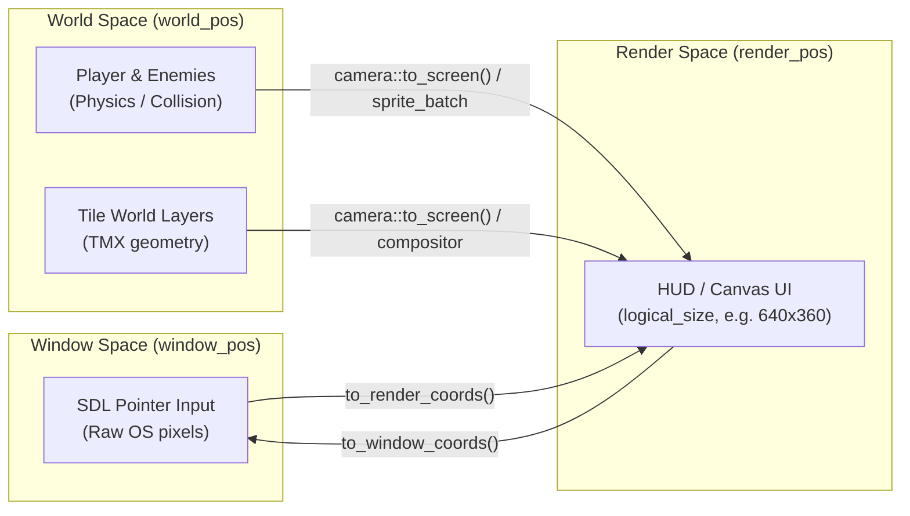

# Coordinate spaces

In many 2D game engines, every coordinate, offset, and rate is represented as a plain pair of floats
(`vec2`, `point`, or `float x, y`). This simplicity comes with subtle, silent bugs:

- **Adding two positions:** Adding position `(100, 50)` to `(200, 30)` produces `(300, 80)`, which has no
  geometric meaning, but compiles without warning.
- **Conflating position and velocity:** Passing a target position where a velocity was expected, or
  fabricating `(target - current) / dt` without clamping, causing catastrophic velocity spikes or wall-pinning freezes.
- **Mixing display spaces:** Passing raw window mouse coordinates into gameplay logic without accounting
  for HiDPI scaling or letterboxing, producing a cursor that drifts across different monitors.

Neutrino solves this at compile time using **distinct strong types** for each quantity and space.



---

## The three spaces

| Space | Type | Coordinate Origin | Represents |
|---|---|---|---|
| **Window space** | `neutrino::window_pos` | Top-left of OS window | Raw window pixels reported by SDL events. |
| **Render space** | `neutrino::render_pos` | Top-left of virtual canvas | The fixed design canvas (`logical_size`). What scenes draw to before display scaling. |
| **World space** | `neutrino::world_pos` | Origin (0, 0) of the game world | Unbounded simulation coordinates where physics bodies and tile maps exist. |

---

## World space quantity algebra

Inside world space, Neutrino separates **locations**, **displacements**, and **rates** into three distinct types:

1. `world_pos` — a specific location in the game world.
2. `world_delta` — a displacement, offset, or distance vector.
3. `world_velocity` — a speed and direction over time (units per second).

### What compiles (and what does not)

The type system permits only operations that have mathematical and geometric meaning:

```cpp
#include <neutrino/world_space.hh>

using namespace neutrino;

world_pos a{100.0f, 50.0f};
world_pos b{140.0f, 80.0f};
world_delta move{10.0f, 0.0f};
world_velocity vel{120.0f, 0.0f};
world_seconds dt{1.0f / 60.0f};

// --- Meaningful operations (COMPILES) ---

// Two positions subtracted yield the displacement between them:
world_delta diff = b - a;                      // (40, 30)

// A position displaced by a delta yields a new position:
world_pos displaced = a + move;                // (110, 50)
a += move;

// Offsets can be combined, scaled, and normalized:
world_delta combined = move + diff;
world_delta scaled = move * 2.5f;
world_delta dir = diff.normalized();

// Velocity integrated over duration yields a displacement:
world_delta step_offset = vel * dt;            // (2.0, 0.0)

// Displacement divided by duration yields effective velocity:
world_velocity effective_vel = diff / dt;      // (2400, 1800)

// --- Nonsense operations (COMPILE ERROR) ---

// Adding two positions is geometrically meaningless:
// world_pos error1 = a + b;                   // COMPILE ERROR

// Subtracting a position from a delta:
// world_pos error2 = move - a;                // COMPILE ERROR

// Multiplying positions or dividing positions by seconds:
// auto error3 = a * 2.0f;                     // COMPILE ERROR
// auto error4 = a / dt;                       // COMPILE ERROR
```

:::tip Why this matters for character controllers
In kinematic character controllers, bodies often calculate how far they *actually* moved after colliding with
walls. Dividing the resolved `world_delta` by `dt` gives the exact `world_velocity` to retain for the next frame.
Because `world_delta / seconds = world_velocity`, the compiler prevents mixing requested speed with actual displacement.
:::

---

## World bounds

For axis-aligned bounding boxes in world space, Neutrino provides `neutrino::world_bounds`:

```cpp
struct world_bounds {
    world_pos min{};
    world_pos max{};

    [[nodiscard]] constexpr world_delta size() const noexcept { return max - min; }
    [[nodiscard]] constexpr world_pos centre() const noexcept;
    [[nodiscard]] constexpr bool contains(world_pos p) const noexcept;
    [[nodiscard]] constexpr bool intersects(world_bounds o) const noexcept;
};
```

Notice that `size()` returns a `world_delta`, and `centre()` returns a `world_pos`.

---

## Crossing boundaries: conversions

Coordinate spaces must never be implicitly cast to each other. When data flows between systems,
conversions are explicit:

### 1. Window to Render space (Input)

Input arrives in raw window coordinates. The input system maps it to render space before handing it to your scene:

```cpp
// Explicit conversion functions:
neutrino::render_pos r = neutrino::to_render_coords(win_pos);
neutrino::window_pos w = neutrino::to_window_coords(render_pos);
```

In `fixed_update`, the [`input_snapshot`](./input.md) has already done this for you:
```cpp
void my_scene::fixed_update(neutrino::sim_duration dt, const neutrino::input_snapshot& in) {
    if (in.pointer().on_screen) {
        // in.pointer().render is already in presentation space (e.g. 640x360).
        neutrino::render_pos cursor = in.pointer().render;
    }
}
```

### 2. World to Render space (Camera & Drawing)

When drawing world entities to the screen, a [`camera`](pathname:///api/) translates world coordinates into render coordinates:

```cpp
neutrino::camera cam;
cam.look_at(player_world_pos);

// Maps world_pos -> render_pos taking camera position and zoom into account:
neutrino::point screen_px = cam.to_screen(player_world_pos, render_viewport);
```

When using a [`sprite_batch`](pathname:///api/), this transformation happens automatically by passing the camera
to the batch constructor.

### 3. Crossing to legacy/untyped APIs

Low-level SDL draw functions (`draw_line`, `draw_rect`) accept raw integers or bare float pairs.
Conversion helpers make these crossings deliberate:

```cpp
neutrino::world_point pt = neutrino::to_world_point(my_pos);   // untyped float pair {x, y}
neutrino::world_pos p = neutrino::to_world_pos(pt);            // typed world position
```

---

## Common pitfalls

- **Bypassing the types with bare floats:** Storing `float x, y` in your player struct loses all compile-time
  guarantees. Store `neutrino::world_pos` for location, `neutrino::world_velocity` for speed, and `neutrino::world_delta` for frame motion.
- **Confusing `window_pos` with `render_pos`:** In an unscaled window on a standard display, `window_pos` and
  `render_pos` may happen to have identical numerical values. On high-DPI displays or resized windows with letterboxing,
  they diverge significantly. Always steer game logic from `render_pos`.

---

## Next

- **Sprites** *(planned)* — how visuals, sheets, and animations are defined and cached.
- [Tutorial Step 1: A window and an empty scene](../tutorial/step-01-window-and-scene.md) — see how logical resolution and presentation spaces are configured in code.
