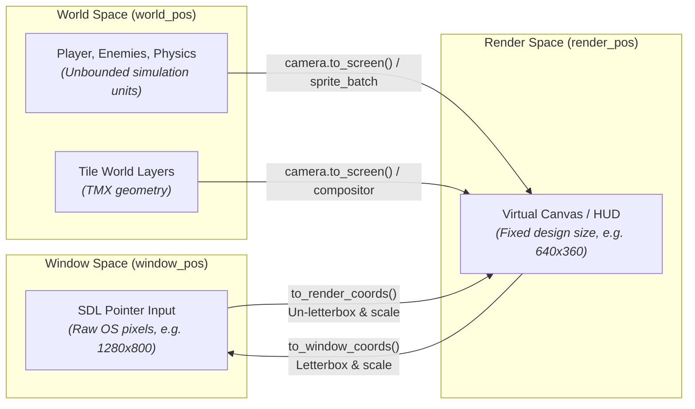
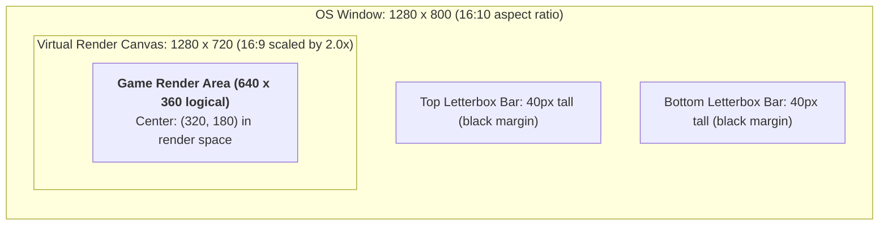
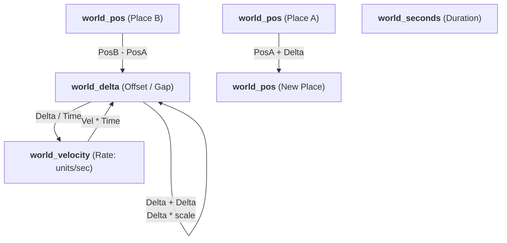
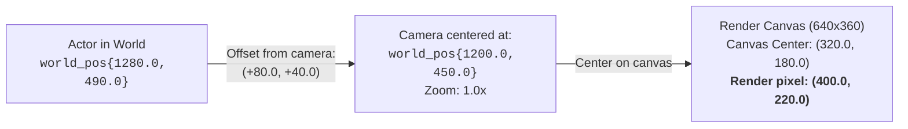

# Coordinate spaces

In many 2D game engines, every coordinate, offset, and rate is represented as a plain pair of floats
(`vec2`, `point`, or `float x, y`). This simplicity comes with subtle, silent bugs:

- **Adding two positions:** Adding position (100, 50) to (200, 30) produces (300, 80), which has no
  geometric meaning, but compiles without warning.
- **Conflating position and velocity:** Passing a target position where a velocity was expected, or
  fabricating `(target - current) / dt` without clamping, causing catastrophic velocity spikes or wall-pinning freezes.
- **Mixing display spaces:** Passing raw window mouse coordinates into gameplay logic without accounting
  for HiDPI scaling or letterboxing, producing a cursor that drifts across different monitors.

Neutrino solves this at compile time using **distinct strong types** for each quantity and space.



---

## The three spaces

| Space | Type | Origin (0, 0) | Units | Represents |
|---|---|---|---|---|
| **Window space** | [`neutrino::window_pos`](pathname:///api/) | Top-left of OS window | Physical OS pixels | Raw display pixels delivered by SDL window and mouse events. |
| **Render space** | [`neutrino::render_pos`](pathname:///api/) | Top-left of virtual canvas | Design pixels | The fixed virtual resolution (`logical_size`). What scenes and UI draw to. |
| **World space** | [`neutrino::world_pos`](pathname:///api/) | Arbitrary origin (0, 0) | Simulation units | Unbounded continuous coordinates where physics bodies, tiles, and actors exist. |

---

## 1. Window to Render Space (Presentation & Input)

When configuring a Neutrino application, you typically specify a **logical design resolution** (e.g. `640 x 360`):

```cpp
neutrino::application_config cfg;
cfg.logical_size = neutrino::dim{640, 360};
cfg.scale = neutrino::scale_mode::letterbox; // or integer_scale
```

This guarantees your game draws to a stable, predictable canvas regardless of whether the player runs on a 1080p monitor, a 4K display, or an ultrawide screen.

However, the user's mouse and touch inputs arrive in **Window space** (physical OS pixels). Converting between the two requires accounting for **HiDPI display density** and **letterboxing black bars**.



### Numeric Walkthrough: The Letterbox Trap

Suppose your game has a logical design canvas of `640 x 360` (16:9 aspect ratio), and runs on a laptop screen with a window size of `1280 x 800` (16:10 aspect ratio) under `scale_mode::letterbox`:

1. **Calculate the Uniform Scale Factor (S):**
   The canvas expands to fill the width (`1280 px`):
   ```text
   S = 1280 / 640 = 2.0
   ```
2. **Calculate Scaled Dimensions:**
   ```text
   scaled_w = 640 * 2.0 = 1280 px
   scaled_h = 360 * 2.0 = 720 px
   ```
3. **Calculate Black Bars (Pillarbox/Letterbox Offset):**
   The total window height is `800 px`, leaving `800 - 720 = 80 px` of unused vertical space:
   ```text
   offset_y = (800 - 720) / 2 = 40 px
   offset_x = 0 px
   ```

#### Case A: Correct Mapping via `to_render_coords()`
The user clicks the physical center of their laptop window:
```text
win_pos = (640.0, 400.0)
```

Neutrino converts this using `to_render_coords()`:
```text
render_x = (win_x - offset_x) / S = (640.0 - 0.0) / 2.0 = 320.0
render_y = (win_y - offset_y) / S = (400.0 - 40.0) / 2.0 = 180.0
```

The result is `render_pos{320.0f, 180.0f}` — the exact center of your `640 x 360` canvas.

#### Case B: Naive Engine (Passing Raw Window Pixels)
If your game passed the raw window coordinates `(640.0, 400.0)` directly into gameplay:
- `x = 640.0` is the extreme right edge of your canvas.
- `y = 400.0` is `40 px` below the bottom of the screen!
- A player clicking the center of their screen would shoot or click entirely outside the game viewport!

### Code: Converting between Input Spaces

In Neutrino, `to_render_coords` and `to_window_coords` are strongly typed templates:

```cpp
#include <neutrino/video/globals.hh>
#include <neutrino/world_space.hh>

// Window space -> Render space (Input conversion):
neutrino::window_pos mouse_win{640.0f, 400.0f};
neutrino::render_pos mouse_render = neutrino::to_render_coords(mouse_win);
// mouse_render == {320.0f, 180.0f}

// Render space -> Window space (e.g. positioning native OS popups or IME):
neutrino::window_pos back_to_win = neutrino::to_window_coords(mouse_render);
// back_to_win == {640.0f, 400.0f}
```

In `fixed_update`, the [`input_snapshot`](./input.md) has already converted pointer input for you:

```cpp
void my_scene::fixed_update(neutrino::sim_duration dt, const neutrino::input_snapshot& in) {
    if (in.pointer().on_screen) {
        // in.pointer().render is ALREADY in render space (320.0f, 180.0f)
        neutrino::render_pos cursor = in.pointer().render;
    }
}
```

---

## 2. World Space Quantity Algebra

Inside world space, Neutrino separates **locations**, **displacements**, **rates**, and **time** into distinct C++ types:



### The Algebraic Rules

| Operation | Formula | Result Type | Meaning |
|---|---|---|---|
| **Difference of Places** | `world_pos - world_pos` | `world_delta` | The geometric offset / displacement vector between two places. |
| **Displacement of a Place** | `world_pos + world_delta` | `world_pos` | Moving a place by an offset produces a new place. |
| **Combining Offsets** | `world_delta + world_delta` | `world_delta` | Combining two displacements. |
| **Scaling an Offset** | `world_delta * float` | `world_delta` | Stretching or shortening a displacement vector. |
| **Rate Integration** | `world_velocity * world_seconds` | `world_delta` | Speed × Time = Distance traveled. |
| **Rate Differentiation** | `world_delta / world_seconds` | `world_velocity` | Distance ÷ Time = Effective speed. |

### Operations Rejected at Compile Time

The whole purpose of strong typing is that nonsensical geometric operations **refuse to compile**:

```cpp
#include <neutrino/world_space.hh>

using namespace neutrino;

world_pos a{100.0f, 50.0f};
world_pos b{140.0f, 80.0f};
world_delta move{10.0f, 0.0f};
world_velocity vel{120.0f, 0.0f};
world_seconds dt{1.0f / 60.0f};

// COMPILE ERRORS:
// world_pos error1 = a + b;           // Adding two locations is geometrically meaningless!
// world_pos error2 = move - a;        // Cannot subtract a position from an offset!
// auto error3 = a * 2.0f;             // A location cannot be doubled!
// auto error4 = a / dt;               // A location divided by time is nonsense!
// world_pos error5 = a + vel;         // Cannot add velocity to position without integrating over dt!
```

---

## 3. Numeric Walkthrough: Motion and Integration

Let's walk through concrete physics numbers for a character moving toward a target in a top-down game.

### Step 1: Calculating Distance and Direction
A character is at position A, aiming toward target B:
```text
A = world_pos{100.0f, 50.0f}
B = world_pos{140.0f, 80.0f}
```

1. **Displacement Vector:**
   ```text
   diff = B - A = {140.0 - 100.0, 80.0 - 50.0} = world_delta{40.0f, 30.0f}
   ```
2. **Euclidean Distance (Length):**
   ```text
   dist = diff.length() = sqrt(40.0^2 + 30.0^2) = sqrt(1600 + 900) = 50.0 units
   ```
3. **Normalized Direction Vector:**
   ```text
   dir = diff.normalized() = {40.0 / 50.0, 30.0 / 50.0} = world_delta{0.8f, 0.6f}
   ```
   *(Note: `world_delta{}.normalized()` safely yields `{0.0f, 0.0f}` without producing `NaN` on zero vectors).*

### Step 2: Velocity and Time Integration
The character has a movement speed of `150.0 units/second`:
```text
vel = dir * 150.0f = world_velocity{0.8 * 150.0, 0.6 * 150.0} = world_velocity{120.0f, 90.0f}
speed = vel.speed() = sqrt(120.0^2 + 90.0^2) = 150.0 units/sec
```

The simulation advances by a fixed tick of `60 Hz` (`dt = 1/60 s ≈ 0.016667 s`):
```text
step_offset = vel * dt = {120.0 * (1/60), 90.0 * (1/60)} = world_delta{2.0f, 1.5f}
```

### Step 3: Updating Position
Adding the displacement to the original location gives the new position:
```text
A_new = A + step_offset = {100.0 + 2.0, 50.0 + 1.5} = world_pos{102.0f, 51.5f}
```

In C++ code:
```cpp
world_pos player_pos{100.0f, 50.0f};
world_pos target_pos{140.0f, 80.0f};

world_delta diff = target_pos - player_pos;          // {40.0f, 30.0f}
world_delta dir = diff.normalized();                 // {0.8f, 0.6f}

world_velocity vel = dir * 150.0f;                   // {120.0f, 90.0f}
world_seconds dt{1.0f / 60.0f};

world_delta step = vel * dt;                         // {2.0f, 1.5f}
player_pos += step;                                  // {102.0f, 51.5f}
```

---

## 4. The Obstacle Problem: Effective Velocity

The separation between `world_delta` and `world_velocity` was created to solve a notorious bug in the Breakout game (*Kinematic Engine / KE*):

### The Bug in Naive Engines
In Breakout, the paddle tracked the mouse target position. But the physics API only accepted a velocity.
The naive implementation tried to synthesize a velocity from the position difference:
```text
V_synthetic = (target_pos - current_pos) / dt
```

Consider what happened when the paddle reached a side wall:
- Current paddle position: `x = 100.0`
- Mouse moved far past the wall: `target_x = 400.0`
- Position difference: `delta_x = 300.0`
- Over `dt = 1/60 s`:
  ```text
  V_x = 300.0 / (1/60) = 300.0 * 60 = 18,000.0 units/second!
  ```

The paddle was injected into the physics engine with an artificial speed of **`18,000 pixels/second`**.
This velocity spike caused the collision solver to explode, tunneling the paddle straight through walls or permanently pinning it in a collision freeze.

### The Solution: Effective Velocity
In a robust physics system, bodies request displacements (`move_by(world_delta)`).
After collision resolution against solid obstacles, the physics engine reports how far the body **actually** moved:

```cpp
world_delta requested_move{2.0f, 0.0f};
world_seconds dt{1.0f / 60.0f};

// A wall blocks the body after only 0.5 units:
world_delta actual_move{0.5f, 0.0f};

// Differentiating the move over time calculates the EFFECTIVE velocity:
world_velocity effective_vel = actual_move / dt;
// effective_vel == {30.0f, 0.0f} units/second (NOT 18,000!)
```

Dividing `world_delta` by `world_seconds` yields the exact velocity to retain for momentum and restitution on the next frame.

---

## 5. World to Render Space (Camera & Viewport)

Game worlds are vast; rendering viewports are bounded. Transforming coordinates from World space into Render space
is the job of the **camera**:



### Numeric Walkthrough: Camera Transformation

1. **World Setup:**
   - Player position: `player_pos = world_pos{1200.0f, 450.0f}`
   - Enemy position: `enemy_pos = world_pos{1280.0f, 490.0f}`
   - Camera tracks the player: `camera_pos = world_pos{1200.0f, 450.0f}`
   - Virtual canvas size: `640 x 360` (Canvas center is `center_render = {320.0f, 180.0f}`)
2. **Calculate Relative Offset:**
   ```text
   offset_world = enemy_pos - camera_pos = {1280.0 - 1200.0, 490.0 - 450.0} = world_delta{+80.0f, +40.0f}
   ```
3. **Apply Camera Zoom (Z = 1.0×):**
   ```text
   render_pos = center_render + (offset_world * Z) = {320.0 + 80.0, 180.0 + 40.0} = render_pos{400.0f, 220.0f}
   ```
4. **Effect of 2.0× Zoom:**
   Under 2.0× zoom, the relative offset doubles:
   ```text
   render_pos = {320.0 + (80.0 * 2.0), 180.0 + (40.0 * 2.0)} = render_pos{480.0f, 260.0f}
   ```

When using [`sprite_batch`](pathname:///api/), the camera transformation is applied automatically when queuing sprites:
```cpp
// sprite_batch transforms world_pos -> render coordinates under the active camera:
batch.add(enemy_world_pos, enemy_sprite.state(), draw_layer{1}, depth);
```

---

## 6. Axis-Aligned World Bounds (`world_bounds`)

For spatial queries, collision volumes, and culling, Neutrino provides [`world_bounds`](pathname:///api/):

```cpp
struct world_bounds {
    world_pos min{};
    world_pos max{};

    [[nodiscard]] constexpr world_delta size() const noexcept { return max - min; }
    [[nodiscard]] constexpr world_pos centre() const noexcept {
        return {(min.x + max.x) * 0.5f, (min.y + max.y) * 0.5f};
    }
    [[nodiscard]] constexpr bool contains(world_pos p) const noexcept;
    [[nodiscard]] constexpr bool intersects(world_bounds o) const noexcept;
};
```

Notice the return types:
- `size()` returns a `world_delta` (`max - min`).
- `centre()` returns a `world_pos` (`(min + max) * 0.5f`).

### Numeric Example: Bounds and Containment

```cpp
// A room spanning from (100, 50) to (340, 210):
constexpr world_bounds room{
    world_pos{100.0f, 50.0f},
    world_pos{340.0f, 210.0f}
};

// Size is the delta vector:
constexpr world_delta room_size = room.size();
// room_size == {240.0f, 160.0f}

// Center is a location in the world:
constexpr world_pos room_center = room.centre();
// room_center == {220.0f, 130.0f}

// Testing points:
world_pos inside_point{150.0f, 80.0f};
world_pos outside_point{50.0f, 80.0f};

assert(room.contains(inside_point) == true);
assert(room.contains(outside_point) == false);
```

---

## Common Pitfalls

- **Bypassing Strong Types with Raw Floats:** Storing `float x, y` in entity structs eliminates all compile-time protection. Always store `world_pos` for location, `world_velocity` for movement speed, and `world_delta` for frame steps.
- **Assuming Window Pixels Equal Render Pixels:** On standard 1080p monitors with 1:1 window scaling, `window_pos` and `render_pos` may happen to have identical numerical values during development. As soon as the game runs on a 4K display, a Steam Deck, or in a resized window with letterboxing, the coordinates diverge. Always convert via `to_render_coords()`.
- **Dividing by Zero Duration:** In `world_delta / world_seconds`, Neutrino safely returns `world_velocity{}` if `dt <= 0`, preventing `NaN` and `Inf` from contaminating physics state.

---

## Next

- [Sprites](./sprites.md) — pure data definitions, GPU atlases, and automatic cache leasing.
- [The frame](./the-frame.md) — how fixed update substeps drive physics deterministically.
- [Input](./input.md) — how pointer coordinates are packaged in the input snapshot.
