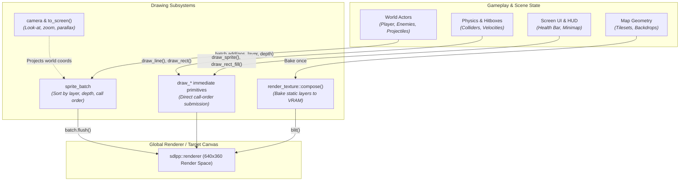
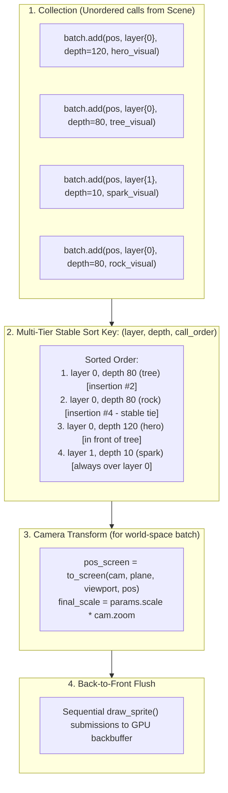
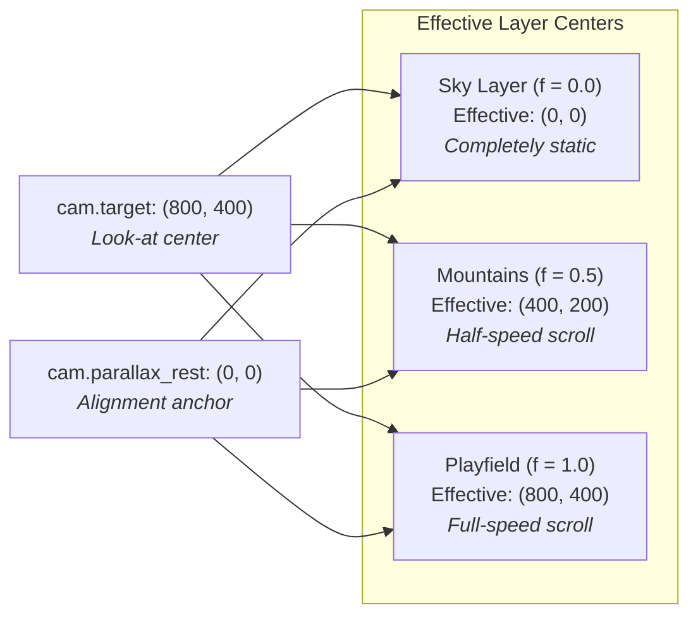

# Drawing

Rendering in a 2D engine is often caught between two extremes:
- **Pure immediate mode** makes drawing lines, debug hitboxes, and UI trivially easy, but struggles with 2.5D actor sorting, camera transformations, and batching.
- **Pure retained scene graphs** solve hierarchical transforms and sorting, but introduce heavy heap allocations, synchronization boilerplate, and friction for simple one-off draws.

Neutrino resolves this tension by providing **two distinct, complementary rendering paths** built on top of a unified geometry and camera model:

1. **Immediate Primitives ([`draw.hh`](pathname:///api/)):** Unbuffered, direct submissions to the GPU renderer in call order. Ideal for debug shapes, HUD frames, progress bars, and overlays.
2. **Depth-Sorted Batches ([`sprite_batch`](pathname:///api/)):** A lightweight draw sink that decouples *when* entities decide to draw from *how* they are projected, depth-sorted, and painter-ordered.

Alongside these paths, **Look-at Cameras ([`camera`](pathname:///api/))** provide mathematically exact, drift-free parallax projection, while **Offscreen Render Textures ([`render_texture`](pathname:///api/))** let you bake complex or static scenes to VRAM once and blit them cheaply.



---

## Vocabulary at a glance

| Type | Header | Role | Lifetime & Responsibility |
|---|---|---|---|
| [`draw_*`](pathname:///api/) | `<neutrino/video/draw.hh>` | Immediate-mode primitives & sprites | Free functions submitting directly to `get_renderer()` in call order. |
| [`sprite_draw_params`](pathname:///api/) | `<neutrino/video/draw.hh>` | Draw transform | Value struct: `.scale`, `.flip`, and `.rotation_degrees`. |
| [`draw_layer`](pathname:///api/) | `<neutrino/video/world/sprite_batch.hh>` | Coarse ordering band | Strongly-typed integer wrapper sorting categories before continuous depth. |
| [`sprite_batch`](pathname:///api/) | `<neutrino/video/world/sprite_batch.hh>` | Depth-sorted draw sink | Collects sprite visuals and states, sorts back-to-front, projects through a camera, and flushes. |
| [`camera`](pathname:///api/) | `<neutrino/video/world/camera.hh>` | 2D look-at camera | Defines viewport center (`target`), `zoom`, and parallax origin (`parallax_rest`). |
| [`render_texture`](pathname:///api/) | `<neutrino/video/render_texture.hh>` | Offscreen VRAM target | Target-access GPU texture. Use `compose()` to bake draws once, then `blit()` repeatedly. |
| [`render_layer`](pathname:///api/) | `<neutrino/video/world/render_layer.hh>` | Compositor slot | Game-owned layer slotted between static tile map layers in a `world_compositor`. |

---

## 1. Immediate-Mode Primitives (`<neutrino/video/draw.hh>`)

When you want to draw a health bar, highlight a selected tile, or visualize a physics collider, you do not want to construct a scene node. You want to call a function.

Neutrino provides immediate-mode free functions for points, lines, rectangles, circles, arrows, and crosses:

```cpp
#include <neutrino/video/draw.hh>
#include <sdlpp/video/color.hh>

// Draw filled and outlined geometry in render-space coordinates
neutrino::draw_rect_fill(neutrino::rect{10, 10, 120, 20}, sdlpp::colors::dark_gray);
neutrino::draw_rect_fill(neutrino::rect{12, 12, 80, 16},  sdlpp::colors::forest_green);
neutrino::draw_rect(neutrino::rect{10, 10, 120, 20},      sdlpp::colors::white);

// Specialized line styles for debugging vectors and paths
neutrino::draw_line(neutrino::point{0, 0}, neutrino::point{100, 100}, sdlpp::colors::red);
neutrino::draw_line_aa(neutrino::point{0, 10}, neutrino::point{100, 110}, sdlpp::colors::yellow);
neutrino::draw_line_thick(neutrino::point{0, 20}, neutrino::point{100, 120}, 3.0f, sdlpp::colors::cyan);
neutrino::draw_line_dashed(neutrino::point{0, 30}, neutrino::point{100, 130}, 8, 4, sdlpp::colors::magenta);
neutrino::draw_line_dotted(neutrino::point{0, 40}, neutrino::point{100, 140}, 6, sdlpp::colors::white);

// Directional vectors and markers
neutrino::draw_arrow(neutrino::point{50, 50}, neutrino::point{80, 20}, 8, 30.0f, 1.5f, sdlpp::colors::orange);
neutrino::draw_cross(neutrino::point{50, 50}, 4, 1.0f, sdlpp::colors::white);
```

### Color scoping & error reporting

Every draw function in `draw.hh` returns `sdlpp::expected<void, std::string>`. On success, the primitive was submitted to the GPU backbuffer; on failure (e.g. an invalidated graphics context), the expected contains SDL's error description.

Calls that take a trailing `sdlpp::color` apply that color for the single call and **automatically restore the previous draw color**:

```cpp
// 1. Explicitly sets global draw color for subsequent color-less calls:
neutrino::set_draw_color(sdlpp::colors::red);
neutrino::draw_point(10, 10);
neutrino::draw_point(11, 10);

// 2. Trailing color overload: sets green, draws, and restores red:
neutrino::draw_line(0, 0, 50, 50, sdlpp::colors::green);

// Still draws red!
neutrino::draw_point(12, 10);
```

### Immediate sprite drawing

You can also draw sprites immediately without a batch:

```cpp
neutrino::sprite_draw_params params{
    .scale = 2.0f,
    .flip = neutrino::sprite_flip::horizontal,
    .rotation_degrees = 45.0f,
};

// Draw a registered visual reference at an anchor point
neutrino::draw_sprite(neutrino::point{100, 150}, player_visual, params);

// Or draw an animated runtime state (advances automatically with the frame loop)
neutrino::draw_sprite(neutrino::point{200, 150}, player_instance.state(), params);
```

:::tip[Pixel-perfect tile stretching]
When rendering tile grids under fractional camera zoom, rounding position and size independently causes 1-pixel seams between neighboring tiles.

For this specific use case, `draw.hh` provides an explicit destination rectangle overload:
```cpp
neutrino::draw_sprite(neutrino::rect{x, y, w, h}, tile_visual, neutrino::sprite_flip::none);
```
Here, the caller derives `rect` from two projected world corners, guaranteeing that adjacent tiles share exact integer boundaries on screen.
:::

---

## 2. Depth-Sorted Batches (`<neutrino/video/world/sprite_batch.hh>`)

Immediate mode submits draws in **call order**. In top-down RPGs, 2.5D platformers, and isometric worlds, call order is not sufficient:

1. **The Painter's Problem:** An actor standing in front of another actor must be drawn on top of them, regardless of which entity's `update()` ran first.
2. **The Coordinate Collision Trap:** Games often fake layer sorting by adding arbitrary constants to the Y coordinate (e.g. `depth = pos.y + 1000` for capsules, `depth = pos.y + 2000` for particles). As soon as the map is taller than 1,000 units, a capsule at the top of the map draws *under* an actor at the bottom of the map.
3. **Z-Fighting on Ties:** When two sprites share the exact same depth, unstable sort algorithms cause them to flicker back and forth every frame.

`neutrino::sprite_batch` eliminates all three issues.



### The 3-tier sort key

Every sprite queued in a batch is ordered by three criteria:

```text
Sort Key = (draw_layer, depth, call_order)
```

1. **`draw_layer` (Coarse Category Band):** An explicit ordering band. A sprite in `draw_layer{1}` will **always** draw above all sprites in `draw_layer{0}`, even if its continuous depth is `-9999.0f`.
2. **`depth` (Fine Continuous Depth):** Typically the entity's Y-coordinate (`pos.y`). Orders objects naturally within the same category band.
3. **`call_order` (Stable Tie-Breaking):** The batch uses `std::stable_sort`. If two sprites have identical `draw_layer` and identical `depth`, their submission order is strictly preserved. No flickering or Z-fighting occurs.

```cpp
#include <neutrino/video/world/sprite_batch.hh>

// Category bands defined by your game
enum class game_layer : int {
    shadows     = 0,
    decorations = 1,
    actors      = 2,
    projectiles = 3,
    particles   = 4,
};

neutrino::draw_layer to_layer(game_layer l) {
    return neutrino::draw_layer{static_cast<int>(l)};
}

// Queueing into the batch
batch.add(tree_pos,   to_layer(game_layer::decorations), tree_pos.y,   tree_visual);
batch.add(shadow_pos, to_layer(game_layer::shadows),     hero_pos.y,   shadow_visual);
batch.add(hero_pos,   to_layer(game_layer::actors),      hero_pos.y,   hero_state);
batch.add(spark_pos,  to_layer(game_layer::particles),   spark_pos.y,  spark_visual);
```

### Screen-space vs. Camera-aware batches

A `sprite_batch` operates in one of two modes depending on its constructor:

#### 1. Screen-Space Batch (Default)
```cpp
neutrino::sprite_batch hud_batch;
```
Positions added to `hud_batch` are literal integer render pixels. No camera, parallax, or zoom is applied. This is the natural sink for UI components, floating health text, or compositing into a `render_texture`.

#### 2. World-Space Batch (Camera-Aware)
```cpp
neutrino::sprite_batch actor_batch(cam, viewport, plane);
```
Positions added to `actor_batch` are continuous `neutrino::world_point` coordinates. During `plan()` and `flush()`:
- Positions are transformed through [`to_screen()`](pathname:///api/) using the camera and layer parallax plane.
- The viewport's top-left corner is added automatically.
- The sprite's scale is multiplied by the camera zoom: `params.scale * cam.zoom`.

### The Plan & Flush lifecycle

A batch separates planning from drawing:

- **`batch.add(...)`**: Fast, unbuffered push to internal queue. Null options (`std::nullopt`) are safely ignored, allowing callers to pass lookup results directly without boilerplate guards.
- **`batch.plan()`**: Performs the stable sort and camera projection, returning a `std::vector<sprite_draw>`. It **does not draw** and does not clear the queue, allowing callers to inspect, debug, or pass draw commands to custom systems.
- **`batch.flush()`**: Calls `plan()`, iterates through the sorted vector, draws each valid entry via `draw_sprite()`, and clears the queue.

:::note[Resilient to asset errors]
`sprite_batch::flush()` follows the engine's no-throw draw policy: if a queued visual or animation state is invalid (e.g. uninitialized or expired lease), it is silently skipped as a no-op rather than throwing an exception or terminating the frame loop.
:::

---

## 3. The Camera Model & Parallax Plane Projection (`<neutrino/video/world/camera.hh>`)

In 2D tile engines, camera systems often suffer from **parallax drift**: when the camera pans, layers moving at different parallax speeds drift out of alignment, creating gaps between the background art and the playfield.

Neutrino prevents drift by formulating the camera as a **look-at target with an explicit parallax origin**:

```cpp
#include <neutrino/video/world/camera.hh>

neutrino::camera cam;
cam.target        = neutrino::world_point{640.0f, 360.0f}; // Look-at point shown at viewport center
cam.zoom          = 1.5f;                                  // Scale factor (>1 zooms in, <1 zooms out)
cam.parallax_rest = neutrino::world_point{0.0f, 0.0f};     // World point where all layers align
```

### The parallax projection math

When projecting a point `p` for a layer with parallax factor `f = (factor_x, factor_y)` and static offset `layer_offset`:

1. **Calculate the Effective Target:**
   ```text
   effective_target.x = rest.x + factor.x * (target.x - rest.x)
   effective_target.y = rest.y + factor.y * (target.y - rest.y)
   ```

   - When `factor = 1.0` (ordinary actor and tile layers), `effective_target = target`. The layer tracks the camera 1:1.
   - When `factor = 0.0` (distant sky or static wallpaper), `effective_target = rest`. The layer remains pinned to the rest origin regardless of where the camera travels.
   - When `target == rest`, `effective_target = rest` for **all** parallax factors. **Every parallax layer aligns perfectly at the rest point.**

2. **Project to Viewport Pixels:**
   The top-left world origin of the layer is found by backing off half the viewport:
   ```text
   layer_origin = effective_target - viewport / (2.0 * zoom) - layer_offset
   screen_pixel = round((p - layer_origin) * zoom)
   ```



### Visibility culling

Before drawing tile layers or dispatching actor updates, query the camera's visible range:

```cpp
// 1. For finite tile layers: returns [x0, x1) x [y0, y1) clamped to grid bounds
neutrino::cell_range range = neutrino::visible_cell_range(world, tile_layer, cam, viewport.dimensions());

for (int y = range.y0; y < range.y1; ++y) {
    for (int x = range.x0; x < range.x1; ++x) {
        // Only iterate and render cells currently inside the camera's frustum
    }
}

// 2. For infinite / chunked maps: returns unclamped floor/ceil bounds for chunk intersection
neutrino::cell_range bounds = neutrino::visible_cell_bounds(world, layer_header, cam, viewport.dimensions());
```

---

## 4. Offscreen Composition (`<neutrino/video/render_texture.hh>`)

Redrawing complex static geometry every frame wastes GPU fillrate. A static background, a procedurally generated minimap, or an ornate dialogue window should be **drawn once and reused**.

`neutrino::render_texture` wraps an RGBA target texture with automatic target guards and draw color restoration:

```cpp
#include <neutrino/video/render_texture.hh>
#include <neutrino/video/draw.hh>

// 1. Allocate an offscreen render target (RGBA8888 with alpha blending)
auto rt_opt = neutrino::render_texture::create(neutrino::dim{320, 240});
if (!rt_opt) {
    // Handle GPU allocation or driver failure
    return;
}
neutrino::render_texture rt = std::move(*rt_opt);

// 2. Compose into the texture once (e.g. during level load or on resize)
rt.compose([&] {
    // Everything drawn inside this lambda renders into the offscreen texture!
    neutrino::draw_rect_fill(neutrino::rect{0, 0, 320, 240}, sdlpp::colors::dark_slate_gray);
    neutrino::draw_circle_fill(neutrino::circle{160, 120, 80}, sdlpp::colors::goldenrod);
    neutrino::draw_line(neutrino::point{0, 0}, neutrino::point{320, 240}, sdlpp::colors::white);
}, /* clear_color = */ sdlpp::colors::transparent);

// 3. Blit the cached texture every frame during scene rendering
// 1:1 blit at origin:
rt.blit();

// Or scaled/positioned blit:
rt.blit(neutrino::rect{50, 50, 160, 120});
```

### Safety guarantees in `compose()`

Rendering to an offscreen texture typically requires tedious bookkeeping: binding the target, setting blend modes, resetting draw colors, and remembering to restore the window backbuffer.

`render_texture::compose` handles this via RAII:
- Uses `sdlpp::renderer::target_guard` to guarantee the original render target is restored even if an exception is thrown.
- Scopes the renderer's draw color: records `get_draw_color()`, clears the texture to the requested clear color, executes the callback, and restores the previous draw color.
- Sets `sdlpp::blend_mode::blend` on the target texture, so transparent regions composite naturally over whatever background exists when blitted.

---

## 5. Putting It All Together: A Multi-Layer Scene Architecture

Here is how a real game scene coordinates offscreen render textures, camera-aware sprite batches, and immediate-mode UI:

```cpp
#include <neutrino/scene/base_scene.hh>
#include <neutrino/video/draw.hh>
#include <neutrino/video/render_texture.hh>
#include <neutrino/video/world/camera.hh>
#include <neutrino/video/world/sprite_batch.hh>

class gameplay_scene final : public neutrino::base_scene {
public:
    void on_enter() override {
        // 1. Bake static backdrop into an offscreen render texture once
        m_backdrop = neutrino::render_texture::create(neutrino::dim{640, 360});
        if (m_backdrop) {
            m_backdrop->compose([&] {
                bake_static_level_art();
            });
        }

        // 2. Configure camera
        m_cam.target = neutrino::world_point{320.0f, 180.0f};
        m_cam.zoom = 1.0f;
    }

    void render() override {
        const neutrino::rect viewport{0, 0, 640, 360};

        // Pass 1: Blit static baked backdrop (0 draw calls for individual tiles)
        if (m_backdrop) {
            m_backdrop->blit();
        }

        // Pass 2: Depth-sorted gameplay actors using camera batch
        neutrino::world_layer_header actor_plane; // parallax = 1.0
        neutrino::sprite_batch actor_batch(m_cam, viewport, actor_plane);

        // Queue all active game entities
        for (const auto& enemy : m_enemies) {
            actor_batch.add(
                neutrino::to_world_point(enemy.position),
                neutrino::draw_layer{1}, // Actors band
                enemy.position.y,        // Y-depth sorting
                enemy.sprite.state()
            );
        }

        // Queue player
        actor_batch.add(
            neutrino::to_world_point(m_player.position),
            neutrino::draw_layer{1},
            m_player.position.y,
            m_player.sprite.state()
        );

        // Sorts by (layer, depth, call order), projects through camera, and draws
        actor_batch.flush();

        // Pass 3: Immediate-mode debug overlays (hitboxes & velocity vectors)
        if (m_show_debug) {
            for (const auto& enemy : m_enemies) {
                const auto sp = neutrino::to_screen(m_cam, viewport.dimensions(), neutrino::to_world_point(enemy.position));
                neutrino::draw_rect(neutrino::rect{sp.x - 16, sp.y - 32, 32, 32}, sdlpp::colors::red);
            }
        }

        // Pass 4: Immediate-mode HUD in screen space
        draw_hud();
    }

private:
    void bake_static_level_art() {
        neutrino::draw_rect_fill(neutrino::rect{0, 0, 640, 360}, sdlpp::colors::midnight_blue);
        // ... draw mountains, distant stars, etc. ...
    }

    void draw_hud() {
        // Literal render pixels: top-left HUD health bar
        neutrino::draw_rect_fill(neutrino::rect{20, 20, 200, 16}, sdlpp::colors::dark_gray);
        neutrino::draw_rect_fill(neutrino::rect{22, 22, 150, 12}, sdlpp::colors::crimson);
        neutrino::draw_rect(neutrino::rect{20, 20, 200, 16}, sdlpp::colors::white);
    }

    neutrino::camera m_cam;
    std::optional<neutrino::render_texture> m_backdrop;
    // ... player and enemies ...
};
```

---

## Summary & Next Steps

Neutrino's drawing architecture is designed so you never fight the engine:
- Use **`draw.hh`** when you want simple, call-order drawing with zero setup.
- Use **`sprite_batch`** when entities need camera transforms and depth sorting across categorical bands.
- Use **`camera`** for drift-free look-at targeting and parallax math.
- Use **`render_texture`** to turn expensive repeated draws into simple single-pass blits.

For more details on how these pieces fit into the rest of the engine, continue to:
- **[Sprites](./sprites.md)** — how definitions, cache leases, and runtime instances feed into visuals.
- **[Coordinate spaces](./coordinate-spaces.md)** — the strong typing behind window, render, and world space.
- **[The frame](./the-frame.md)** — the simulation loop that drives `fixed_update` and `render`.
