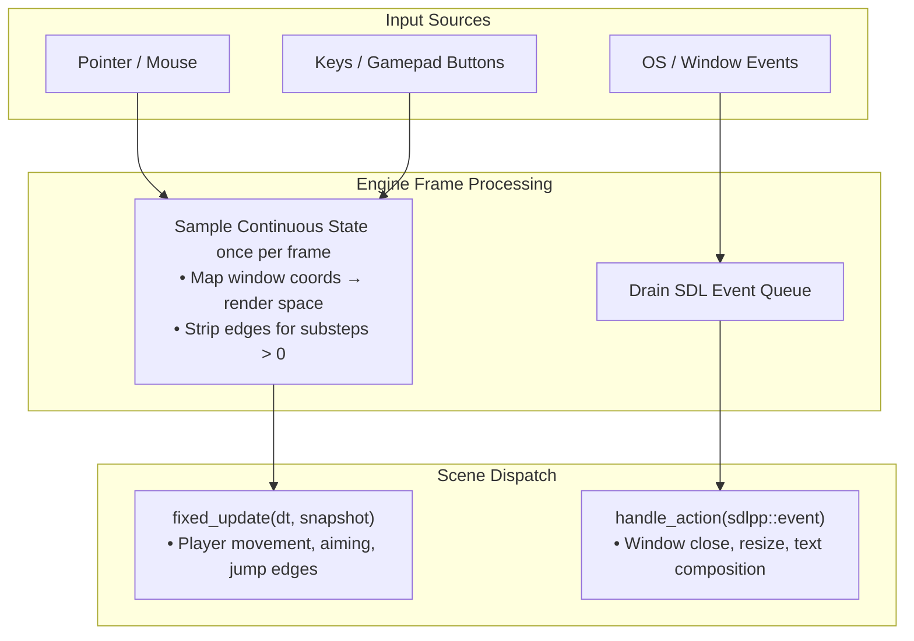

# Input

Input reaches your game two ways, and choosing correctly between them prevents most input bugs:

- **Continuous state** — where the pointer is, whether a key is down — arrives as a **snapshot**
  passed to `fixed_update`.
- **Discrete events** — a window closing, text being typed — arrive as raw SDL events in
  `handle_action`.

The division is not stylistic. Continuous input read from events only updates *when an event
happens*, so a value the player is holding steady goes stale. The snapshot is sampled every frame
regardless, so it is always current.



See [Tutorial Step 1: A window and an empty scene](../tutorial/step-01-window-and-scene.md) for how
scenes inspect input and react to actions.

## The snapshot

```cpp
void my_scene::fixed_update(neutrino::sim_duration dt, const neutrino::input_snapshot& in) {
    if (in.pointer().on_screen) {
        m_cursor = in.pointer().render;
    }
    if (in.mouse(sdlpp::mouse_button::left).pressed) {
        fire();                                   // exactly once per physical click
    }
    if (in.mouse(sdlpp::mouse_button::right).held) {
        aim();                                    // every step the button is down
    }
}
```

`input_snapshot` is a plain value type with no service lookup behind it, which means you can
construct one in a test and drive a scene with synthetic input:

```cpp
const neutrino::input_snapshot in{
    neutrino::pointer_state{{100.0f, 50.0f}, {50.0f, 25.0f}, true},
    neutrino::button_state{true, false, true},   // left: pressed this step, and held
    {}, {}
};
scene.fixed_update(neutrino::sim_duration{1.0f / 60.0f}, in);
```

## Edges versus held

Every button reports three booleans, and they answer different questions:

| Field | Meaning | True for |
|---|---|---|
| `pressed` | Transitioned to down | The one step it went down |
| `released` | Transitioned to up | The one step it came up |
| `held` | Is currently down | Every step it is down |

`pressed` and `released` are **edges** — moments. `held` is a **state**.

Use `pressed` for one-shot actions (fire, jump, confirm) and `held` for continuous ones (walk,
charge). Using `held` where you meant `pressed` gives you a weapon that fires every simulation step
you keep the trigger down.

### Why this needs engine machinery

A frame samples input once, but [may run several fixed substeps](./the-frame.md). Handing the same
snapshot to each would replay the transition — and at the default 120 Hz simulation on a 60 Hz
display, that is two substeps per frame, so **every click fires twice**.

So the engine delivers edges to exactly one substep:

- **substep 0** gets the full snapshot, edges included
- **later substeps** get a copy with `pressed` and `released` cleared, `held` intact

You do not have to do anything to get this; it is worth knowing because it explains why `held` and
the edges behave differently across a frame, and why you must not cache a snapshot and re-read it
later.

:::note[One honest gap]

A press that begins *and ends* within a frame that runs **zero** substeps is seen only if the
button is still down on the next stepping frame. In practice that requires a frame rate far above
the simulation rate and a click shorter than one frame. A latch could close it; nothing has needed
one yet.
:::

## Pointer position: two spaces

```cpp
struct pointer_state {
    window_pos window;    // raw window pixels, as SDL delivers them
    render_pos render;    // logical presentation space, what scenes draw in
    bool on_screen;
};
```

These are **different types on purpose**. They differ by the HiDPI scale factor and by
logical-presentation letterboxing, so they coincide only on an unscaled window whose aspect ratio
matches exactly — which is to say, frequently on the developer's machine and rarely on a player's.

Before the types were separated, using one where the other belonged compiled fine and produced a
cursor that drifted from the pointer under display scaling. Now it is a compile error, and
`render` — already mapped for you — is what a scene almost always wants.

If you do need to convert, the mapping is available in both directions:

```cpp
const neutrino::render_pos r = neutrino::to_render_coords(w);
const neutrino::window_pos w2 = neutrino::to_window_coords(r);
```

### Always check `on_screen`

`on_screen` is false when the pointer is outside the window, when no pointer has been seen yet, and
when your scene is [covered by an overlay](./scenes.md#only-the-top-scene-receives-input).

**A scene that steers anything from the pointer must check it.** The position is not meaningful
when it is false, and acting on it snaps whatever you are steering to an arbitrary spot — the
classic symptom being a paddle or cursor that jumps to a corner before the player has touched the
mouse.

```cpp
if (in.pointer().on_screen) {
    model.set_target(static_cast<int>(in.pointer().render.x));
}
// else: hold the last target. Do not steer from a meaningless position.
```

## Keyboard, Gamepad, and Query Matchers

The `input_snapshot` provides complete coverage of all continuous inputs across pointer, mouse buttons, keyboard keys, and gamepads.

You can query keys, buttons, and axes directly from the snapshot:

```cpp
// Direct keyboard queries
if (in.pressed(sdlpp::scancode::space)) { fire(); }     // edge
if (in.held(sdlpp::scancode::a))        { move_left(); } // state

// Direct gamepad queries (slot 0 = Player 1)
if (in.gamepad_button_state(0, sdlpp::gamepad_button::south).pressed) { jump(); }
const float move_x = in.gamepad_axis(0, sdlpp::gamepad_axis::leftx);
```

### Expressive matchers: `hotkey`, `mouse_click`, `gamepad_button`

For shortcuts, modifiers, or complex key matching, use query matchers. Matchers are pure query specifications evaluated against the frame snapshot:

```cpp
neutrino::hotkey jump{sdlpp::scancode::SPACE};
neutrino::hotkey save{neutrino::modifier::ctrl, sdlpp::scancode::S};
neutrino::mouse_click ctrl_click{neutrino::modifier::ctrl, sdlpp::mouse_button::left};
neutrino::gamepad_button shoot{sdlpp::gamepad_button::right_trigger};

// Symmetric evaluation:
if (in.pressed(jump))         { ... } // or: jump.pressed(in)
if (in.held(jump))            { ... } // or: jump.held(in)
if (in.pressed(save))         { ... } // or: save.pressed(in)
if (in.pressed(ctrl_click))   { ... } // or: ctrl_click.pressed(in)
if (in.pressed(shoot))        { ... } // or: shoot.pressed(in)
```

A `hotkey` can match either a **scancode** (physical key position, layout-independent — right for
WASD movement) or a **keycode** (the logical key in the current layout — right for a shortcut the
player thinks of as "S"). Modifiers match strictly: `modifier::ctrl` requires Ctrl, and
side-specific values like `lctrl` require that particular key.

:::tip[Architectural guarantees of the snapshot]

Because queries are strictly evaluated against the `input_snapshot`:
1. **Scene stack isolation:** When a scene is covered by a pause menu or modal dialog, it automatically receives a neutral snapshot (`no_input`). Key and button presses cannot accidentally leak into background scenes.
2. **Headless testability:** You can construct a synthetic `input_snapshot` in a unit test and simulate any combination of keys, clicks, or gamepad axes without needing a running SDL application.
3. **Multi-substep determinism:** One-shot edges (`pressed`, `released`) fire exclusively on substep 0, while continuous states (`held`, axes) survive across all substeps via `in.without_edges()`.
:::

## Common pitfalls

- **Steering from the pointer without checking `on_screen`:** If the cursor leaves the window or the
  scene is covered by an overlay, `pointer.on_screen` is false. Ignoring this will snap objects to stale
  or zero coordinates (e.g. paddles darting to the corner).
- **Using `held` where you wanted a single trigger:** Checking `.held` for a jump or weapon fire will execute
  every simulation substep (e.g. firing 120 bullets/sec at the default tick). Always use `.pressed()` for
  one-shot transitions.
- **Handling continuous motion in `handle_action()`:** Moving entities inside SDL key-down events causes jerky,
  OS-key-repeat dependent motion. Movement belongs in `fixed_update` with `.held` or axis queries.

## Next

[Concepts index](./index.md) for what else is written, or the [tutorial](../tutorial/index.md) for
input in the context of a game being built.
