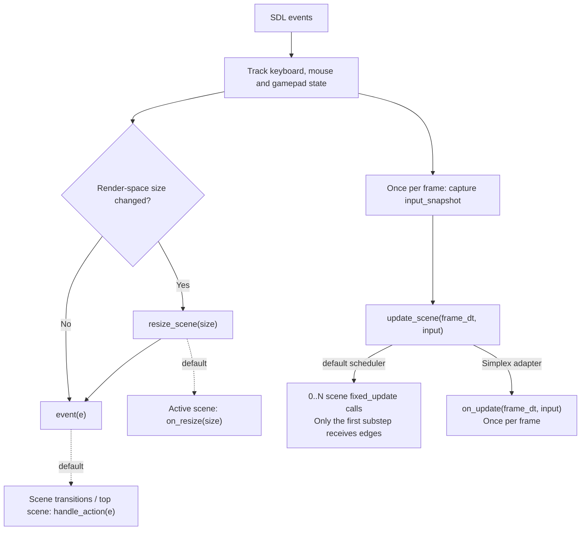

# Input

The application captures one `input_snapshot` per frame. It contains pointer position,
button and key states, wheel movement, and gamepad state. Use it for movement and aiming,
and use its `pressed` and `released` edges for one-shot actions.

Raw SDL events carry individual notifications such as text input and window events.
The engine also uses input events to maintain the state copied into the snapshot.
Move an object during an update using held state; moving it only on key-down events
would make its speed depend on OS key repeat.

## Where input is delivered

| Hook | When it runs | Default behavior |
|---|---|---|
| `application::update_scene(float dt, const input_snapshot& input)` | Once per frame, including frames with no scenes or simulation steps | Runs the scene stack's fixed-step scheduler. An override replaces that scheduler. |
| `base_scene::fixed_update(sim_duration dt, const input_snapshot& input)` | Zero or more times per frame under the default scheduler | Your scene implements simulation using a constant time step. |
| `simplex::application::on_update(float dt, const input_snapshot& input)` | Once per frame | Your Simplex callback receives elapsed seconds and the frame snapshot; return `false` to stop. |

The final application callbacks keep common input bookkeeping in place. After input
tracking, `handle_event()` detects render-space size changes and calls `resize_scene(size)`
when needed, then calls `event(e)`:

- The default `event(e)` dispatches scene transitions and forwards other events to the
  top scene's `handle_action(e)`. Overriding it replaces that dispatch; call
  `application::event(e)` explicitly if you also want the default behavior.
- The default `resize_scene(size)` calls the active scene's `on_resize(size)`. An override
  replaces this notification. Scene activation delivers an initial size separately;
  an application without scenes can query `render_size()` in `ready()`.
- The default event and resize hooks contain scene exceptions. Exceptions from custom
  overrides propagate to the application entry point.

Simplex replaces the scene update, rendering, event, and resize hooks. It forwards the
snapshot to `on_update()` and lets SDL presentation scale its fixed canvas. It does not
dispatch raw events to scenes. Ignored scene-transition requests remain owned until shutdown.


```mermaid
flowchart TD
    Pump["SDL events"] --> Track["Track keyboard, mouse and gamepad state"]
    Track --> Size{"Render-space size changed?"}
    Size -- Yes --> Resize["resize_scene(size)"]
    Resize --> Event["event(e)"]
    Size -- No --> Event
    Resize -. "default" .-> SceneResize["Active scene: on_resize(size)"]
    Event -. "default" .-> Actions["Scene transitions / top scene: handle_action(e)"]
    Track --> Sample["Once per frame: capture input_snapshot"]
    Sample --> Update["update_scene(frame_dt, input)"]
    Update -- "default scheduler" --> Steps["0..N scene fixed_update calls<br/>Only the first substep receives edges"]
    Update -- "Simplex adapter" --> Simplex["on_update(frame_dt, input)<br/>Once per frame"]
```

Overriding `update_scene()` does not automatically disable scene event dispatch. Each hook
can be replaced independently. See [Scenes](./scenes.md) for the default stack behavior.

For example, this complete Simplex application checks Escape once per frame:

```cpp
#include <neutrino/simplex/entry_point.hh>

class input_demo final : public neutrino::simplex::application {
public:
    input_demo() : application(320, 200, "Input demo", 3.0f) {}

    bool on_update(float, const neutrino::input_snapshot& input) override {
        return !input.pressed(neutrino::key::escape);
    }
};

SIMPLEX_MAIN(input_demo)
```

## The snapshot

In a scene, use the snapshot passed to each simulation step:

```cpp
void my_scene::fixed_update(neutrino::sim_duration dt, const neutrino::input_snapshot& in) {
    if (in.pointer().on_screen) {
        m_cursor = in.pointer().render;
    }
    if (in.mouse(neutrino::mouse_button::left).pressed) {
        fire();                                   // only on a delivered press edge
    }
    if (in.mouse(neutrino::mouse_button::right).held) {
        aim();                                    // every step the button is down
    }
}
```

The snapshot stores input state by value. You can construct one in a test and drive a
scene with synthetic input:

```cpp
const neutrino::input_snapshot in{
    neutrino::pointer_state{{100.0f, 50.0f}, {50.0f, 25.0f}, true},
    neutrino::button_state{true, false, true},   // left: pressed this frame, and held
    {}, {}
};
scene.fixed_update(neutrino::sim_duration{1.0f / 60.0f}, in);
```

The reference passed to an update callback is valid during that call. A saved copy records
past input; its edges do not clear themselves. Do not reuse it as fresh input in later frames.
Keycode queries also have a [keyboard-layout dependency](#scancodes-keycodes-and-modifiers).

## Edges versus held

Every button reports three booleans:

| Field | Meaning in the frame snapshot |
|---|---|
| `pressed` | A transition to down was recorded for this frame. |
| `released` | A transition to up was recorded for this frame. |
| `held` | The button is currently down. |

`pressed` and `released` are **edges**; `held` is a **state**. Use `pressed` for one-shot
actions such as fire, jump, and confirm. Use `held` for continuous actions such as walking
or charging. A snapshot describes state and edges, not a queue counting every physical click.

### Input across simulation substeps

A frame samples input once, but [may run several fixed substeps](./the-frame.md). Passing
the full snapshot to every substep would repeat the same one-shot action within that frame.
The default scene scheduler therefore delivers edges to **at most one substep**:

- **Substep 0**, if it runs, gets the full snapshot, including edges and wheel movement.
- **Later substeps** get `input.without_edges()`: `pressed`, `released`, and wheel movement
  are cleared; held state, axes, modifiers, and pointer position remain available.

This applies to the snapshot supplied to `fixed_update()`, which is the engine's input API:
there is no separate live-polling call that could report the same `pressed` edge in several
substeps.

:::caution[Frames with no simulation steps]

The current scene scheduler does **not** latch edges for a future simulation step. If a
frame runs zero substeps, its press/release edges and wheel movement are cleared at frame
completion without reaching `fixed_update()`.

This also affects a press that remains held: the next stepping frame sees `held == true`
but `pressed == false`. It does not require a short click; for example, a 144 Hz display
with a 120 Hz simulation can have frames with no simulation step.

The per-frame `update_scene()` hook and Simplex's `on_update()` still receive that frame's
snapshot. Guaranteed delivery to fixed-step logic would require buffering actions until
a simulation step consumes them; the default scheduler currently does not do this.
:::

## Pointer position: two spaces

```cpp
struct pointer_state {
    window_pos window;    // window coordinates (points), as SDL reports mouse positions
    render_pos render;    // coordinates mapped into the renderer's view
    bool on_screen;
};
```

Window coordinates are not necessarily drawable pixels. A HiDPI window can have more
drawable pixels than window points, and logical presentation can add scaling and letterboxing.
The distinct `window_pos` and `render_pos` types prevent accidentally mixing these spaces.
Use `pointer().render` for drawing and hit testing in render space.

For diagrams, worked HiDPI examples, and button, viewport, and minimap use cases, see
[window and renderer coordinates](./window-and-renderer-coordinates.md).

If you need to convert explicitly, the mapping is available in both directions:

```cpp
const neutrino::render_pos r = neutrino::to_render_coords(w);
const neutrino::window_pos w2 = neutrino::to_window_coords(r);
```

### Always check `on_screen`

The engine samples the live pointer position from SDL, including on the first frame, and
uses mouse focus to determine availability. `on_screen` is false when there is no mouse
focus and in the neutral snapshot supplied to a [covered scene](./scenes.md#only-the-top-scene-receives-input).
It does not depend on receiving a first mouse-motion event.

```cpp
if (in.pointer().on_screen) {
    model.set_target(static_cast<int>(in.pointer().render.x));
}
// Otherwise, keep the last target.
```

Mouse focus does not imply that the pointer is inside the logical canvas. Over letterbox
bars, the mapped render position can lie outside the canvas; check your content bounds
as well when deciding whether a click should interact with it.

## Keyboard, Gamepad, and Query Matchers

Query keys, mouse buttons, wheel movement, and gamepad buttons or axes from the snapshot:

```cpp
if (in.pressed(neutrino::key::space)) { fire(); }      // edge
if (in.held(neutrino::key::a))        { move_left(); } // state

// Gamepad slot 0 is Player 1.
if (in.gamepad_button_state(0, neutrino::pad_button::south).pressed) { jump(); }
const float move_x = in.gamepad_axis(0, neutrino::pad_axis::leftx);
const float trigger = in.gamepad_axis(0, neutrino::pad_axis::right_trigger);
```

Triggers are **axes**, not `gamepad_button` values. A trigger threshold tests a level;
detecting a one-shot threshold crossing requires comparing against previous state.

### Expressive matchers: `hotkey`, `mouse_click`, `gamepad_button`

Matchers describe which key or button to query and, for keyboard and mouse shortcuts,
which modifiers must be present:

```cpp
const neutrino::hotkey jump_key{neutrino::key::space};
const neutrino::hotkey save_key{neutrino::modifier::ctrl, neutrino::key::s};
const neutrino::mouse_click ctrl_click{neutrino::modifier::ctrl, neutrino::mouse_button::left};
const neutrino::gamepad_button shoot_button{neutrino::pad_button::right_shoulder};

if (in.pressed(jump_key))     { jump(); }          // equivalent to jump_key.pressed(in)
if (in.held(jump_key))        { charge_jump(); }   // equivalent to jump_key.held(in)
if (in.pressed(save_key))     { save(); }
if (in.pressed(ctrl_click))   { select(); }
if (in.pressed(shoot_button)) { fire(); }
```

### Scancodes, keycodes, and modifiers

A **scancode** identifies a physical key position, useful for layout-independent movement.
A **keycode** identifies a logical key in the current keyboard layout, useful for a
shortcut the player thinks of as a letter. Both are accepted by `hotkey`.

Scancode queries and mouse/gamepad matchers read only stored snapshot state. Keycode
queries, including keycode-based `hotkey` matchers, call SDL to resolve the keycode to a
scancode **at query time**. The snapshot does not capture that layout mapping. Use scancodes
or resolved game actions for tests and replay data that must be independent of SDL's current layout.

Modifier matching is strict:

- `hotkey{scancode::space}` requires no modifiers. Direct `in.pressed(scancode::space)`
  ignores modifiers.
- `modifier::ctrl` accepts either Ctrl key, but rejects additional Shift, Alt, or GUI modifiers.
- `modifier::lctrl` requires left Ctrl and rejects right Ctrl, including when both are held.

:::tip[Testing and replay]

Construct synthetic snapshots with `set_key()`, `set_mouse()`, and the gamepad setters.
For gamepad tests, also call `set_gamepad_connected(slot, true)`; queries treat disconnected
slots as neutral. Scancode, mouse, and gamepad queries need no running SDL application.

The default scene stack supplies a neutral snapshot to covered scenes that continue updating.
This isolation and the per-substep edge stripping apply to the snapshots it dispatches,
not to live polling APIs.

Recording snapshots or resolved actions can support replay, but does not by itself guarantee
identical results. Reproduction also needs the same initial state, simulation-step sequence,
randomness, and other external inputs, together with deterministic simulation behavior.
:::

## Common pitfalls

- **Ignoring pointer availability or content bounds:** Check `on_screen`, then check canvas
  bounds when clicks over letterbox bars should be ignored.
- **Using held state for a one-shot action:** It repeats on every simulation step while down.
- **Polling live state inside a scene update:** It bypasses substep edge stripping and scene
  input isolation. Use the supplied snapshot.
- **Moving on key-down events:** Movement should use held state during `fixed_update()` or
  a per-frame application update, rather than advancing only when key-repeat events arrive.
- **Expecting every press to reach a fixed step:** Account for the current zero-substep
  limitation described above.

## Next

See [The frame](./the-frame.md) for fixed-step scheduling, or follow
[Step 3: Moving with the keyboard](../tutorial/step-03-moving-with-keyboard.md) for a scene-based example.
