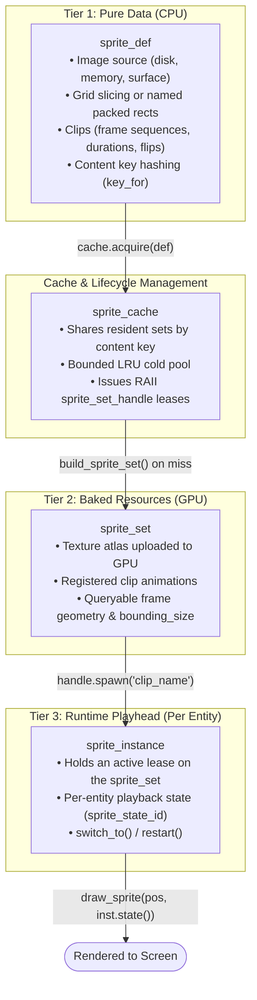

# Sprites

In many 2D game engines, a "Sprite" is a single monolithic class holding everything: the image file, the GPU
texture, the current animation frame, the position on screen, and the rendering logic.

That coupling causes immediate architectural friction:
- Every enemy instance reloads or duplicates texture memory.
- Loading or validating assets requires an active window and GPU context, making automated tests painful.
- Destroying an entity can unregister an animation while another entity is mid-frame.

Neutrino separates sprites into a **three-tier architecture**:



---

## Tier 1: Pure Data (`sprite_def`)

A [`sprite_def`](pathname:///api/) is a plain C++ data structure with **zero GPU state**. It can be constructed,
serialized, or content-hashed anywhere without a running window or graphics driver.

A definition consists of:
1. **`image`**: An atlas source (`world_image`) referencing an image path on disk, raw memory bytes, or an in-memory `sdlpp::surface`.
2. **`grid`** *(optional)*: Uniform slicing for spritesheets laid out in regular rows and columns.
3. **`visuals`** *(optional)*: Explicit named sub-rectangles with pivots, origins, and optional transparent trimming.
4. **`clips`**: Named animations referencing visuals by name with durations and flip flags.

### Uniform grid slicing

For traditional spritesheets with uniform cells, define a `sprite_grid`:

```cpp
neutrino::sprite_def def;
def.image = neutrino::world_image{"assets/characters.png"};

def.grid = neutrino::sprite_grid{
    .cell_w = 32,
    .cell_h = 32,
    .margin = 0,
    .spacing = 0,
    .origin = neutrino::sprite_origin_rule::bottom_center,
};
```

This auto-generates frames named `"0"`, `"1"`, ..., `"N-1"` in row-major order.
The `origin` rule automatically anchors the pivot (for instance, `bottom_center` ensures the character's feet
rest consistently on ground colliders across different animations).

### Explicit named visuals and trimming

For packed atlases where frames have varying sizes or trimmed transparency:

```cpp
def.visuals = {
    {.name = "player.idle", .src = {0, 0, 32, 32}, .origin = {16, 32}},
    {.name = "player.run.0", .src = {32, 0, 32, 32}, .origin = {16, 32}},
    {.name = "player.run.1", .src = {64, 0, 32, 32}, .origin = {16, 32}},
    {.name = "spark", .src = {192, 0, 16, 16}, .origin = {8, 16}},
};
```

### Defining animation clips

Clips bind visuals into timed sequences:

```cpp
def.clips = {
    {
        .name = "idle",
        .frames = {
            {.visual = "player.idle", .duration = neutrino::sprite_animation_duration{100.0f}},
        },
        .loop = true,
    },
    {
        .name = "run",
        .frames = {
            {.visual = "player.run.0", .duration = neutrino::sprite_animation_duration{80.0f}},
            {.visual = "player.run.1", .duration = neutrino::sprite_animation_duration{80.0f}},
        },
        .loop = true,
    },
};
```

---

## Tier 2: Baked Resources (`sprite_set` & `sprite_cache`)

Calling `build_sprite_set(def)` decodes the atlas image, uploads the GPU texture, and registers
the animation clip curves with the engine's animation subsystem.

### Queryable geometry without source data

Once built, a `sprite_set` is **queryable**. Gameplay systems can query collision boxes and visual extents
directly from the set without keeping the original art files or `sprite_def` in memory:

```cpp
// Query pixel bounds:
std::optional<neutrino::rect> rect = set.frame_rect("player.idle");
std::optional<neutrino::point> pivot = set.origin("player.idle");

// Maximum bounding size across an animation range:
neutrino::dim bounds = set.bounding_size();
```

### The Sprite Cache & Refcounted Leases

Instead of building sets manually, games use `neutrino::sprite_cache`:

```cpp
neutrino::sprite_cache cache;

// Returns a RAII lease (sprite_set_handle):
neutrino::sprite_set_handle handle = cache.acquire(def);
```

- **Content-Keyed Sharing:** Two calls to `acquire()` with identical contents share the same underlying
  GPU resources via `key_for(def)`.
- **LRU Cold Pool:** When the last entity holding a `sprite_set_handle` drops its lease, the set is not
  immediately destroyed. It moves to an LRU cold pool (default 8 items) to avoid thrashing GPU reallocations
  if the same asset is requested again shortly.

---

## Tier 3: Runtime Instances (`sprite_instance`)

A single `sprite_set` can be shared across hundreds of active enemies, but each enemy needs its own
**playback state** (which frame is currently playing, elapsed animation time, and current clip).

This is represented by `neutrino::sprite_instance`:

```cpp
class player_actor {
public:
    void init(neutrino::sprite_set_handle set) {
        // Spawn a per-instance playhead for the "idle" clip:
        m_sprite = set.spawn("idle");
    }

    void set_running(bool running) {
        if (running) {
            // Switches clip, preserving elapsed phase:
            m_sprite.switch_to("run");
        } else {
            m_sprite.switch_to("idle");
        }
    }

    void draw(neutrino::point screen_pos) {
        // Draw the current state:
        neutrino::draw_sprite(screen_pos, m_sprite.state());
    }

private:
    neutrino::sprite_instance m_sprite;
};
```

### Safe Teardown by Construction

A common bug in game engines is dangling animation states: when an entity dies, its destructor frees its
animation object *after* the texture atlas has already been evicted from the GPU.

`sprite_instance` prevents this by holding a copy of the `sprite_set_handle` lease. Its destructor unregisters
the runtime playback state **first**, while the set's GPU resources are guaranteed resident by the lease.
Only then is the lease dropped.

---

## Drawing sprites

Neutrino offers two ways to draw sprites:

### 1. Immediate Mode Drawing

For simple scenes or HUD rendering, use `neutrino::draw_sprite`:

```cpp
neutrino::sprite_draw_params params{
    .scale = 2.0f,
    .flip = facing_left ? neutrino::sprite_flip::horizontal : neutrino::sprite_flip::none,
    .rotation_degrees = 0.0f,
};

neutrino::draw_sprite(render_point, m_sprite.state(), params);
```

### 2. Depth-Sorted Batching

For worlds with multiple actors, props, and depth sorting, pass the instance state to a `sprite_batch`:

```cpp
batch.add(actor_world_pos, m_sprite.state(), draw_layer{1}, depth);
```

---

## Common pitfalls

- **Declaration order in scene classes:** Because destruction in C++ happens in reverse declaration order,
  declare the cache **before** handles, and handles **before** instances:
  ```cpp
  class game_scene : public neutrino::base_scene {
      neutrino::sprite_cache    m_cache;  // Destroyed LAST
      neutrino::sprite_set_handle m_set;  // Destroyed second
      neutrino::sprite_instance m_player; // Destroyed FIRST
  };
  ```
- **Rebuilding `sprite_def` every frame:** A `sprite_def` is intended to be defined once and acquired via
  the cache. Do not reconstruct or reload image surfaces inside `fixed_update` or `render`.
- **Manual string concatenation in hot loops:** Sliced grid frames can be accessed by zero-based integer index
  (`set.visual(0)`) rather than building string keys (`set.visual(std::to_string(i))`).

---

## Next

- **Drawing & Depth Batches** *(planned)* — how `sprite_batch`, ordering bands, and cameras manage 2D layering.
- [Tutorial: One sprite on screen](../tutorial/step-01-window-and-scene.md) — step-by-step implementation of sprites in a running game.
