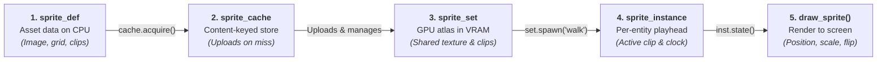
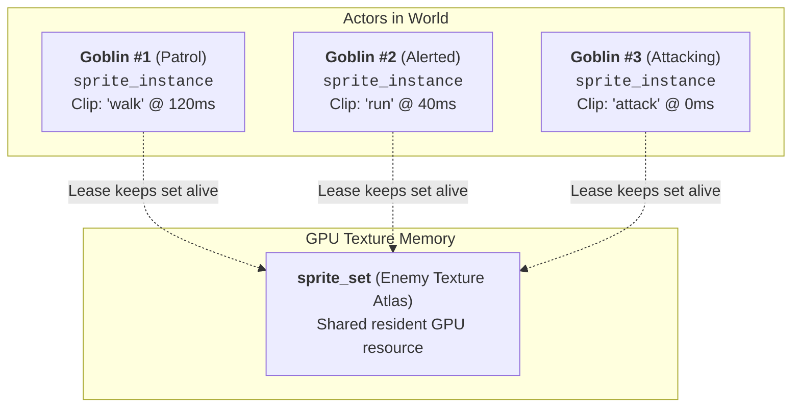
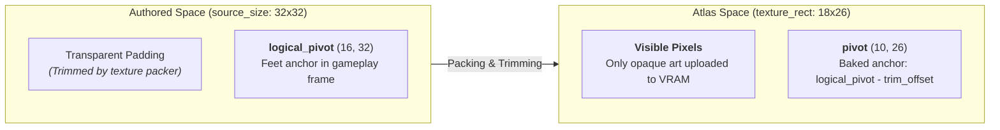

# Sprites

In many 2D game frameworks, a "Sprite" is a monolithic class that bundles together an image file, a GPU texture,
an animation clock, an $(x, y)$ world position, and rendering code.

In a non-trivial game, that coupling quickly causes architectural friction:
- **Redundant GPU Memory:** Spawning 50 goblin enemies reloads or duplicates texture memory unless wrapped in custom managers.
- **Painful Automated Testing:** You cannot test asset loading, frame slicing, or animation logic without initializing an active window and GPU context.
- **Coupling Appearance to Position:** A sprite is *what an object looks like*, not *where a physics body lives*. Storing world positions in sprite classes leads to synchronization bugs between physics and rendering.
- **Teardown & Dangling Pointer Bugs:** If an enemy dies and destroys its animation while the texture is still in use (or conversely, if a scene transition unloads a texture while an enemy is mid-frame), the game crashes with a use-after-free.

Neutrino solves this by decoupling sprites into a clean pipeline of distinct responsibilities:



---

## Vocabulary at a glance

| Type | Residence | Purpose | Ownership & Lifetime |
|---|---|---|---|
| [`sprite_def`](pathname:///api/) | CPU | Pure asset description: image source, frame slicing rules, and animation clips. | Value object. Created, serialized, or tested without GPU. |
| [`sprite_set`](pathname:///api/) | GPU | Uploaded texture atlas, frame geometry, and registered animation curves. | Owned by a `sprite_cache` or `render_bundle`. Shared across entities. |
| [`sprite_cache`](pathname:///api/) | CPU & GPU | Content-keyed registry with an LRU cold pool. Deduplicates identical definitions. | One instance per game/scene. Must outlive all handles it issues. |
| [`sprite_set_handle`](pathname:///api/) | Lease | RAII handle to a resident `sprite_set`. Copy retains; destruction releases. | Movable / copyable lease. |
| [`sprite_instance`](pathname:///api/) | Entity | Per-entity playback cursor (which clip is playing, elapsed time, current visual). | Move-only. Bundles an RAII lease and a registered runtime state. |
| [`sprite_state_id`](pathname:///api/) | Engine | Opaque identifier for a registered playback state advanced by the engine loop. | Managed internally by the application update loop. |
| [`sprite_metrics`](pathname:///api/) | CPU | Complete resolved geometry: both packed visible pixels and untrimmed authored frame. | Value object queried from a `sprite_set`. |

---

## 1. Pure Asset Data (`sprite_def`)

A `sprite_def` contains **zero GPU state**. You can construct it, modify it, serialize it to disk, or unit-test
its frame slicing without creating an SDL window or graphics context.

A definition combines three parts:
1. **Atlas Image Source:** Where the pixels come from (`world_image`).
2. **Frame Slicing:** Either a uniform grid (`sprite_grid`) or explicit named rectangles (`sprite_visual_def`).
3. **Animation Clips:** Named sequences of frames (`sprite_clip_def`).

```cpp
#include <neutrino/video/sprite/sprite_def.hh>

neutrino::sprite_def def;

// 1. Image source: disk file, memory buffer, or procedural sdlpp::surface
def.image.source = neutrino::image_from_disk{"assets/hero.png"};
def.image.width  = 128;
def.image.height = 64;

// 2. Uniform grid slicing: 32x32 cells with feet pivot
def.grid = neutrino::sprite_grid{
    .cell_w = 32,
    .cell_h = 32,
    .origin = neutrino::sprite_origin_rule::bottom_center,
};

// 3. Animation clips referencing frames by name ("0", "1", ...)
def.clips = {
    neutrino::sprite_clip_def{
        .name = "idle",
        .frames = {
            {.visual = "0", .duration = neutrino::sprite_animation_duration{1000.0f}},
        },
        .loop = true,
    },
    neutrino::sprite_clip_def{
        .name = "walk",
        .frames = {
            {.visual = "0", .duration = neutrino::sprite_animation_duration{100.0f}},
            {.visual = "1", .duration = neutrino::sprite_animation_duration{100.0f}},
            {.visual = "2", .duration = neutrino::sprite_animation_duration{100.0f}},
            {.visual = "1", .duration = neutrino::sprite_animation_duration{100.0f}},
        },
        .loop = true,
    },
};
```

### Uniform grids vs. Explicit packed visuals

- **Uniform Grids (`sprite_grid`):** Generates frames named `"0"`, `"1"`, ..., `"N-1"` in row-major order.
  The `origin` rule automatically places the pivot (e.g. `bottom_center` ensures the character's feet rest
  consistently on collision boundaries).
- **Explicit Visuals (`sprite_visual_def`):** For packed atlases where each frame has an arbitrary size,
  position, and pivot:
  ```cpp
  def.visuals = {
      {.name = "hero.idle", .src = {0, 0, 32, 32}, .origin = {16, 32}},
      {.name = "spark",     .src = {96, 0, 16, 16}, .origin = {8, 16}},
  };
  ```

---

## 2. Automatic Caching & RAII Leases (`sprite_cache`)

Rather than uploading textures manually and tracking their destruction, games use [`sprite_cache`](pathname:///api/).

Calling `cache.acquire(def)` computes a 64-bit content hash of the definition (`key_for(def)`):
- **On a cache hit:** The cache returns a new lease to the already-uploaded `sprite_set`.
- **On a cache miss:** It uploads the texture atlas to the GPU, registers the animation curves, and stores the resulting `sprite_set`.

```cpp
neutrino::sprite_cache cache;

// Returns an RAII lease (sprite_set_handle):
neutrino::sprite_set_handle hero_set = cache.acquire(hero_def);
```

### Shared assets across independent entities

A `sprite_set` owns the GPU texture atlas and registered animation curves, but contains **no entity-specific state**.
Multiple actors share the exact same `sprite_set`:



### The LRU Cold Pool

When the last entity holding a `sprite_set_handle` is destroyed, the GPU asset is **not** immediately deallocated.
Instead, it drops into a bounded **LRU cold pool** (default 8 items).

If the player leaves a room and returns a moment later, acquiring the room's sprites resurrects the set
instantly from the cold pool without re-decoding images or re-uploading textures. Only when the cold pool
exceeds its capacity is the least-recently-used set evicted.

---

## 3. Runtime Playheads (`sprite_instance`)

Each actor in your game owns a [`sprite_instance`](pathname:///api/) created via `set.spawn("clip_name")`:

```cpp
class player_actor {
public:
    void init(neutrino::sprite_set_handle set) {
        // Spawns a playhead starting in the "idle" animation
        m_sprite = set.spawn("idle");
    }

    void handle_movement(bool moving) {
        if (moving) {
            // switch_to: changes clip only if different; preserves elapsed playback phase
            m_sprite.switch_to("walk");
        } else {
            m_sprite.switch_to("idle");
        }
    }

    void jump() {
        // restart: resets animation to frame 0 (ideal for one-shot triggers)
        m_sprite.restart("jump");
    }

    [[nodiscard]] neutrino::sprite_state_id state() const noexcept {
        return m_sprite.state();
    }

private:
    neutrino::sprite_instance m_sprite;
};
```

### Automatic animation clock

:::tip You do not need to tick sprites manually
Unlike engines where you must call `sprite.update(delta_time)` inside your entity's update loop,
Neutrino's engine loop **automatically ticks all registered runtime sprite states** during `application::on_update`.
Drawing the state automatically resolves the active frame corresponding to the current time.
:::

### Safe Teardown by Construction

A notorious bug in manual sprite engines is the order of destruction: if a scene unloads a texture atlas before
an actor finishes destroying its animation playhead, an access violation or GPU crash occurs.

`sprite_instance` makes this impossible:
1. It holds an internal copy of the `sprite_set_handle` lease.
2. In its destructor, `sprite_instance` unregisters its runtime state from the engine's sprite manager **first**.
3. It then drops its lease on the `sprite_set`.
4. The GPU set remains resident until all instances and all external handles release their leases.

---

## 4. Trimmed Art and Geometry (`sprite_metrics`)

Professional sprite packing tools (such as TexturePacker or Aseprite) crop transparent borders from individual frames
to pack more art into smaller GPU textures.

In naive engines, trimming causes visual bugs:
- As a character runs, the trimmed frame dimensions fluctuate, causing the sprite to visibly jitter.
- Physics collision boxes that read the texture size unexpectedly shrink and expand.

Neutrino prevents this using [`sprite_metrics`](pathname:///api/), which retains both coordinate spaces:



### Querying bounds safely

You can query geometric bounds from the `sprite_set` without needing to keep the original source definition in memory:

```cpp
// 1. Full metrics for a frame:
neutrino::sprite_metrics m = set.require_metrics("player.run.0");

// 2. The authored box (what physics/gameplay should align to):
neutrino::rect collider_box = m.logical_bounds_at(player_world_pos);

// 3. The packed pixel rectangle (what is actually drawn on the GPU):
neutrino::rect visible_box = m.visible_bounds_at(player_world_pos);

// 4. Maximum bounding size over all frames (useful for UI slots or culling):
neutrino::dim max_size = set.bounding_size();
```

### Strict invariants: `require_*` vs. optional lookups

The `sprite_set` API provides two flavors of accessors:
- `set.visual("name")` / `set.clip("name")`: Returns `std::optional`. Use this when dynamically probing whether an asset includes a cosmetic animation.
- `set.require_visual("name")` / `set.require_clip("name")` / `set.require_frame_rect("name")`: **Throws immediately** if the name does not exist.

Always use `require_*` for core gameplay frames. If a required frame is missing, failing immediately with a clear error
message (`missing visual: player.idle`) prevents silent degradations like $0 \times 0$ collision boxes.

---

## 5. Drawing Sprites

A sprite state represents *what to draw*, not *where to draw*. Placement and transforms are supplied at draw time.

### Immediate Screen Drawing (`neutrino::draw_sprite`)

For simple scenes, title menus, or HUD overlays:

```cpp
#include <neutrino/video/draw.hh>

neutrino::sprite_draw_params params{
    .scale = 2.0f,
    .flip = facing_left ? neutrino::sprite_flip::horizontal : neutrino::sprite_flip::none,
    .rotation_degrees = 0.0f,
};

neutrino::draw_sprite(render_point, m_player.state(), params);
```

- `position`: The visual anchor (pivot) in render coordinates.
- `scale`: Scaling factor applied about the visual pivot.
- `flip`: Composable bit flags (`none`, `horizontal`, `vertical`, `diagonal`). Flips preserve the pivot position.
- `rotation_degrees`: Clockwise rotation applied about the visual pivot.

### Depth-Sorted World Batching (`sprite_batch`)

In world scenes where actors, projectiles, and environmental objects must be depth-sorted alongside tile layers:

```cpp
#include <neutrino/video/world/sprite_batch.hh>

// Add the sprite state to a depth-sorted batch:
batch.add(actor_world_pos, m_player.state(), neutrino::draw_layer{1}, depth_y);
```

---

## 6. Common Pitfalls & Best Practices

- **Scene Member Declaration Order:**
  In C++, class members are destroyed in reverse order of declaration. In your scene class, declare the cache
  **before** handles, and handles **before** instances:
  ```cpp
  class game_scene : public neutrino::base_scene {
  private:
      neutrino::sprite_cache      m_cache;   // 3. Destroyed LAST
      neutrino::sprite_set_handle m_set;     // 2. Destroyed second
      neutrino::sprite_instance   m_player;  // 1. Destroyed FIRST
  };
  ```
- **Do Not Advance Animations Manually:**
  Do not write manual timers or frame-increment logic inside `fixed_update` for sprite animations.
  The engine updates all active states automatically.
- **Do Not Recreate Definitions Every Frame:**
  `sprite_def` is intended to be defined once during scene initialization or loading. Do not rebuild definitions
  or reload image files inside `fixed_update` or `render`.
- **Use Integer Indices in Hot Loops:**
  For uniform grid sheets, you can access frames by zero-based integer index (`set.visual(i)`) rather than
  allocating strings (`set.visual(std::to_string(i))`).

---

## Next

- [Coordinate spaces](./coordinate-spaces.md) — how world, render, and window spaces interact with sprite positions.
- [The frame](./the-frame.md) — fixed simulation updates and display presentation.
- [Tutorial: Window & Scene](../tutorial/step-01-window-and-scene.md) — setting up the base scene that hosts your sprites.
