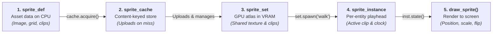
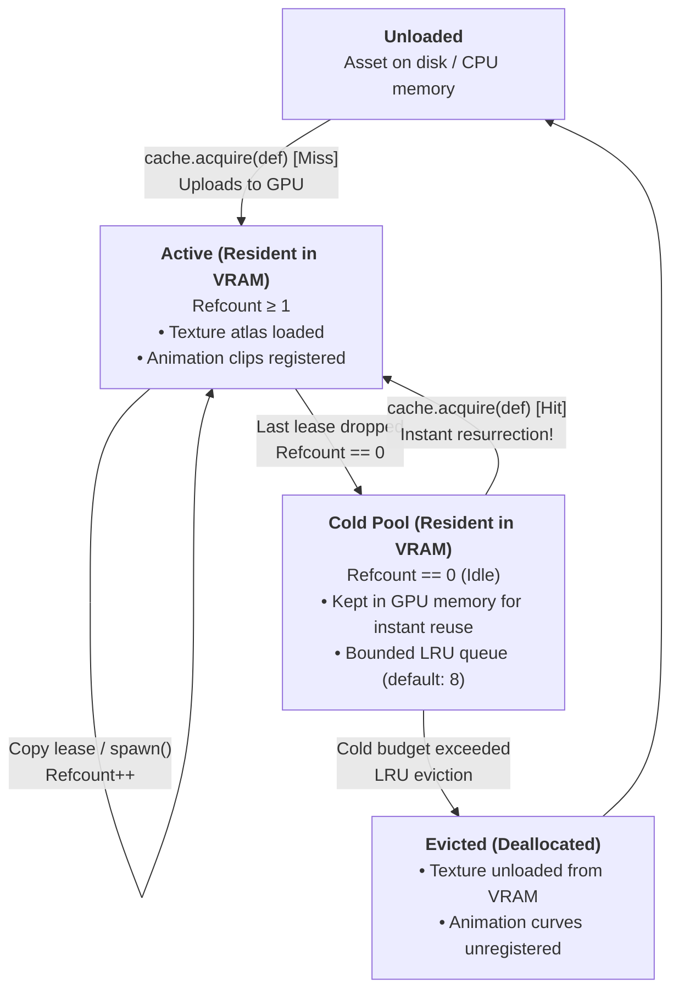
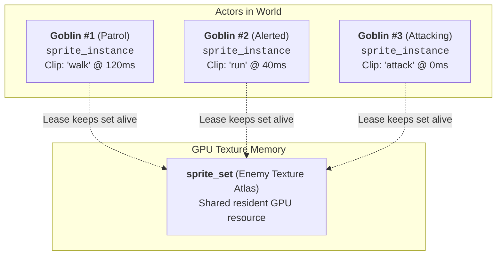
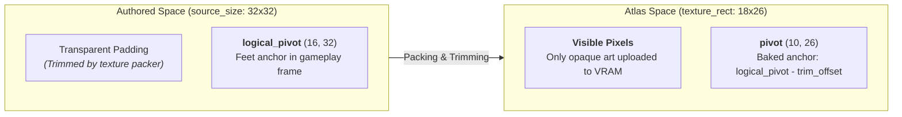

# Sprites

In many 2D game frameworks, a "Sprite" is a monolithic class that bundles together an image file, a GPU texture,
an animation clock, an $(x, y)$ world position, and rendering code.

In a non-trivial game, that coupling quickly causes architectural friction:
- **Redundant GPU Memory:** Spawning 50 goblin enemies reloads or duplicates texture memory unless wrapped in custom managers.
- **Painful Automated Testing:** You cannot test asset loading, frame slicing, or animation logic without initializing an active window and GPU context.
- **Coupling Appearance to Position:** A sprite is *what an object looks like*, not *where a physics body lives*. Storing world positions in sprite classes leads to synchronization bugs between physics and rendering.
- **Teardown & Dangling Pointer Bugs:** If an enemy dies and destroys its animation while the texture is still in use (or conversely, if a scene transition unloads a texture while an enemy is mid-frame), the game crashes with a use-after-free.

Neutrino solves this by decoupling sprites into a clean pipeline of distinct responsibilities:



---

## Vocabulary at a glance

| Type | Residence | Purpose | Ownership & Lifetime |
|---|---|---|---|
| [`sprite_def`](pathname:///api/) | CPU | Pure asset description: image source, frame slicing rules, and animation clips. | Value object. Created, serialized, or tested without GPU. |
| [`sprite_set`](pathname:///api/) | GPU | Uploaded texture atlas, frame geometry, and registered animation curves. | Owned by a `sprite_cache` or `render_bundle`. Shared across entities. |
| [`sprite_cache`](pathname:///api/) | CPU & GPU | Content-keyed registry with an LRU cold pool. Deduplicates identical definitions. | One instance per game/scene. Must outlive all handles it issues. |
| [`sprite_set_handle`](pathname:///api/) | Lease | RAII handle to a resident `sprite_set`. Copy retains; destruction releases. | Movable / copyable lease. |
| [`sprite_instance`](pathname:///api/) | Entity | Per-entity playback cursor (which clip is playing, elapsed time, current visual). | Move-only. Bundles an RAII lease and a registered runtime state. |
| [`sprite_state_id`](pathname:///api/) | Engine | Opaque identifier for a registered playback state advanced by the engine loop. | Managed internally by the application update loop. |
| [`sprite_metrics`](pathname:///api/) | CPU | Complete resolved geometry: both packed visible pixels and untrimmed authored frame. | Value object queried from a `sprite_set`. |

---

## 1. Pure Asset Data (`sprite_def`)

A `sprite_def` contains **zero GPU state**. You can construct it, modify it, serialize it to disk, or unit-test
its frame slicing without creating an SDL window or graphics context.

A definition combines three parts:
1. **Atlas Image Source:** Where the pixels come from (`world_image`).
2. **Frame Slicing:** Either a uniform grid (`sprite_grid`) or explicit named rectangles (`sprite_visual_def`).
3. **Animation Clips:** Named sequences of frames (`sprite_clip_def`).

```cpp
#include <neutrino/video/sprite/sprite_def.hh>

neutrino::sprite_def def;

// 1. Image source: disk file, memory buffer, or procedural sdlpp::surface
def.image.source = neutrino::image_from_disk{"assets/hero.png"};
def.image.width  = 128;
def.image.height = 64;

// 2. Uniform grid slicing: 32x32 cells with feet pivot
def.grid = neutrino::sprite_grid{
    .cell_w = 32,
    .cell_h = 32,
    .origin = neutrino::sprite_origin_rule::bottom_center,
};

// 3. Animation clips referencing frames by name ("0", "1", ...)
def.clips = {
    neutrino::sprite_clip_def{
        .name = "idle",
        .frames = {
            {.visual = "0", .duration = neutrino::sprite_animation_duration{1000.0f}},
        },
        .loop = true,
    },
    neutrino::sprite_clip_def{
        .name = "walk",
        .frames = {
            {.visual = "0", .duration = neutrino::sprite_animation_duration{100.0f}},
            {.visual = "1", .duration = neutrino::sprite_animation_duration{100.0f}},
            {.visual = "2", .duration = neutrino::sprite_animation_duration{100.0f}},
            {.visual = "1", .duration = neutrino::sprite_animation_duration{100.0f}},
        },
        .loop = true,
    },
};
```

### Uniform grids vs. Explicit packed visuals

- **Uniform Grids (`sprite_grid`):** Generates frames named `"0"`, `"1"`, ..., `"N-1"` in row-major order.
  The `origin` rule automatically places the pivot (e.g. `bottom_center` ensures the character's feet rest
  consistently on collision boundaries).
- **Explicit Visuals (`sprite_visual_def`):** For packed atlases where each frame has an arbitrary size,
  position, and pivot:
  ```cpp
  def.visuals = {
      {.name = "hero.idle", .src = {0, 0, 32, 32}, .origin = {16, 32}},
      {.name = "spark",     .src = {96, 0, 16, 16}, .origin = {8, 16}},
  };
  ```

### Fluent Authoring with `sprite_def_builder`

Instead of verbose manual aggregate initialization, Neutrino provides [`sprite_def_builder`](pathname:///api/) (`<neutrino/video/sprite/sprite_def_builder.hh>`), allowing you to chain image configuration, grid slicing, custom frames, and animation clips fluently:

```cpp
#include <neutrino/video/sprites.hh>

using namespace std::chrono_literals;

// Construct a sprite definition fluently:
neutrino::sprite_def hero_def = neutrino::sprite_def_builder()
    .from_file("assets/hero.png")
    .with_grid(32, 32, neutrino::sprite_origin_rule::bottom_center)
    .add_clip("idle", {"0", "1"}, 200ms, /*loop=*/true)
    .add_clip_range("walk", /*first_index=*/2, /*count=*/4, 100ms, /*loop=*/true)
    .clip("attack", /*loop=*/false)
        .frame("6", 80ms)
        .frame("7", 120ms, neutrino::sprite_flip::horizontal)
        .frame("8", 80ms)
        .end_clip()
    .build();

// Direct acquisition into the cache:
auto handle = cache.acquire(hero_def);
```

### Resource Files, Archives & Memory-Backed Sprites (PAK, ZIP, VFS)

In production games, art and metadata are rarely stored as loose individual files on disk. Instead, assets are packaged into archive files (e.g., custom `.pak` files, `.zip` archives, virtual filesystems, or embedded binary blobs in the executable).

`sprite_def_builder` natively supports in-memory buffers and streaming inputs:

#### 1. In-Memory Image Buffers & Streams

When your virtual filesystem or archive reader extracts an image entry into memory (as raw encoded PNG/BMP bytes), pass it directly via `.from_memory(...)` or `.from_stream(...)`:

```cpp
// 1. Read binary image payload from your custom archive / PAK file:
std::vector<std::uint8_t> png_bytes = my_archive.read_entry("sprites/player.png");

// 2. Build directly from memory bytes without writing temporary files to disk:
neutrino::sprite_def def = neutrino::sprite_def_builder()
    .from_memory(std::move(png_bytes))
    .with_grid(16, 16, neutrino::sprite_origin_rule::bottom_center)
    .add_clip_range("walk", 0, 4, 100ms)
    .build();
```

#### 2. Bundled Aseprite Metadata + In-Memory Image

If your resource archive stores exported Aseprite JSON metadata along with the atlas texture, you can load the metadata while pointing to the in-memory texture bytes:

```cpp
std::string json_text = my_archive.read_text("sprites/hero.json");
std::vector<std::uint8_t> texture_bytes = my_archive.read_entry("sprites/hero.png");

// Parse frames, trim metadata, and tags from JSON, while supplying in-memory pixels:
neutrino::sprite_def def = neutrino::sprite_def_builder::from_aseprite_json(
    json_text, std::move(texture_bytes)).build();
```

#### 3. Automatic Archive Resolvers

When an exported metadata file references an image filename (such as `"image": "hero_atlas.png"` inside `meta`), you can pass a resolver callback to `from_aseprite_json` or `load_aseprite_atlas`. The loader queries your resolver to locate the corresponding bytes within the archive:

```cpp
// The resolver callback looks up the referenced image inside the archive:
auto archive_resolver = [&](std::string_view filename) -> std::vector<std::uint8_t> {
    return my_archive.read_entry(std::string("assets/") + std::string(filename));
};

// One-liner to load complete atlas and image directly from the archive:
neutrino::sprite_def def = neutrino::sprite_def_builder::from_aseprite_json(
    json_text, archive_resolver).build();

// Or via load_aseprite_atlas:
neutrino::sprite_def def2 = neutrino::load_aseprite_atlas(json_text, archive_resolver);
```

#### 4. Procedural & In-Memory Surfaces (`from_surface`)

For procedurally generated textures or images decoded by an external library:

```cpp
auto procedural_surface = generate_minimap_surface();

neutrino::sprite_def def = neutrino::sprite_def_builder()
    .from_surface(std::move(procedural_surface))
    .add_visual("full", neutrino::rect{0, 0, 128, 128})
    .build();
```

---

## 2. Automatic Caching & RAII Leases (`sprite_cache`)

In traditional game engines, manual texture and asset management is fraught with subtle bugs:
- **Redundant GPU uploads:** If two distinct systems independently load `goblin.png`, they might upload duplicate textures to VRAM.
- **Dangling GPU resources:** If an asset manager unloads a texture while an enemy is still playing an attack animation, the engine crashes on draw.
- **Scene transition hitching:** If a player steps through a doorway into another room and immediately steps back, freeing and re-loading art causes noticeable frame rate drops.

Neutrino eliminates these problems with [`sprite_cache`](pathname:///api/). The cache provides:
1. **Content-keyed deduplication:** Two identical definitions share a single GPU upload.
2. **RAII refcounting leases (`sprite_set_handle`):** The GPU resources stay resident as long as any lease lives.
3. **A bounded LRU cold pool:** Idle assets linger in VRAM, allowing instant resurrection across scene transitions.
4. **Engine-level service lifecycle:** Hosted globally by `neutrino::application`, eliminating scene-level cache lifetime management and member destruction ordering fragility.

---

### The Lifecycle of a Cached Asset

Every asset managed by `sprite_cache` moves through four distinct lifecycle states:



1. **Unloaded ➔ Active (Cache Miss):**
   Calling `cache.acquire(def)` for the first time uploads the atlas image to GPU texture memory, bakes the visual metrics, and registers the animation clips. The entry is inserted into the cache with a reference count of 1.
2. **Active ➔ Active (Sharing & Retaining):**
   Any copy of a `sprite_set_handle` or call to `handle.spawn()` retains the cache entry, bumping the refcount.
3. **Active ➔ Cold Pool (Last Lease Dropped):**
   When the refcount reaches zero (every entity and handle referencing the set has been destroyed), the asset is **not** immediately destroyed. It transitions into the LRU cold pool.
4. **Cold Pool ➔ Active (Resurrection):**
   If `cache.acquire()` is called with the same definition while the asset is in the cold pool, it is resurrected instantly with **zero CPU image decoding and zero GPU reallocation**.
5. **Cold Pool ➔ Evicted (Clean Teardown):**
   When the cold pool exceeds its configured capacity, the least recently used idle asset is evicted. Its destructor tears down the GPU texture atlas and unregisters all associated animation clips.

---

### Content-Keyed Deduplication (`key_for`)

Rather than relying on file paths (which fails for embedded memory bytes or procedurally generated surfaces),
`cache.acquire(def)` computes a 64-bit content hash via `neutrino::key_for`:

- The hash folds the **image identity** (file path, memory buffer hash, or surface address), the **grid slicing parameters**, and all **visuals and clips** in declared order.
- Two definitions with identical content produce the exact same key and share the resident GPU set.

```cpp
neutrino::sprite_cache cache;

// def_a and def_b are separate objects in memory, but have identical content:
neutrino::sprite_def def_a = make_enemy_def();
neutrino::sprite_def def_b = make_enemy_def();

neutrino::sprite_set_handle handle_a = cache.acquire(def_a); // Miss: uploads to GPU
neutrino::sprite_set_handle handle_b = cache.acquire(def_b); // Hit: shares handle_a!

assert(cache.resident_count() == 1); // Only 1 texture uploaded in VRAM
assert(cache.cold_count() == 0);

// A definition with different clips or frames produces a different key:
neutrino::sprite_def boss_def = make_boss_def();
neutrino::sprite_set_handle boss_handle = cache.acquire(boss_def); // Miss: uploads second set

assert(cache.resident_count() == 2);
```

---

### The RAII Lease Model (`sprite_set_handle`)

A [`sprite_set_handle`](pathname:///api/) represents an active lease on a cached `sprite_set`. It behaves as a lightweight value object:

- **Default-constructed:** An invalid, empty lease (`handle.valid() == false`).
- **Copying:** Calls `cache.retain()`, incrementing the refcount. The asset remains resident.
- **Moving:** Transfers ownership (`std::move`), leaving the source invalid without changing the refcount.
- **Destruction:** Calls `cache.release()`, decrementing the refcount.

```cpp
neutrino::sprite_cache cache;

{
    // 1. Acquire lease: refcount = 1
    neutrino::sprite_set_handle outer = cache.acquire(hero_def);
    assert(cache.resident_count() == 1);
    assert(cache.cold_count() == 0);

    {
        // 2. Copy lease to inner scope: refcount = 2
        neutrino::sprite_set_handle inner = outer;
        assert(inner.valid());
        assert(cache.cold_count() == 0);
    } // 3. inner is destroyed: refcount drops to 1, asset stays active!

    assert(cache.cold_count() == 0);

    // 4. Move lease to another variable: refcount unchanged (1)
    neutrino::sprite_set_handle transferred = std::move(outer);
    assert(!outer.valid());
    assert(transferred.valid());
    assert(cache.cold_count() == 0);
} // 5. transferred is destroyed: refcount reaches 0 -> moves to cold pool!

assert(cache.resident_count() == 1); // Still resident in VRAM
assert(cache.cold_count() == 1);     // But idle in the cold pool
```

---

### Application-Level Cache Service (`neutrino::acquire_sprite`)

In a clean game architecture, scenes should not own asset caches. If each scene instantiates its own cache, assets cannot be shared across scene transitions, and scenes become vulnerable to fragile C++ member declaration order dependencies (where destroying a cache before active instances or leases causes crashes).

To eliminate this fragility entirely, Neutrino hosts `sprite_cache` as an application-level service registered with `service_locator` and managed by `neutrino::application`:

```cpp
#include <neutrino/video/sprites.hh>

void my_scene::on_enter() {
    // Acquire a resident GPU lease directly from the engine-level cache:
    m_set = neutrino::acquire_sprite(make_hero_def());

    // Spawn an actor playhead:
    m_player = m_set.spawn("idle");
}
```

```cpp
class my_scene final : public neutrino::base_scene {
private:
    // Scenes only hold lightweight handles and instances.
    // Zero cache members, zero member destruction order bugs!
    neutrino::sprite_set_handle m_set;
    neutrino::sprite_instance   m_player;
};
```

#### Two-Layer Safety Design

Neutrino enforces two layers of safety around sprite cache lifecycles:

1. **Architectural Safety:** `neutrino::application` outlives all scenes. When a scene transitions or pops, its actors and leases drop cleanly while textures linger in the engine cache's cold pool. Even if `m_player` is declared before `m_set` or vice-versa, `sprite_instance` unregisters its animation state before releasing its lease copy, preventing any use-after-free.
2. **Implementation Safety (Weak Pointer Back-Reference):** Each `sprite_set_handle` retains a `std::weak_ptr` to the cache's implementation. If a developer or test creates a local `sprite_cache` and destroys it before its handles, `handle.valid()` safely evaluates to `false`, and subsequent operations or handle destructions safely no-op instead of invoking undefined behavior.

---

### Shared Assets Across Independent Entities

A `sprite_set` owns the GPU texture atlas and registered animation curves, but contains **no entity-specific state**.
Multiple actors share the exact same `sprite_set`:



---

### The LRU Cold Pool & Room Transitions

The cold pool is specifically designed to eliminate stutters during scene and room transitions.

Consider a game where the player moves between two rooms:
1. In Room 1, the player encounters goblins.
2. The player steps into Room 2. Room 1 is popped from the scene stack, destroying all goblin entities and handles.
3. Instead of immediately deallocating the goblin texture atlas, the cache moves it to the **cold pool**.
4. The player steps back into Room 1. When `cache.acquire(goblin_def)` is called, the cache finds the asset in the cold pool and **resurrects it instantly**, avoiding any disk I/O, image parsing, or GPU texture upload.

#### Configuring the Cold Budget and Eviction

The cold pool has a configurable capacity (default `8` items):

```cpp
// Create a cache that retains up to 4 idle sets before evicting:
neutrino::sprite_cache cache(/*cold_budget=*/4);
```

When an asset's refcount drops to zero and the cold pool is already at capacity, the **least recently used (LRU)**
idle asset is evicted from GPU memory:

```cpp
neutrino::sprite_cache cache(/*cold_budget=*/2);

// Load and release assets A, B, and C:
{ auto a = cache.acquire(asset_a); } // cold pool: [A]
{ auto b = cache.acquire(asset_b); } // cold pool: [A, B] (at capacity)

// Acquiring and releasing a third asset pushes the oldest (A) out:
{ auto c = cache.acquire(asset_c); } // cold pool: [B, C]; asset A is evicted!

assert(cache.cold_count() == 2);
assert(cache.resident_count() == 2); // Only B and C remain in VRAM
```

---

### Actor Lifetime Integration (`spawn` and Hidden Leases)

When an actor creates its playhead via `set.spawn("clip_name")`, the resulting [`sprite_instance`](pathname:///api/)
takes an internal copy of the `sprite_set_handle`:

```cpp
class enemy_spawner {
public:
    explicit enemy_spawner(neutrino::sprite_cache& cache, const neutrino::sprite_def& def)
        : m_set(cache.acquire(def)) {}

    std::unique_ptr<enemy> spawn_enemy(neutrino::point spawn_pos) {
        // m_set.spawn() copies the lease into the sprite_instance:
        neutrino::sprite_instance playhead = m_set.spawn("walk");
        return std::make_unique<enemy>(spawn_pos, std::move(playhead));
    }

private:
    neutrino::sprite_set_handle m_set;
};
```

This guarantees **safe asset lifetimes by construction**:
- Even if the `enemy_spawner` or the original `m_set` is destroyed, the enemies themselves keep the underlying `sprite_set` resident through their internal leases.
- When an `enemy` dies, `sprite_instance::~sprite_instance()` unregisters its animation playback state from the engine *first*, and then releases its lease.

---

### Monotonic Tokens (Preventing Stale Handle Corruption)

Under high memory turnover, an asset might be evicted and later rebuilt under the same content key.
To prevent an ABA bug where a stale or delayed handle decrements the refcount of a newly rebuilt entry,
every fresh cache build is stamped with a monotonic 64-bit **token**.

If an old handle's token does not match the entry's current token, release operations safely ignore the stale handle,
protecting cache integrity.

---

## 3. Runtime Playheads (`sprite_instance`)

Each actor in your game owns a [`sprite_instance`](pathname:///api/) created via `set.spawn("clip_name")`:

```cpp
class player_actor {
public:
    void init(neutrino::sprite_set_handle set) {
        // Spawns a playhead starting in the "idle" animation
        m_sprite = set.spawn("idle");
    }

    void handle_movement(bool moving) {
        if (moving) {
            // switch_to: changes clip only if different; preserves elapsed playback phase
            m_sprite.switch_to("walk");
        } else {
            m_sprite.switch_to("idle");
        }
    }

    void jump() {
        // restart: resets animation to frame 0 (ideal for one-shot triggers)
        m_sprite.restart("jump");
    }

    [[nodiscard]] neutrino::sprite_state_id state() const noexcept {
        return m_sprite.state();
    }

private:
    neutrino::sprite_instance m_sprite;
};
```

### Automatic animation clock

:::tip[You do not need to tick sprites manually]
Unlike engines where you must call `sprite.update(delta_time)` inside your entity's update loop,
Neutrino's engine loop **automatically ticks all registered runtime sprite states** during `application::on_update`.
Drawing the state automatically resolves the active frame corresponding to the current time.
:::

### Safe Teardown by Construction

A notorious bug in manual sprite engines is the order of destruction: if a scene unloads a texture atlas before
an actor finishes destroying its animation playhead, an access violation or GPU crash occurs.

`sprite_instance` makes this impossible:
1. It holds an internal copy of the `sprite_set_handle` lease.
2. In its destructor, `sprite_instance` unregisters its runtime state from the engine's sprite manager **first**.
3. It then drops its lease on the `sprite_set`.
4. The GPU set remains resident until all instances and all external handles release their leases.

---

## 4. Trimmed Art and Geometry (`sprite_metrics`)

Professional sprite packing tools (such as TexturePacker or Aseprite) crop transparent borders from individual frames
to pack more art into smaller GPU textures.

In naive engines, trimming causes visual bugs:
- As a character runs, the trimmed frame dimensions fluctuate, causing the sprite to visibly jitter.
- Physics collision boxes that read the texture size unexpectedly shrink and expand.

Neutrino prevents this using [`sprite_metrics`](pathname:///api/), which retains both coordinate spaces:



### Querying bounds safely

You can query geometric bounds from the `sprite_set` without needing to keep the original source definition in memory:

```cpp
// 1. Full metrics for a frame:
neutrino::sprite_metrics m = set.require_metrics("player.run.0");

// 2. The authored box (what physics/gameplay should align to):
neutrino::rect collider_box = m.logical_bounds_at(player_world_pos);

// 3. The packed pixel rectangle (what is actually drawn on the GPU):
neutrino::rect visible_box = m.visible_bounds_at(player_world_pos);

// 4. Maximum bounding size over all frames (useful for UI slots or culling):
neutrino::dim max_size = set.bounding_size();
```

### Strict invariants: `require_*` vs. optional lookups

The `sprite_set` API provides two flavors of accessors:
- `set.visual("name")` / `set.clip("name")`: Returns `std::optional`. Use this when dynamically probing whether an asset includes a cosmetic animation.
- `set.require_visual("name")` / `set.require_clip("name")` / `set.require_frame_rect("name")`: **Throws immediately** if the name does not exist.

Always use `require_*` for core gameplay frames. If a required frame is missing, failing immediately with a clear error
message (`missing visual: player.idle`) prevents silent degradations like $0 \times 0$ collision boxes.

---

## 5. Drawing Sprites

A sprite state represents *what to draw*, not *where to draw*. Placement and transforms are supplied at draw time.

### Immediate Screen Drawing (`neutrino::draw_sprite`)

For simple scenes, title menus, or HUD overlays:

```cpp
#include <neutrino/video/draw.hh>

neutrino::sprite_draw_params params{
    .scale = 2.0f,
    .flip = facing_left ? neutrino::sprite_flip::horizontal : neutrino::sprite_flip::none,
    .rotation_degrees = 0.0f,
};

neutrino::draw_sprite(render_point, m_player.state(), params);
```

- `position`: The visual anchor (pivot) in render coordinates.
- `scale`: Scaling factor applied about the visual pivot.
- `flip`: Composable bit flags (`none`, `horizontal`, `vertical`, `diagonal`). Flips preserve the pivot position.
- `rotation_degrees`: Clockwise rotation applied about the visual pivot.

### Depth-Sorted World Batching (`sprite_batch`)

In world scenes where actors, projectiles, and environmental objects must be depth-sorted alongside tile layers:

```cpp
#include <neutrino/video/world/sprite_batch.hh>

// Add the sprite state to a depth-sorted batch:
batch.add(actor_world_pos, m_player.state(), neutrino::draw_layer{1}, depth_y);
```

---

## 6. Common Pitfalls & Best Practices

- **Scene Member Declaration Order:**
  In C++, class members are destroyed in reverse order of declaration. In your scene class, declare the cache
  **before** handles, and handles **before** instances:
  ```cpp
  class game_scene : public neutrino::base_scene {
  private:
      neutrino::sprite_cache      m_cache;   // 3. Destroyed LAST
      neutrino::sprite_set_handle m_set;     // 2. Destroyed second
      neutrino::sprite_instance   m_player;  // 1. Destroyed FIRST
  };
  ```
- **Do Not Advance Animations Manually:**
  Do not write manual timers or frame-increment logic inside `fixed_update` for sprite animations.
  The engine updates all active states automatically.
- **Do Not Recreate Definitions Every Frame:**
  `sprite_def` is intended to be defined once during scene initialization or loading. Do not rebuild definitions
  or reload image files inside `fixed_update` or `render`.
- **Use Integer Indices in Hot Loops:**
  For uniform grid sheets, you can access frames by zero-based integer index (`set.visual(i)`) rather than
  allocating strings (`set.visual(std::to_string(i))`).

---

## Next

- [Coordinate spaces](./coordinate-spaces.md) — how world, render, and window spaces interact with sprite positions.
- [The frame](./the-frame.md) — fixed simulation updates and display presentation.
- [Tutorial: Window & Scene](../tutorial/step-01-window-and-scene.md) — setting up the base scene that hosts your sprites.
