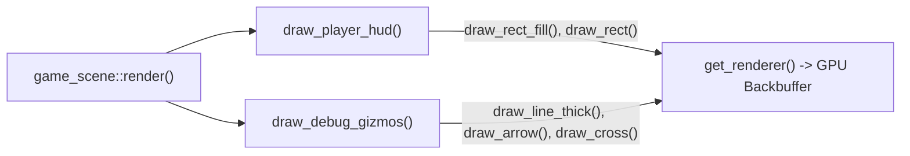

# Part 1: Primitives & UI

In this tutorial, you will learn how to use Neutrino's immediate-mode drawing library ([`<neutrino/video/draw.hh>`](pathname:///api/)) to render:
1. **A player status HUD:** Health and stamina gauges with borders, background tracks, and warning alerts.
2. **Diagnostic physics gizmos:** Bounding box outlines, center markers, and velocity vectors.
3. **Specialized line styles:** Anti-aliased lines, thick strokes, dashed motion paths, and dotted sensor perimeters.
4. **Circular radar sweeps and proximity zones.**

---

## Why Immediate Mode for UI and Gizmos?

When drawing a user interface or debugging physics contacts, setting up retained scene graphs or batch nodes creates unnecessary friction:
- UI elements change position and size dynamically based on player health, menu selections, and resolution.
- Debug shapes (such as raycasts, velocity vectors, and bounding boxes) are ephemeral: they exist for exactly one frame and should be discarded immediately.

Neutrino's immediate-mode drawing functions submit primitives **straight to the GPU renderer in call order**. There are no retained objects to allocate, synchronize, or destroy.



---

## Step 1: The Health & Stamina HUD

Let's build a clean, styled status bar located at the top-left of our 640 × 360 render canvas.

A professional health bar consists of three visual layers:
1. **Background Tray:** A dark border and background so the bar remains visible against bright backgrounds.
2. **Current Value Fill:** A colored rectangle whose width is scaled proportional to the player's current health fraction.
3. **Border Outline:** A crisp 1-pixel border that clearly defines the gauge boundaries.

```cpp
#include <neutrino/video/draw.hh>
#include <sdlpp/video/color.hh>
#include <algorithm>

void draw_gauge(int x, int y, int width, int height, 
                float current, float maximum, 
                const sdlpp::color& fill_color) 
{
    // Clamp fraction between 0.0 and 1.0 to prevent underflow/overflow
    const float fraction = std::clamp(maximum > 0.0f ? current / maximum : 0.0f, 0.0f, 1.0f);
    const int fill_width = static_cast<int>(fraction * (width - 4));

    // 1. Outer background tray (dark charcoal)
    neutrino::draw_rect_fill(neutrino::rect{x, y, width, height}, sdlpp::color{25, 25, 25, 220});

    // 2. Filled gauge bar (with 2px inner padding)
    if (fill_width > 0) {
        neutrino::draw_rect_fill(
            neutrino::rect{x + 2, y + 2, fill_width, height - 4}, 
            fill_color
        );
    }

    // 3. Crisp outer border (semi-transparent white)
    neutrino::draw_rect(neutrino::rect{x, y, width, height}, sdlpp::color{200, 200, 200, 255});
}
```

### Adding a Low-Health Pulsing Flash

When the player's health drops below 25%, we can draw a flashing red warning outline:

```cpp
void draw_hud(float health, float max_health, float stamina, float max_stamina, float total_time_sec) {
    // Health Bar (Emerald green)
    sdlpp::color health_color = sdlpp::color{46, 204, 113, 255};

    if (health / max_health < 0.25f) {
        // Pulse between bright red and dark red at 4 Hz
        const float pulse = (std::sin(total_time_sec * 8.0f) + 1.0f) * 0.5f;
        health_color = sdlpp::color{
            static_cast<uint8_t>(200 + pulse * 55),
            static_cast<uint8_t>(40 * (1.0f - pulse)),
            static_cast<uint8_t>(40 * (1.0f - pulse)),
            255
        };
    }

    draw_gauge(16, 16, 180, 18, health, max_health, health_color);

    // Stamina Bar (Sky blue, slightly narrower)
    draw_gauge(16, 38, 140, 12, stamina, max_stamina, sdlpp::color{52, 152, 219, 255});
}
```

---

## Step 2: Diagnostic Physics Overlays (Gizmos)

During gameplay development, you frequently need to visualize what your physics engine and AI controllers are doing.

Neutrino provides specialized primitives designed specifically for diagnostics:

### 1. Velocity & Movement Vectors (`draw_arrow`)

An arrow visualizes direction and magnitude. `draw_arrow` takes starting and ending points, arrowhead pixel length, arrowhead half-angle in degrees, and stroke thickness:

```cpp
void draw_velocity_vector(neutrino::point actor_pos, float vx, float vy) {
    // Scale velocity for visual clarity on screen
    const neutrino::point arrow_end{
        actor_pos.x + static_cast<int>(vx * 0.25f),
        actor_pos.y + static_cast<int>(vy * 0.25f)
    };

    // Draw an orange vector arrow with a 6px head at a 30-degree spread
    neutrino::draw_arrow(
        actor_pos, 
        arrow_end, 
        /* head_size = */ 8, 
        /* head_angle = */ 30.0f, 
        /* thickness = */ 1.5f, 
        sdlpp::colors::orange
    );
}
```

### 2. Entity Anchor Points (`draw_cross`)

When debugging sprite pivot offsets and bounding box alignment, `draw_cross` places an exact marker at the entity's position:

```cpp
// Draw a 5-pixel radius white cross centered directly on the actor's anchor
neutrino::draw_cross(actor_pos, /* size = */ 5, /* thickness = */ 1.0f, sdlpp::colors::white);
```

### 3. Hitbox Outlines (`draw_rect`)

```cpp
// Visualize an axis-aligned bounding box (AABB) in translucent yellow
neutrino::draw_rect(neutrino::rect{actor_pos.x - 16, actor_pos.y - 32, 32, 32}, sdlpp::colors::yellow);
```

---

## Step 3: Specialized Line Styles

Not all lines are created equal. The engine provides 5 line rendering functions:

| Function | Style | Common Use Case |
|---|---|---|
| [`draw_line`](pathname:///api/) | Standard 1-pixel Bresenham line | Fast grid lines and simple borders |
| [`draw_line_aa`](pathname:///api/) | Anti-aliased line | Smooth aesthetic diagonals |
| [`draw_line_thick`](pathname:///api/) | Scalable stroke width (pixels) | Laser beams, health bars, heavy dividers |
| [`draw_line_dashed`](pathname:///api/) | Alternating dashes and gaps | Predicted movement trajectories |
| [`draw_line_dotted`](pathname:///api/) | Spaced dots | Sensor perimeters and tether cords |

```cpp
const neutrino::point start{50, 200};
const neutrino::point end{250, 200};

// 1. Standard thin line
neutrino::draw_line(start, end, sdlpp::colors::gray);

// 2. Smooth anti-aliased diagonal
neutrino::draw_line_aa(neutrino::point{50, 220}, neutrino::point{250, 260}, sdlpp::colors::light_blue);

// 3. Thick 4-pixel stroke
neutrino::draw_line_thick(neutrino::point{50, 280}, neutrino::point{250, 280}, 4.0f, sdlpp::colors::red);

// 4. Dashed line: 10px marks separated by 5px gaps
neutrino::draw_line_dashed(neutrino::point{50, 300}, neutrino::point{250, 300}, 10, 5, sdlpp::colors::yellow);

// 5. Dotted line: dots spaced every 8 pixels
neutrino::draw_line_dotted(neutrino::point{50, 320}, neutrino::point{250, 320}, 8, sdlpp::colors::white);
```

---

## Step 4: Proximity Sensors & Circular Zones

To draw radar ranges, blast radiuses, or detection zones, use `draw_circle` (outline) and `draw_circle_fill` (filled disk):

```cpp
void draw_detection_radius(neutrino::point center, int radius, bool player_detected) {
    const sdlpp::color fill_color = player_detected 
        ? sdlpp::color{231, 76, 60, 60}    // Translucent red when triggered
        : sdlpp::color{52, 152, 219, 40};   // Translucent blue when idle

    const sdlpp::color border_color = player_detected 
        ? sdlpp::color{231, 76, 60, 200} 
        : sdlpp::color{52, 152, 219, 180};

    // 1. Semi-transparent filled area
    neutrino::draw_circle_fill(neutrino::circle{center, radius}, fill_color);

    // 2. Sharp outer perimeter ring
    neutrino::draw_circle(neutrino::circle{center, radius}, border_color);
}
```

---

## Step 5: Complete Working Example Scene

Here is a complete, self-contained scene demonstrating all of these primitives working together in an interactive diagnostic HUD:

```cpp
#include <neutrino/application.hh>
#include <neutrino/scene/base_scene.hh>
#include <neutrino/video/draw.hh>
#include <sdlpp/app/entry_point.hh>
#include <sdlpp/video/color.hh>
#include <cmath>

class primitives_demo_scene final : public neutrino::base_scene {
public:
    void fixed_update(neutrino::sim_duration dt, const neutrino::input_snapshot& in) override {
        m_elapsed_sec += static_cast<float>(dt.count());

        // Simulate fluctuating player health and stamina
        m_health = 50.0f + 45.0f * std::sin(m_elapsed_sec * 0.8f);
        m_stamina = 75.0f + 25.0f * std::cos(m_elapsed_sec * 1.5f);

        // Move actor in a small circle to demonstrate vectors
        m_actor_pos.x = 320 + static_cast<int>(80.0f * std::cos(m_elapsed_sec * 2.0f));
        m_actor_pos.y = 180 + static_cast<int>(50.0f * std::sin(m_elapsed_sec * 2.0f));

        // Velocity is derivative of position
        m_actor_vel_x = -160.0f * std::sin(m_elapsed_sec * 2.0f);
        m_actor_vel_y =  100.0f * std::cos(m_elapsed_sec * 2.0f);
    }

    void render() override {
        // Clear canvas with dark slate
        neutrino::draw_rect_fill(neutrino::rect{0, 0, 640, 360}, sdlpp::color{20, 24, 30, 255});

        // 1. Draw detection sensor centered on screen
        const bool in_range = std::hypot(m_actor_pos.x - 320, m_actor_pos.y - 180) < 100.0f;
        draw_detection_radius(neutrino::point{320, 180}, 100, in_range);

        // 2. Draw trajectory path (dashed line from center to actor)
        neutrino::draw_line_dashed(neutrino::point{320, 180}, m_actor_pos, 8, 4, sdlpp::colors::dark_gray);

        // 3. Draw actor collision box and center cross
        neutrino::draw_rect(neutrino::rect{m_actor_pos.x - 16, m_actor_pos.y - 16, 32, 32}, sdlpp::colors::yellow);
        neutrino::draw_cross(m_actor_pos, 4, 1.0f, sdlpp::colors::white);

        // 4. Draw actor velocity arrow
        draw_velocity_vector(m_actor_pos, m_actor_vel_x, m_actor_vel_y);

        // 5. Draw the player HUD on top of everything
        draw_hud(m_health, 100.0f, m_stamina, 100.0f, m_elapsed_sec);
    }

    void handle_action(const sdlpp::event& ev) override {}

private:
    float m_elapsed_sec = 0.0f;
    float m_health = 100.0f;
    float m_stamina = 100.0f;
    neutrino::point m_actor_pos{320, 180};
    float m_actor_vel_x = 0.0f;
    float m_actor_vel_y = 0.0f;
};
```

---

## Running the Executable

Build and run the Part 1 executable:

```bash
cmake --build cmake-build-debug --target neutrino_tutorial_drawing_01_primitives
./cmake-build-debug/tutorials/drawing/01_primitives_and_ui/neutrino_tutorial_drawing_01_primitives
```

### What You See:
- **Left Panel:** All five line rendering styles (regular, AA, thick, dashed, dotted), plus arrows and crosses.
- **Right Area:** An interactive proximity sensor circle that lights up when the orbiting actor enters range, along with bounding box outlines and velocity vectors.
- **Top-Left:** Player health and stamina HUD with smooth pulsating alerts.
- Press <kbd>Escape</kbd> to exit cleanly.

---

## Best Practices & Pitfalls

:::tip[Color Scoping is Automatic]
Always prefer overloads that take an explicit trailing `sdlpp::color` (e.g. `draw_rect(r, color)`). These functions save the renderer's previous draw color, apply your color, and restore the previous color upon return. This keeps isolated drawing routines from corrupting each other's colors.
:::

:::caution[Don't Draw Millions of Immediate Shapes]
Immediate mode issues unbatched draw calls straight to the GPU backend. While modern hardware easily processes hundreds of UI boxes and lines per frame without dropping below 60 FPS, attempting to render a 200 × 200 tilemap tile-by-tile via `draw_rect_fill()` will stall the GPU.

For large collections of sorted sprites and world geometry, move to **[Part 2: Batches & Ordering Bands](./02-batches-and-ordering.md)**!
:::

