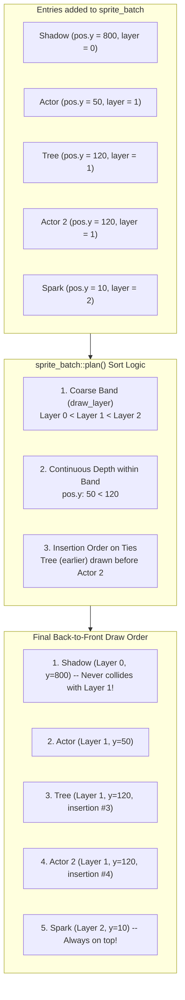

# Part 2: Batches & Ordering Bands

In [Part 1: Primitives & UI](./01-primitives-and-ui.md), we drew shapes immediately in call order.

In top-down games, isometric RPGs, and 2.5D platformers, immediate drawing immediately breaks down:
- An enemy walking downwards must appear **in front** of a tree when standing south of it, but **behind** the tree when standing north of it.
- Ground shadows must **always** draw beneath actors, even if a shadow belongs to an actor at the bottom of the screen.
- Spell effects and floating damage numbers must **always** draw above actors.

In this tutorial, you will learn how to use [`neutrino::sprite_batch`](pathname:///api/) and [`neutrino::draw_layer`](pathname:///api/) to manage depth sorting and categorical layering with rock-solid stability.

---

## The Two Traps of 2D Depth Sorting

### Trap 1: The Painter's Dilemma
If you draw entities by looping through an array:
```cpp
for (const auto& actor : actors) {
    draw_sprite(actor.pos, actor.sprite);
}
```
The render order is dictated by memory layout or spawn time, not world geometry. An enemy spawned later will draw on top of the player even if the enemy is standing 100 pixels farther away in the background.

### Trap 2: The Fake Depth Constant Trap (`y + 1000`)
To solve categorical ordering (shadows < actors < particles), games often add arbitrary offsets to the Y coordinate:
```cpp
float shadow_depth   = pos.y + 0.0f;
float actor_depth    = pos.y + 1000.0f;
float particle_depth = pos.y + 2000.0f;
```
This fails as soon as a map is taller than 1,000 pixels! An actor at the top of the map (Y = 50, `depth = 1050`) will draw underneath a ground shadow cast by an entity at the bottom of the map (Y = 1200, `depth = 1200`).

---

## The Solution: The 3-Tier Sort Key

Neutrino's `sprite_batch` replaces arbitrary offsets with a mathematically separated 3-tier sort key:

```text
Sort Key = (draw_layer, depth, call_order)
```



1. **`draw_layer` (Coarse Category Band):** A strongly typed integer wrapper (`neutrino::draw_layer`). A higher layer **always** draws above a lower layer, regardless of position coordinates.
2. **`depth` (Fine Continuous Float):** The Y-coordinate (`pos.y`) in top-down games, or custom Z-depth. Orders entities naturally within the same layer band.
3. **`call_order` (Stable Tie-Breaker):** `sprite_batch` uses `std::stable_sort`. When two sprites share identical layers and identical depths, their original submission order is preserved, eliminating Z-fighting jitter.

---

## Defining Categorical Ordering Bands

In your game, define an `enum class` for your visual categories:

```cpp
#include <neutrino/video/world/sprite_batch.hh>

enum class render_band : int {
    floor_decals = 0,
    shadows      = 1,
    actors       = 2,
    projectiles  = 3,
    overhead_vfx = 4,
    floating_ui  = 5,
};

[[nodiscard]] constexpr neutrino::draw_layer to_layer(render_band b) noexcept {
    return neutrino::draw_layer{static_cast<int>(b)};
}
```

---

## Using `sprite_batch` in a Scene

Let's build a top-down scene featuring:
- Floor decals and blood splatters (`render_band::floor_decals`)
- Entity shadows anchored under character feet (`render_band::shadows`)
- Y-sorted players, enemies, and obstacles (`render_band::actors`)
- Flying magic missiles (`render_band::projectiles`)
- Floating damage numbers (`render_band::floating_ui`)

```cpp
#include <neutrino/scene/base_scene.hh>
#include <neutrino/video/draw.hh>
#include <neutrino/video/world/sprite_batch.hh>
#include <vector>

struct game_entity {
    neutrino::world_point position;
    neutrino::sprite_visual_ref sprite;
    neutrino::sprite_visual_ref shadow_sprite;
};

class depth_sorting_scene final : public neutrino::base_scene {
public:
    void render() override {
        // Clear background to dark grass green
        neutrino::draw_rect_fill(neutrino::rect{0, 0, 640, 360}, sdlpp::color{34, 139, 34, 255});

        // 1. Create a screen-space batch for this frame
        // (In Part 3, we will connect this to a world camera)
        neutrino::sprite_batch batch;

        // 2. Queue static environment obstacles (trees, rocks)
        for (const auto& obstacle : m_obstacles) {
            batch.add(
                obstacle.position,
                to_layer(render_band::actors),
                obstacle.position.y, // Y-depth sorting
                obstacle.sprite
            );
        }

        // 3. Queue moving characters and their shadows
        for (const auto& actor : m_actors) {
            // A. The ground shadow: belongs to the shadows band!
            // Even if the shadow's Y position is high, it will render under all actors.
            batch.add(
                actor.position,
                to_layer(render_band::shadows),
                actor.position.y,
                actor.shadow_sprite
            );

            // B. The actor body: belongs to the actors band!
            batch.add(
                actor.position,
                to_layer(render_band::actors),
                actor.position.y,
                actor.sprite
            );
        }

        // 4. Queue flying projectiles
        for (const auto& proj : m_projectiles) {
            batch.add(
                proj.position,
                to_layer(render_band::projectiles),
                proj.position.y,
                proj.sprite
            );
        }

        // 5. Stable-sort everything and flush back-to-front!
        batch.flush();
    }

private:
    std::vector<game_entity> m_obstacles;
    std::vector<game_entity> m_actors;
    std::vector<game_entity> m_projectiles;
};
```

---

## Depth Sorting in Action: Y-Ordering

Consider what happens when an actor moves past a static tree located at Y = 150:

```text
Tree:  Y = 150 (draw_layer = actors)
Actor: Y = 120 (North of tree) -> Actor draws FIRST, Tree draws OVER actor.
Actor: Y = 180 (South of tree) -> Tree draws FIRST, Actor draws OVER tree.
```

Because both the tree and the actor belong to `render_band::actors`, their relative order is determined entirely by their bottom pivot (`position.y`).

---

## Inspecting the Draw Queue (`batch.plan()`)

Sometimes you need to inspect what the batch is about to render before committing it to the screen (for example, for occlusion culling, collision queries, or debug counters).

Calling `batch.plan()` executes the stable sort without drawing or clearing the internal queue:

```cpp
// Returns a std::vector<neutrino::sprite_draw> sorted back-to-front
std::vector<neutrino::sprite_draw> planned = batch.plan();

std::cout << "Queued sprites: " << planned.size() << "\n";
for (const auto& draw : planned) {
    std::cout << "Screen pos: (" << draw.position.x << ", " << draw.position.y << ")\n";
}

// When you are ready to render:
batch.flush(); // Automatically executes plan(), draws, and clears the queue
```

---

## Ergonomics: Null-Safe Visual Lookups

In many game engines, looking up a sprite from a dictionary or an optional slot requires checking if it exists before adding it to a batch:

```cpp
// Tedious manual guard:
auto maybe_visual = sprite_set.visual("hero.idle");
if (maybe_visual) {
    batch.add(pos, layer, depth, *maybe_visual);
}
```

Neutrino's `sprite_batch::add()` provides an overload that directly accepts `std::optional<sprite_visual_ref>`. If the visual is null (`std::nullopt`), it is **silently ignored with zero allocation**:

```cpp
// Clean, idiomatic Neutrino code:
batch.add(pos, layer, depth, sprite_set.visual("hero.idle"));
```

---

## Running the Executable

Build and run the Part 2 executable:

```bash
cmake --build cmake-build-debug --target neutrino_tutorial_drawing_02_batches
./cmake-build-debug/tutorials/drawing/02_batches_and_ordering/neutrino_tutorial_drawing_02_batches
```

### Controls & Observations:
- **Watch the Y-Sorting:** Three characters walk up and down past trees at Y = 180. Notice that when a character is north of a tree, they draw behind it; when they step south, they draw in front.
- **Permanent Ground Shadows:** Notice that shadows belong to `draw_layer{0}` and *never* draw over characters or trees.
- **Press <kbd>Tab</kbd> or <kbd>Space</kbd>:** Toggles between `sprite_batch` sorted rendering (Green HUD) and naive unsorted painting (Red HUD). In naive mode, observe the severe sorting artifacts where south-standing characters are drawn under trees.
- Press <kbd>Escape</kbd> to exit cleanly.

---

## Summary & What's Next

By utilizing `neutrino::sprite_batch`:
- Categories (shadows, characters, spell particles, UI) are separated by **`draw_layer` bands**, making coordinate overlap mathematically impossible.
- Within each band, entities are depth-sorted continuously by their Y-position.
- Ties maintain exact submission order, completely preventing flickering.

In **[Part 3: Camera & Parallax](./03-camera-and-parallax.md)**, we will upgrade our batch to follow a player across a scrolling world with look-at cameras, smooth zoom, and drift-free parallax!
