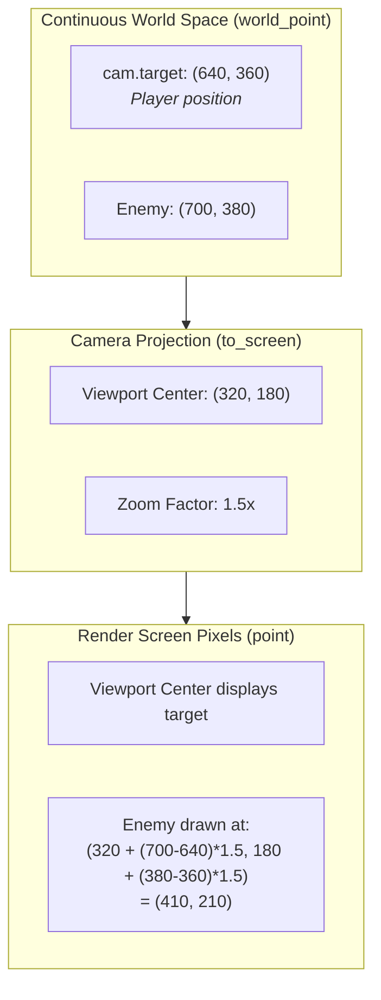
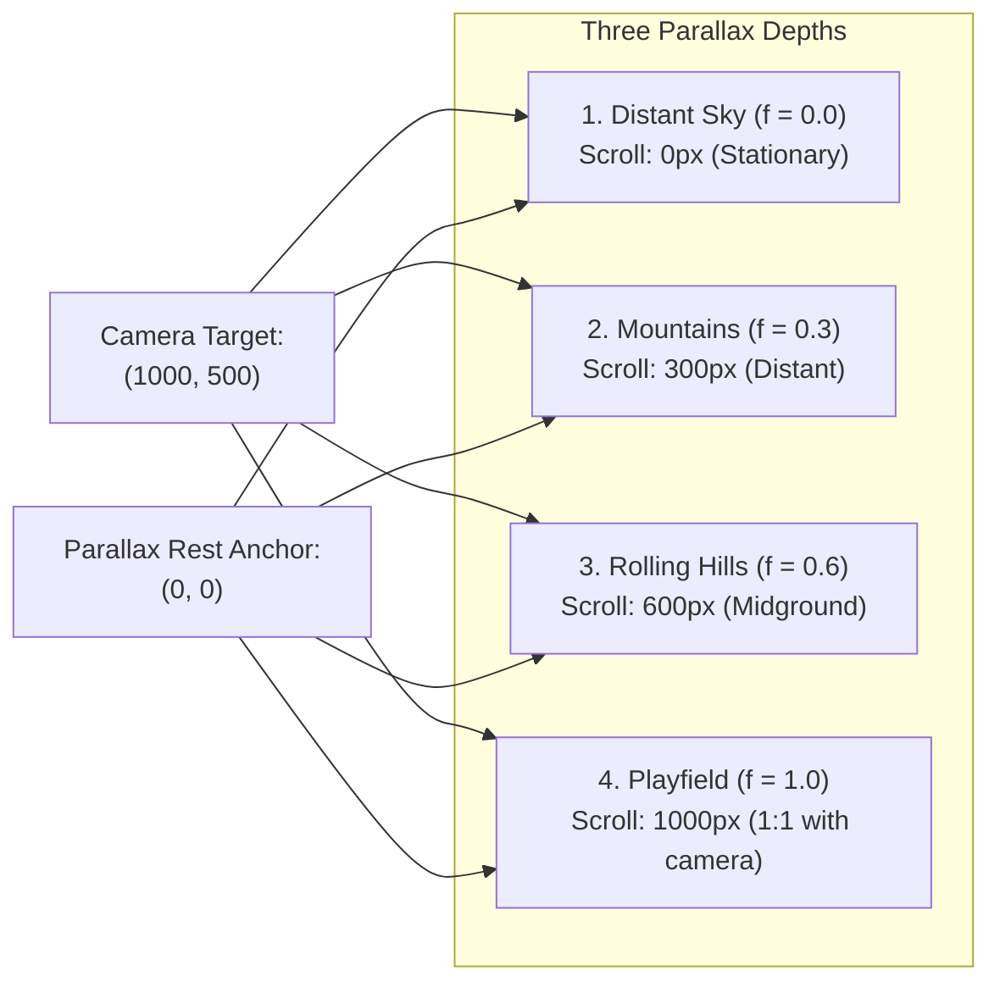

# Part 3: Camera & Parallax

In [Part 2: Batches & Ordering Bands](./02-batches-and-ordering.md), we organized entities into depth-sorted layers on a stationary screen.

Now, we make the world scroll.

In this tutorial, you will learn how to:
1. Configure a 2D look-at camera ([`neutrino::camera`](pathname:///api/)).
2. Implement **smooth camera tracking** and **zoom controls**.
3. Create a **multi-plane parallax background** that never drifts or leaves seams.
4. Connect the camera directly to [`neutrino::sprite_batch`](pathname:///api/) so world coordinates project to screen pixels automatically.
5. Perform **frustum culling** so offscreen tiles and entities are never submitted to the GPU.

---

## The Camera Model (`neutrino::camera`)

In Neutrino, a camera is not a complex matrix stack. It is a simple, intuitive look-at struct:

```cpp
#include <neutrino/video/world/camera.hh>

neutrino::camera cam{
    .target = neutrino::world_point{640.0f, 360.0f},  // Point displayed at viewport center
    .zoom = 1.0f,                                    // Scale factor (>1 zooms in, <1 zooms out)
    .parallax_rest = neutrino::world_point{0.0f, 0.0f} // World origin where all layers align
};
```



---

## Step 1: Smooth Camera Tracking (Lerping)

If the camera snaps instantly to the player's position, high-speed movement or sudden jumps feel jarring. We can create smooth cinematic tracking using **frame-rate independent exponential decay**:

```cpp
#include <neutrino/video/world/camera.hh>
#include <cmath>

void update_camera_tracking(neutrino::camera& cam, 
                            neutrino::world_point player_pos, 
                            float dt_sec) 
{
    // Damping sharpness: higher values catch up faster (e.g. 5.0f to 10.0f)
    constexpr float sharpness = 8.0f;
    const float blend = 1.0f - std::exp(-sharpness * dt_sec);

    cam.target.x += (player_pos.x - cam.target.x) * blend;
    cam.target.y += (player_pos.y - cam.target.y) * blend;
}
```

:::tip[Why not simple linear lerp?]
Linear lerping (`target += (player - target) * (speed * dt)`) is not frame-rate independent and can cause oscillation or overshoot if a sudden frame hitch occurs. Exponential decay (`1.0f - std::exp(-sharpness * dt)`) guarantees a smooth, asymptotic curve regardless of delta time.
:::

---

## Step 2: Camera-Aware Sprite Batching

In Part 2, we constructed a default `sprite_batch()`, which operated in literal screen pixels.

To make a batch **camera-aware**, pass the camera, viewport destination rectangle, and the target layer plane to its constructor:

```cpp
const neutrino::rect viewport{0, 0, 640, 360};
neutrino::world_layer_header actor_plane; // Standard foreground (parallax = 1.0)

// 1. Construct camera-aware batch
neutrino::sprite_batch batch(cam, viewport, actor_plane);

// 2. Add entities in WORLD coordinates!
batch.add(
    actor.world_pos, 
    to_layer(render_band::actors), 
    actor.world_pos.y, 
    actor.sprite
);

// 3. Flush to screen
batch.flush();
```

Inside `batch.flush()`:
1. Every position is transformed through `to_screen(cam, plane, viewport, pos)`.
2. The viewport's top-left offset is added automatically.
3. The camera zoom is automatically folded into the sprite scale: `params.scale * cam.zoom`.

---

## Step 3: Multi-Plane Parallax Without Drift

Parallax backgrounds create an illusion of depth by scrolling distant scenery slower than the foreground.

In many engines, parallax is computed by multiplying the raw camera position by a factor (e.g. `scroll_x = cam.x * 0.5f`). This creates **parallax drift**: as the camera moves, the background layers drift further and further away from the level geometry, causing seams and alignment bugs at the level start.

### The Alignment Solution: `parallax_rest`

Neutrino anchors all parallax calculation around an explicit **`parallax_rest`** point (typically `{0, 0}`):

```text
effective_target.x = rest.x + factor.x * (target.x - rest.x)
effective_target.y = rest.y + factor.y * (target.y - rest.y)
```



- When `factor = 0.0`, the layer is locked to `rest` (stationary background).
- When `factor = 1.0`, the layer tracks the camera at 1:1 speed (the foreground).
- When `target == rest`, **all layers align with zero offset**, ensuring your authored art lines up perfectly at the level origin.

### Rendering Parallax Planes

To render multiple parallax planes, create a batch for each layer plane:

```cpp
void draw_parallax_scenery(const neutrino::camera& cam, const neutrino::rect& viewport) {
    // Plane 1: Distant mountains (moves at 30% camera speed)
    neutrino::world_layer_header mountain_plane;
    mountain_plane.parallax_x = 0.3f;
    mountain_plane.parallax_y = 0.1f;

    neutrino::sprite_batch mountain_batch(cam, viewport, mountain_plane);
    mountain_batch.add(neutrino::world_point{0.0f, 100.0f}, 0.0f, mountain_visual);
    mountain_batch.flush();

    // Plane 2: Foreground hills (moves at 60% camera speed)
    neutrino::world_layer_header hill_plane;
    hill_plane.parallax_x = 0.6f;
    hill_plane.parallax_y = 0.2f;

    neutrino::sprite_batch hill_batch(cam, viewport, hill_plane);
    hill_batch.add(neutrino::world_point{0.0f, 180.0f}, 0.0f, hill_visual);
    hill_batch.flush();
}
```

---

## Step 4: Frustum Culling

In a large world (4000 × 2000 pixels), testing and submitting thousands of offscreen entities wastes CPU cycles.

Neutrino provides `visible_cell_range()` to query the exact bounding box of the camera frustum:

```cpp
#include <neutrino/video/world/camera.hh>

void render_world(const neutrino::world& map, 
                  const neutrino::world_tile_layer& layer, 
                  const neutrino::camera& cam, 
                  neutrino::dim viewport_size) 
{
    // Returns [x0, x1) x [y0, y1) cell indices intersecting the camera viewport
    const neutrino::cell_range range = neutrino::visible_cell_range(map, layer, cam, viewport_size);

    for (int cy = range.y0; cy < range.y1; ++cy) {
        for (int cx = range.x0; cx < range.x1; ++cx) {
            // Only draw tiles that are actually visible on screen!
            const auto tile_gid = layer.get_tile(cx, cy);
            draw_tile(cx, cy, tile_gid);
        }
    }
}
```

For actors and dynamic entities, calculate the visible world rectangle and cull before queueing into `sprite_batch`:

```cpp
// Back off half the viewport to get the visible world rectangle
const float half_w = (viewport.width / 2.0f) / cam.zoom;
const float half_h = (viewport.height / 2.0f) / cam.zoom;

const neutrino::world_rect view_bounds{
    cam.target.x - half_w - 32.0f, // Add 32px padding for sprite radius
    cam.target.y - half_h - 32.0f,
    (half_w * 2.0f) + 64.0f,
    (half_h * 2.0f) + 64.0f
};

for (const auto& enemy : enemies) {
    if (view_bounds.contains(enemy.position)) {
        actor_batch.add(enemy.position, to_layer(render_band::actors), enemy.position.y, enemy.sprite);
    }
}
```

---

## Step 5: Complete Scrolling Scene Example

Here is a complete, working scene with player tracking, zoom controls, and parallax:

```cpp
#include <neutrino/application.hh>
#include <neutrino/scene/base_scene.hh>
#include <neutrino/video/draw.hh>
#include <neutrino/video/world/camera.hh>
#include <neutrino/video/world/sprite_batch.hh>
#include <sdlpp/app/entry_point.hh>
#include <sdlpp/video/color.hh>
#include <cmath>

class scrolling_scene final : public neutrino::base_scene {
public:
    void on_enter() override {
        m_cam.target = {320.0f, 180.0f};
        m_cam.zoom = 1.0f;
        m_cam.parallax_rest = {0.0f, 0.0f};
    }

    void fixed_update(neutrino::sim_duration dt, const neutrino::input_snapshot& in) override {
        const float dt_sec = static_cast<float>(dt.count());
        constexpr float move_speed = 200.0f;

        // 1. Move player with arrow keys or WASD
        if (in.held(neutrino::key_code::right) || in.held(neutrino::key_code::d)) m_player_pos.x += move_speed * dt_sec;
        if (in.held(neutrino::key_code::left)  || in.held(neutrino::key_code::a)) m_player_pos.x -= move_speed * dt_sec;
        if (in.held(neutrino::key_code::down)  || in.held(neutrino::key_code::s)) m_player_pos.y += move_speed * dt_sec;
        if (in.held(neutrino::key_code::up)    || in.held(neutrino::key_code::w)) m_player_pos.y -= move_speed * dt_sec;

        // 2. Zoom controls: Q to zoom out, E to zoom in
        if (in.held(neutrino::key_code::q)) m_cam.zoom = std::max(0.5f, m_cam.zoom - 0.5f * dt_sec);
        if (in.held(neutrino::key_code::e)) m_cam.zoom = std::min(2.5f, m_cam.zoom + 0.5f * dt_sec);

        // 3. Smooth camera tracking with exponential decay
        const float blend = 1.0f - std::exp(-6.0f * dt_sec);
        m_cam.target.x += (m_player_pos.x - m_cam.target.x) * blend;
        m_cam.target.y += (m_player_pos.y - m_cam.target.y) * blend;
    }

    void render() override {
        const neutrino::rect viewport{0, 0, 640, 360};

        // Clear backdrop with dark twilight sky
        neutrino::draw_rect_fill(viewport, sdlpp::color{15, 20, 35, 255});

        // 1. Draw distant mountains (parallax = 0.25)
        neutrino::world_layer_header bg_plane;
        bg_plane.parallax_x = 0.25f;
        bg_plane.parallax_y = 0.1f;
        draw_distant_scenery(m_cam, viewport, bg_plane);

        // 2. Draw playfield actors (parallax = 1.0)
        neutrino::world_layer_header actor_plane;
        neutrino::sprite_batch actor_batch(m_cam, viewport, actor_plane);

        // Player avatar
        const auto player_screen = neutrino::to_screen(m_cam, actor_plane, viewport.dimensions(), m_player_pos);
        neutrino::draw_rect_fill(neutrino::rect{player_screen.x - 16, player_screen.y - 32, 32, 32}, sdlpp::colors::goldenrod);
        neutrino::draw_rect(neutrino::rect{player_screen.x - 16, player_screen.y - 32, 32, 32}, sdlpp::colors::white);

        // 3. Draw screen-space HUD (no camera transform)
        neutrino::draw_rect_fill(neutrino::rect{10, 10, 160, 24}, sdlpp::color{0, 0, 0, 180});
        neutrino::draw_rect(neutrino::rect{10, 10, 160, 24}, sdlpp::colors::white);
    }

    void handle_action(const sdlpp::event& ev) override {}

private:
    void draw_distant_scenery(const neutrino::camera& cam, const neutrino::rect& viewport, const neutrino::world_layer_header& plane) {
        for (int i = -2; i <= 5; ++i) {
            const neutrino::world_point peak{i * 300.0f, 200.0f};
            const auto sp = neutrino::to_screen(cam, plane, viewport.dimensions(), peak);
            neutrino::draw_circle_fill(neutrino::circle{sp, static_cast<int>(120 * cam.zoom)}, sdlpp::color{30, 45, 70, 255});
        }
    }

    neutrino::camera m_cam;
    neutrino::world_point m_player_pos{320.0f, 180.0f};
};
```

---

## Running the Executable

Build and run the Part 3 executable:

```bash
cmake --build cmake-build-debug --target neutrino_tutorial_drawing_03_camera
./cmake-build-debug/tutorials/drawing/03_camera_and_parallax/neutrino_tutorial_drawing_03_camera
```

### What You See:
- **Player Movement:** Use Arrow Keys or <kbd>W</kbd><kbd>A</kbd><kbd>S</kbd><kbd>D</kbd> to move the golden player avatar around the world.
- **Smooth Damped Tracking:** The camera eases smoothly behind the player rather than snapping instantly.
- **Dynamic Zoom:** Press <kbd>E</kbd> to zoom in and <kbd>Q</kbd> to zoom out.
- **3-Layer Parallax Background:** Distant celestial bodies, mountain silhouettes, and rolling hills scroll at different relative velocities anchored to the rest position.
- Press <kbd>Escape</kbd> to exit cleanly.

---

## Summary & What's Next

With `neutrino::camera`:
- The camera follows any game object with **exponential damping**.
- **Parallax backgrounds** never drift because they are referenced to `parallax_rest`.
- `sprite_batch` automatically handles camera projection, viewport centering, and zoom scaling.

In the final chapter, **[Part 4: Offscreen Render Textures](./04-render-textures.md)**, we will optimize our rendering by baking static backgrounds and minimaps into offscreen textures!

