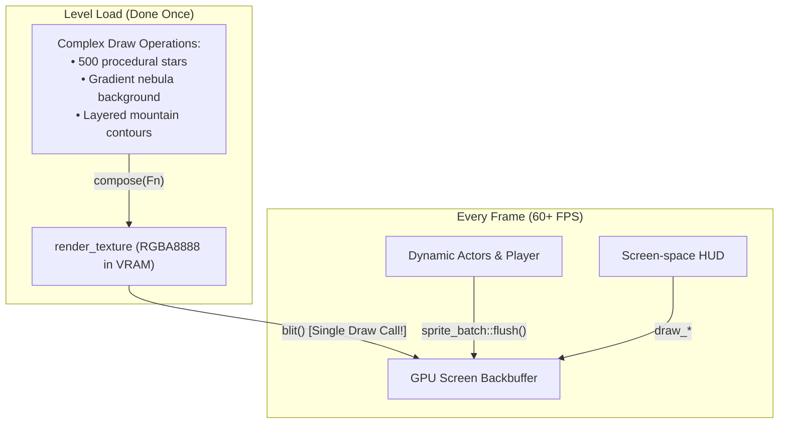
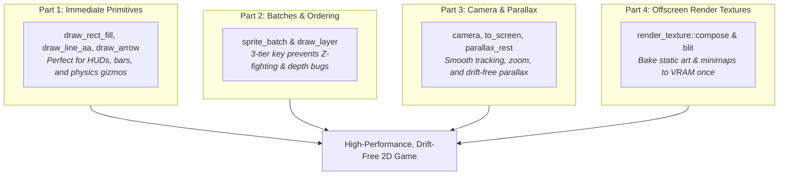

# Part 4: Offscreen Render Textures

In the previous parts of this tutorial, we learned how to draw shapes immediately, sort sprites into batches, and track players across parallaxed worlds.

However, drawing hundreds of static background tiles, complex procedural mountain silhouettes, or ornate HUD frames **every single frame** wastes CPU cycles and GPU fillrate.

In this tutorial, you will learn how to use [`neutrino::render_texture`](pathname:///api/) to:
1. **Bake complex scenery once into VRAM** and blit it as a single texture every frame.
2. Build a **cached minimap** that updates on demand rather than on every render tick.
3. Use the safe, RAII-guarded **`compose()` pattern** to eliminate render target bugs.

---

## What is a `render_texture`?

In GPU architectures, textures typically reside in VRAM as read-only image data sampled by shaders.

A **render texture** (or offscreen render target) is a GPU texture configured with *target access* (`sdlpp::texture_access::target`). This allows the GPU to redirect drawing commands into the texture's pixel buffer instead of the screen window.



---

## Step 1: Creating a Render Texture

Allocate an offscreen render target by calling `render_texture::create(size)`:

```cpp
#include <neutrino/video/render_texture.hh>
#include <iostream>

// Allocate a 640x360 offscreen target texture
auto rt_opt = neutrino::render_texture::create(neutrino::dim{640, 360});

if (!rt_opt) {
    std::cerr << "Failed to allocate render texture (check VRAM or driver support)\n";
    return;
}

neutrino::render_texture backdrop = std::move(*rt_opt);
```

When created, `render_texture`:
- Allocates an `RGBA8888` texture on the active GPU renderer.
- Automatically enables `sdlpp::blend_mode::blend`, so transparent areas in the texture will composite over whatever lies beneath when blitted.
- Is movable but non-copyable (strictly owns its GPU texture handle).

---

## Step 2: The `compose()` Idiom

Drawing to an offscreen target manually is notorious for subtle bugs:
- Forgetting to reset the render target back to the window leaves the screen pitch black.
- Changing draw colors inside the target corrupts the draw color of your main scene.
- Uninitialized textures start with undefined, noisy memory.

Neutrino's `compose()` solves all three by wrapping execution in an RAII target guard:

```cpp
#include <neutrino/video/draw.hh>

// Render into the texture:
backdrop.compose([&] {
    // 1. Fill entire texture with deep midnight blue
    neutrino::draw_rect_fill(neutrino::rect{0, 0, 640, 360}, sdlpp::color{10, 15, 30, 255});

    // 2. Draw 200 random stars
    for (int i = 0; i < 200; ++i) {
        int x = std::rand() % 640;
        int y = std::rand() % 240;
        uint8_t brightness = static_cast<uint8_t>(150 + std::rand() % 105);
        neutrino::draw_point(x, y, sdlpp::color{brightness, brightness, brightness, 255});
    }

    // 3. Draw mountain silhouettes
    neutrino::draw_circle_fill(neutrino::circle{neutrino::point{160, 360}, 180}, sdlpp::color{20, 25, 45, 255});
    neutrino::draw_circle_fill(neutrino::circle{neutrino::point{480, 360}, 220}, sdlpp::color{15, 20, 38, 255});
}, /* clear_color = */ sdlpp::colors::transparent);
```

### What `compose()` does behind the scenes:
1. **Target Guard:** Uses `sdlpp::renderer::target_guard` to bind `m_texture` as the active target and guarantees the previous target is restored when the lambda exits.
2. **Color Restoration:** Reads `get_draw_color()`, clears the texture to the requested `clear_color` (defaulting to `{0, 0, 0, 0}` transparent), runs your lambda, and restores the previous draw color.
3. **Arbitrary Draws:** Any Neutrino drawing code executed inside the lambda — immediate primitives, `draw_sprite`, or `sprite_batch::flush()` — automatically renders into the texture!

---

## Step 3: Blitting the Texture

During your scene's `render()` method, drawing the entire pre-baked scenery takes just **one line of code**:

```cpp
void render() override {
    // 1. Blit the entire baked backdrop 1:1 at (0, 0)
    backdrop.blit();

    // 2. Render dynamic gameplay actors on top
    actor_batch.flush();

    // 3. Render HUD
    draw_hud();
}
```

You can also blit the texture into a specific destination rectangle (scaled or repositioned):

```cpp
// Blit a 128x128 preview into the bottom-right corner
backdrop.blit(neutrino::rect{500, 220, 128, 72});
```

---

## Step 4: Practical Example — A Cached Minimap

Minimaps often redraw the entire world layout, player markers, and enemy dots. Redrawing 500 room outlines every frame is wasteful when rooms don't move!

We can maintain a **cached minimap**:
1. Bake the static walls and terrain into a 160 × 160 `render_texture` **once**.
2. Each frame, blit the cached map texture.
3. Draw only the moving entity dots (player, enemies) immediately on top!

```cpp
#include <neutrino/scene/base_scene.hh>
#include <neutrino/video/draw.hh>
#include <neutrino/video/render_texture.hh>
#include <optional>
#include <vector>

class minimap_scene final : public neutrino::base_scene {
public:
    void on_enter() override {
        // Allocate 120x120 minimap target
        m_minimap = neutrino::render_texture::create(neutrino::dim{120, 120});

        if (m_minimap) {
            // Bake static dungeon walls into the minimap texture ONCE:
            m_minimap->compose([&] {
                // Background
                neutrino::draw_rect_fill(neutrino::rect{0, 0, 120, 120}, sdlpp::color{20, 20, 25, 200});

                // Static dungeon room outlines (scaled 1:10)
                neutrino::draw_rect(neutrino::rect{10, 10, 40, 30}, sdlpp::colors::light_gray);
                neutrino::draw_rect(neutrino::rect{45, 20, 30, 50}, sdlpp::colors::light_gray);
                neutrino::draw_rect(neutrino::rect{70, 50, 40, 40}, sdlpp::colors::light_gray);

                // Minimap outer border
                neutrino::draw_rect(neutrino::rect{0, 0, 120, 120}, sdlpp::colors::gold);
            });
        }
    }

    void render() override {
        // [Main gameplay rendering happens here...]

        // Draw the Minimap Overlay at top-right (x = 500, y = 16):
        const neutrino::rect minimap_dst{504, 16, 120, 120};

        if (m_minimap) {
            // 1. Blit the pre-baked static rooms (1 draw call!)
            m_minimap->blit(minimap_dst);

            // 2. Draw dynamic entity blips on top
            // Player blip (green dot)
            const int p_x = minimap_dst.x + static_cast<int>(m_player_pos.x * 0.1f);
            const int p_y = minimap_dst.y + static_cast<int>(m_player_pos.y * 0.1f);
            neutrino::draw_circle_fill(neutrino::circle{neutrino::point{p_x, p_y}, 2}, sdlpp::colors::lime_green);

            // Enemy blip (red dot)
            const int e_x = minimap_dst.x + static_cast<int>(m_enemy_pos.x * 0.1f);
            const int e_y = minimap_dst.y + static_cast<int>(m_enemy_pos.y * 0.1f);
            neutrino::draw_circle_fill(neutrino::circle{neutrino::point{e_x, e_y}, 2}, sdlpp::colors::red);
        }
    }

    void handle_action(const sdlpp::event& ev) override {}

private:
    std::optional<neutrino::render_texture> m_minimap;
    neutrino::point m_player_pos{250, 200};
    neutrino::point m_enemy_pos{800, 600};
};
```

---

## Running the Executable

Build and run the Part 4 executable:

```bash
cmake --build cmake-build-debug --target neutrino_tutorial_drawing_04_render_textures
./cmake-build-debug/tutorials/drawing/04_render_textures/neutrino_tutorial_drawing_04_render_textures
```

### What You See:
- **Offscreen Static Canvas:** A complex grid and room layout pre-rendered once into an offscreen render texture and blitted to the screen each frame in a single draw call.
- **Dynamic Entities:** Use Arrow Keys or <kbd>W</kbd><kbd>A</kbd><kbd>S</kbd><kbd>D</kbd> to move the player around the main view.
- **Interactive Minimap:** A dedicated top-right radar display with a 1:10 scaled overview of the static map and real-time blips for player and patrol drone.
- Press <kbd>Escape</kbd> to exit cleanly.

---

## When to Invalidate and Re-compose

A `render_texture` remains valid in VRAM until its destructor runs or `compose()` is called again.

### Rules of thumb:
- **Level Load / Scene Transition:** Bake static background scenery once when the scene loads (`on_enter()`).
- **Window Resize:** If your render target depends on window dimensions, re-allocate and re-compose during `on_resize()`.
- **Low-Frequency Timers:** For dynamic systems like weather maps or minimap fog-of-war, re-compose on a periodic timer (e.g. 2 times per second) instead of 60 times per second.

---

## Series Conclusion: The Complete 2D Drawing Toolkit

Congratulations! You now have a complete mastery of Neutrino's 2D rendering pipeline:



### Where to go from here:
- Read the **[Drawing Concept Page](../../concepts/drawing.md)** for deep reference on signatures and mathematical guarantees.
- Explore the **[Sprites Concept Page](../../concepts/sprites.md)** to see how texture atlases and animations are managed in cache.
- Jump into the **[Platformer Tutorial](../index.md)** to connect this rendering pipeline to physics, collision detection, and player controls!
