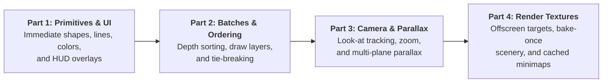

# Drawing Tutorial

Rendering in games is much more than putting a sprite on screen. Real games need:
- **Heads-up displays (HUDs)**, health bars, radar sweeps, and diagnostic physics overlays.
- **Depth sorting** in 2.5D, isometric, and top-down scenes so actors, trees, and ground decals layer naturally without Z-fighting.
- **Camera projection** with smooth tracking, zoom, and parallax backgrounds that never drift out of alignment.
- **Offscreen composition** to bake static or procedural scenery once and blit it cheaply each frame.

This 4-part tutorial series teaches Neutrino's rendering architecture from the ground up through practical, working C++20 code.

:::tip[Companion Concept Pages]
While these tutorials focus on practical, step-by-step implementation, the theory and engine mechanics are explained in:
- **[Drawing Concept Page](../../concepts/drawing.md)** — immediate primitives, depth-sorted batches, and render textures
- **[Coordinate Spaces Concept Page](../../concepts/coordinate-spaces.md)** — window space, render space, and world space
- **[Sprites Concept Page](../../concepts/sprites.md)** — definitions, GPU sets, and runtime playheads
:::

---

## The 4-Part Roadmap

| Part | Title | What you build | Key engine APIs |
|---|---|---|---|
| **1** | [**Primitives & UI**](./01-primitives-and-ui.md) | A complete player status HUD, diagnostic shape gizmos, and custom line styles | `draw.hh`, `draw_rect_fill`, `draw_line_aa`, `draw_arrow`, `draw_cross` |
| **2** | [**Batches & Ordering Bands**](./02-batches-and-ordering.md) | A top-down multi-entity scene with Y-sorting, shadows, characters, and spell effects | `sprite_batch`, `draw_layer`, `plan()`, `flush()` |
| **3** | [**Camera & Parallax**](./03-camera-and-parallax.md) | A scrolling world with smooth player tracking, zoom controls, and 3-plane parallax | `camera`, `to_screen()`, `visible_cell_range` |
| **4** | [**Offscreen Render Textures**](./04-render-textures.md) | A bake-once procedural background, cached minimap, and stylized 9-slice frame | `render_texture`, `compose()`, `blit()` |

---

## Prerequisites

Before starting this series, you should be familiar with:
1. Setting up a Neutrino application and scene ([Tutorial Step 1](../step-01-window-and-scene.md)).
2. Loading sprites and defining visual frames ([Tutorial Step 2](../step-02-one-sprite.md)).
3. The distinction between **render space** (fixed design canvas, e.g. 640 × 360) and **window space** (physical OS pixels). See [Coordinate spaces](../../concepts/coordinate-spaces.md).

Let's begin with **[Part 1: Primitives & UI](./01-primitives-and-ui.md)**!
