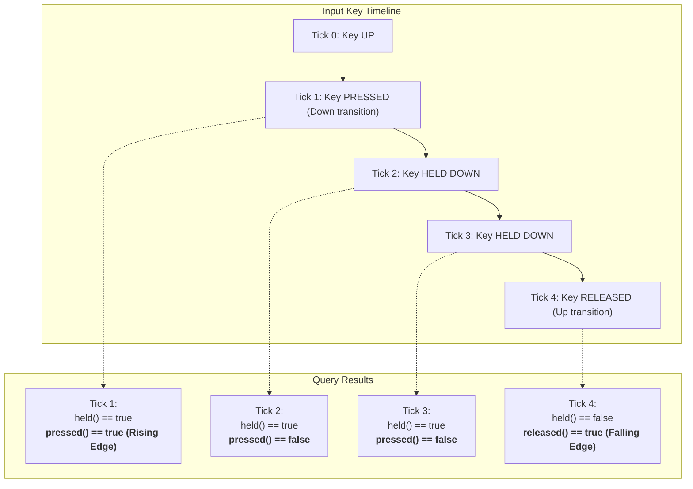
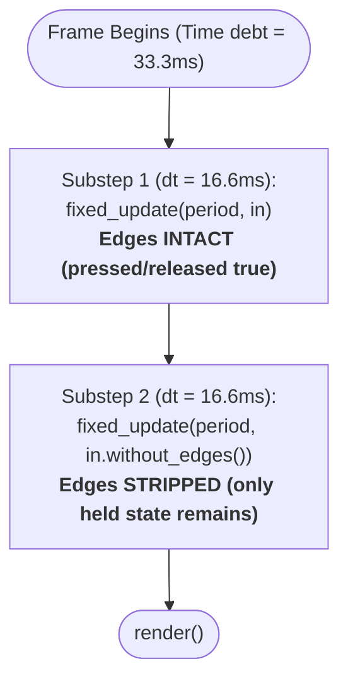

# Step 3: Moving with the keyboard

In [Step 2: One sprite on screen](./step-02-one-sprite.md), we rendered our animated platformer hero standing on the ground with an idle animation.

In this step, we give the player control:
- Running left and right with **Arrow keys** or **WASD**.
- Jumping with **Space** or **Up**.
- Flipping the sprite visually to face the movement direction.
- Switching animations smoothly between `idle`, `walk`, and `jump`.

By the end of this step, you will have a responsive, playable character running and leaping across the screen.

:::tip[Companion Concept Pages]
For the deep architectural reasoning behind Neutrino's input architecture and simulation loop, see:
- **[Input Concept Page](../concepts/input.md)** — the per-frame snapshot, edges vs. held state, and query matchers
- **[The Frame Concept Page](../concepts/the-frame.md)** — fixed timesteps, accumulator draining, and edge stripping
- **[Sprites Concept Page](../concepts/sprites.md)** — runtime playhead instances and visual flips
:::

---

## What We Are Building

Here is the complete source code for Step 3, located in `tutorials/03_keyboard_movement/main.cc`:

```cpp
#include <neutrino/application.hh>
#include <neutrino/scene/base_scene.hh>
#include <neutrino/scene/scene_transitions.hh>
#include <neutrino/video/draw.hh>
#include <neutrino/video/sprites.hh>

#include <sdlpp/app/entry_point.hh>
#include <sdlpp/video/color.hh>

#include <algorithm>
#include <chrono>
#include <cmath>
#include <filesystem>
#include <iostream>
#include <memory>
#include <string>

using namespace std::chrono_literals;

namespace {

    // Logical design resolution for our platformer.
    constexpr int logical_width = 640;
    constexpr int logical_height = 360;

    // Window dimensions at startup.
    constexpr int window_width = 1280;
    constexpr int window_height = 720;

    // Ground position where character feet rest.
    constexpr int ground_y = 300;

    // Visual scale factor for pixel-art sprites.
    constexpr float sprite_scale = 2.0f;

    // Half-width of player sprite (16px authored frame * scale = 32px on screen).
    constexpr float player_half_width = 16.0f * sprite_scale;

    // Kinematic movement constants.
    constexpr float run_speed = 180.0f;      // Horizontal speed in pixels per second.
    constexpr float jump_velocity = -420.0f; // Initial upward impulse.
    constexpr float gravity = 980.0f;        // Downward acceleration.

    // Helper to resolve asset paths across build and run environments.
    [[nodiscard]] std::filesystem::path asset_path(const std::string& filename) {
#ifdef NEUTRINO_TUTORIAL_ASSET_DIR
        auto p = std::filesystem::path{NEUTRINO_TUTORIAL_ASSET_DIR} / filename;
        if (std::filesystem::exists(p)) {
            return p;
        }
#endif
        if (std::filesystem::exists("tutorials/assets/" + filename)) {
            return "tutorials/assets/" + filename;
        }
        if (std::filesystem::exists("assets/" + filename)) {
            return "assets/" + filename;
        }
        return filename;
    }

    // =========================================================================
    // Pure Asset Definition (CPU Data): make_player_def
    // =========================================================================
    [[nodiscard]] neutrino::sprite_def make_player_def() {
        return neutrino::sprite_def_builder{}
            .from_file(asset_path("arcade_platformer.png"), 352, 320)
            // Visual frames with bottom-center pivot origin {16, 32}
            .add_visual("player.idle",   neutrino::rect{0, 0, 32, 32},  neutrino::point{16, 32})
            .add_visual("player.walk.0", neutrino::rect{0, 0, 32, 32},  neutrino::point{16, 32})
            .add_visual("player.walk.1", neutrino::rect{32, 0, 32, 32}, neutrino::point{16, 32})
            .add_visual("player.walk.2", neutrino::rect{64, 0, 32, 32}, neutrino::point{16, 32})
            .add_visual("player.jump",   neutrino::rect{0, 32, 32, 32}, neutrino::point{16, 32})

            // Animation clips
            .add_clip("idle", {"player.idle"}, 1000ms, true)
            .add_clip("walk", {"player.walk.0", "player.walk.1", "player.walk.2", "player.walk.1"}, 100ms, true)
            .add_clip("jump", {"player.jump"}, 1000ms, false)
            .build();
    }

    // =========================================================================
    // The Scene: main_scene
    // =========================================================================
    class main_scene final : public neutrino::base_scene {
    public:
        main_scene() = default;

        void on_enter() override {
            std::cout << "[Tutorial 03] Acquiring player sprite set from cache...\n";
            m_set = neutrino::acquire_sprite(make_player_def());
            m_player = m_set.spawn("idle");
        }

        void fixed_update(neutrino::sim_duration dt, const neutrino::input_snapshot& in) override {
            // 1. Exit cleanly on Escape press
            if (in.pressed(sdlpp::scancode::escape)) {
                std::cout << "[Tutorial 03] Escape pressed - exiting\n";
                neutrino::pop_scene();
                return;
            }

            const float dt_sec = dt.count();

            // 2. Read continuous horizontal movement (Held State)
            const bool move_left = in.held(sdlpp::scancode::left) || in.held(sdlpp::scancode::a);
            const bool move_right = in.held(sdlpp::scancode::right) || in.held(sdlpp::scancode::d);

            if (move_left != move_right) {
                const float dir = move_right ? 1.0f : -1.0f;
                m_player_x += dir * run_speed * dt_sec;
                m_facing_left = move_left;
            }

            // Clamp player within screen margins
            m_player_x = std::clamp(
                m_player_x, 
                player_half_width, 
                static_cast<float>(logical_width) - player_half_width
            );

            // 3. Read discrete jump impulse (Edge Transition)
            const bool jump_pressed = in.pressed(sdlpp::scancode::space) 
                                   || in.pressed(sdlpp::scancode::up) 
                                   || in.pressed(sdlpp::scancode::w);

            if (jump_pressed && m_on_ground) {
                m_player_vy = jump_velocity;
                m_on_ground = false;
                m_player.restart("jump");
                m_current_clip = "jump";
            }

            // 4. Apply vertical integration and gravity when airborne
            if (!m_on_ground) {
                m_player_vy += gravity * dt_sec;
                m_player_y += m_player_vy * dt_sec;

                // Ground landing check
                if (m_player_y >= ground_y) {
                    m_player_y = ground_y;
                    m_player_vy = 0.0f;
                    m_on_ground = true;
                }
            }

            // 5. Manage animation clips based on state
            if (m_on_ground) {
                if (move_left != move_right) {
                    if (m_current_clip != "walk") {
                        m_current_clip = "walk";
                        m_player.switch_to("walk");
                    }
                } else {
                    if (m_current_clip != "idle") {
                        m_current_clip = "idle";
                        m_player.switch_to("idle");
                    }
                }
            }
        }

        void handle_action(const sdlpp::event&) override {}

        void render() override {
            // Sky background
            neutrino::draw_rect_fill(
                neutrino::rect{0, 0, logical_width, logical_height},
                sdlpp::color{90, 160, 230, 255}
            );

            // Ground strip
            constexpr int ground_height = logical_height - ground_y;
            neutrino::draw_rect_fill(
                neutrino::rect{0, ground_y, logical_width, 10},
                sdlpp::color{80, 185, 95, 255}
            );
            neutrino::draw_rect_fill(
                neutrino::rect{0, ground_y + 10, logical_width, ground_height - 10},
                sdlpp::color{110, 75, 45, 255}
            );

            // Draw player sprite with horizontal flipping
            if (m_player.valid()) {
                const auto flip = m_facing_left 
                    ? neutrino::sprite_flip::horizontal 
                    : neutrino::sprite_flip::none;

                neutrino::draw_sprite(
                    neutrino::point{static_cast<int>(m_player_x), static_cast<int>(m_player_y)},
                    m_player.state(),
                    neutrino::sprite_draw_params{
                        .scale = sprite_scale,
                        .flip = flip,
                        .rotation_degrees = 0.0f,
                    }
                );
            }
        }

        [[nodiscard]] bool is_opaque() const override {
            return true;
        }

    private:
        neutrino::sprite_set_handle m_set;
        neutrino::sprite_instance   m_player;

        float m_player_x{120.0f};
        float m_player_y{ground_y};
        float m_player_vy{0.0f};

        bool m_facing_left{false};
        bool m_on_ground{true};
        std::string m_current_clip{"idle"};
    };

    // =========================================================================
    // The Application: tutorial_app
    // =========================================================================
    class tutorial_app final : public neutrino::application {
    public:
        tutorial_app()
            : neutrino::application(make_config()) {
        }

    protected:
        std::unique_ptr<neutrino::base_scene> create_initial_scene() override {
            return std::make_unique<main_scene>();
        }

    private:
        static neutrino::application_config make_config() {
            neutrino::application_config cfg;
            cfg.title = "Neutrino Tutorial 03 - Moving with the Keyboard";
            cfg.width = window_width;
            cfg.height = window_height;
            cfg.flags = sdlpp::window_flags::resizable;

            cfg.logical_size = neutrino::dim{logical_width, logical_height};
            cfg.scale = neutrino::scale_mode::letterbox;

            return cfg;
        }
    };

} // namespace

SDLPP_MAIN(tutorial_app)
```

---

## 1. The Per-Frame Input Snapshot

In many game tutorials, input is read by querying a global keyboard state:
```cpp
// ANTI-PATTERN: Global unsynchronized polling
if (SDL_GetKeyboardState(nullptr)[SDL_SCANCODE_SPACE]) {
    jump();
}
```

In Neutrino, `fixed_update` never reads global state. Instead, it receives a read-only **[`input_snapshot`](pathname:///api/)**:

```cpp
void fixed_update(neutrino::sim_duration dt, const neutrino::input_snapshot& in) override {
    // All input queries evaluate strictly against `in`
}
```

### Why a snapshot?
1. **Determinism:** If the simulation loop runs multiple fixed substeps to catch up with display time, all substeps evaluate against a synchronized, immutable record of input events that occurred during that frame window.
2. **Testability:** You can unit-test player movement, combos, and physics trajectories by constructing an artificial `input_snapshot` without opening an OS window.
3. **Replay Support:** Recording input snapshots enables byte-for-byte gameplay replays.

---

## 2. Edges vs. Held State

The input snapshot answers two fundamentally different questions:
1. **Held State (`in.held(...)`):** Is this key currently down right now?
2. **Edge Transition (`in.pressed(...)` / `in.released(...)`):** Did this key transition state in this specific frame?



### When to use `held()`: Continuous Movement
Horizontal running is a continuous process. As long as the player holds `D` or `Right`, the character moves forward every tick:

```cpp
const bool move_left  = in.held(sdlpp::scancode::left)  || in.held(sdlpp::scancode::a);
const bool move_right = in.held(sdlpp::scancode::right) || in.held(sdlpp::scancode::d);

if (move_left != move_right) {
    m_player_x += (move_right ? 1.0f : -1.0f) * run_speed * dt_sec;
}
```

### When to use `pressed()`: Discrete Impulses
Jumping is an impulse event. If we used `in.held()` for jumping, holding the Spacebar would cause the character to continuously jump the exact microsecond their feet touched the grass.

Using `in.pressed()` ensures the jump fires **exactly once per key strike**:

```cpp
const bool jump_pressed = in.pressed(sdlpp::scancode::space) 
                       || in.pressed(sdlpp::scancode::up);

if (jump_pressed && m_on_ground) {
    m_player_vy = jump_velocity;
    m_on_ground = false;
    m_player.restart("jump");
}
```

---

## 3. Substep Edge Stripping

A critical feature of Neutrino's frame loop is how it handles multiple fixed-update substeps.

Suppose the game experiences a 33ms display frame delay, prompting the engine to run **two** fixed substeps of 16.6ms:



1. **Substep 1** runs with the complete snapshot. If the user tapped Space, `in.pressed(space)` is `true`. The player launches into the air.
2. **Substep 2** runs with `in.without_edges()`. The key is still `held()`, but its `pressed()` edge has been stripped.

:::note[Why edge stripping matters]
Without edge stripping, a jump impulse would execute twice during a single frame hitch, sending the player flying into outer space at double the expected jump height. Neutrino's automatic edge stripping guarantees that one physical tap translates to exactly one simulation impulse.
:::

---

## 4. Facing Direction & Visual Flipping

Instead of drawing two separate sets of spritesheets for left and right movement, we author left-facing frames once and flip them dynamically at render time.

In `main_scene::render()`:
```cpp
const auto flip = m_facing_left 
    ? neutrino::sprite_flip::horizontal 
    : neutrino::sprite_flip::none;

neutrino::draw_sprite(
    neutrino::point{static_cast<int>(m_player_x), static_cast<int>(m_player_y)},
    m_player.state(),
    neutrino::sprite_draw_params{
        .scale = sprite_scale,
        .flip = flip,
    }
);
```

Because our visual pivot is placed at `{16, 32}` (the bottom horizontal center of the 32px sprite), flipping horizontally flips the character around its central vertical axis. The character's feet remain anchored in the exact same spot on the ground.

---

## 5. Animation Switching: `switch_to` vs. `restart`

Our character has three animation clips: `idle`, `walk`, and `jump`.

The `sprite_instance` class provides two methods for changing animations:

1. **`m_player.switch_to("walk")`**:
   - Switches to the new clip. If the clip is already playing, this is a fast no-op.
   - Preserves phase if clips share compatible timing.
   - Use for looping state transitions (`idle` $\leftrightarrow$ `walk`).

2. **`m_player.restart("jump")`**:
   - Rewinds the animation playhead back to frame 0 and restarts playback immediately.
   - Use for one-shot action triggers (jumping, taking damage, swinging a sword).

---

## Running the Executable

Build and run the Step 3 tutorial executable:

```bash
cmake --build cmake-build-debug --target neutrino_tutorial_03_keyboard_movement
./cmake-build-debug/tutorials/03_keyboard_movement/neutrino_tutorial_03_keyboard_movement
```

### Controls:
- **Left / Right** or **A / D**: Run left and right.
- **Space** or **Up** or **W**: Jump into the air.
- **Escape**: Exit the game cleanly.

---

## What's Next?

Our character runs and jumps, but its vertical motion is currently driven by a hardcoded `m_player_y >= ground_y` condition.

In **[Step 4: Standing on ground](./index.md)**, we replace this manual clamp with Neutrino's **physics world**, kinematic colliders, and move-and-slide collision resolution!
